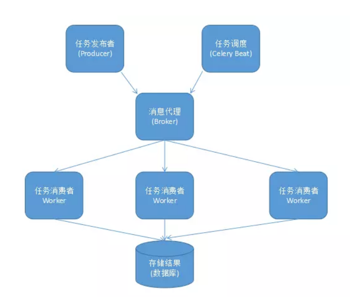
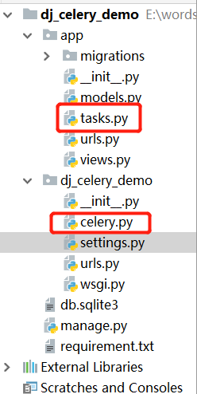
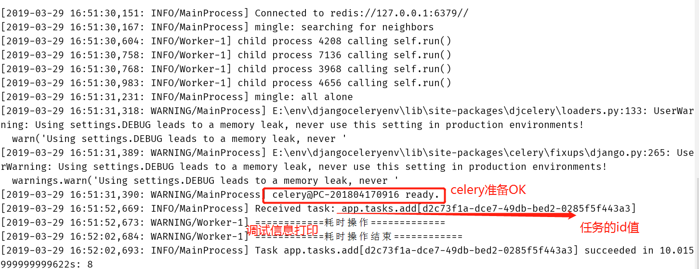
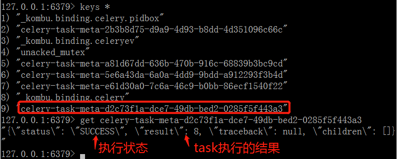
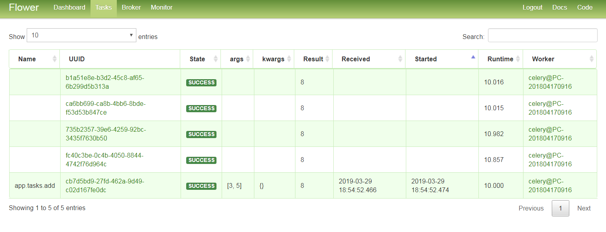
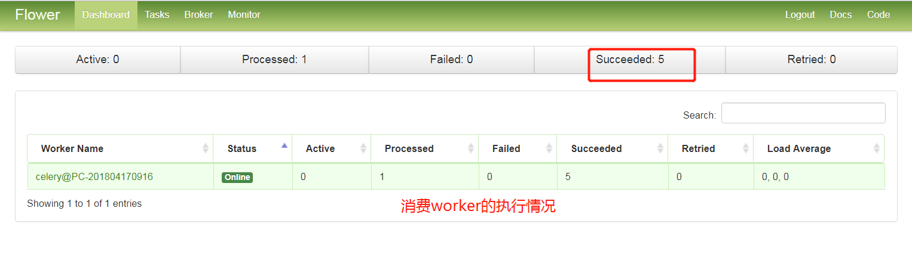

# celery使用指南--入门基础

>Auth: 王海飞
>
>Data：2019-03-29
>
>Email：779598160@qq.com
>
>github：https://github.com/coco369/knowledge

***

### 前言

Celery 是一个简单、灵活且可靠的，处理大量消息的分布式系统，并且提供维护这样一个系统的必需工具。

它是一个专注于实时处理的任务队列，同时也支持任务调度。

### 1. 何为消息队列？

任务队列是一种在线程或机器间分发任务的机制。

消息队列的输入是工作的一个单元，称为任务，独立的职程（Worker）进程持续监视队列中是否有需要处理的新任务。

Celery 用消息通信，通常使用中间人（Broker）在客户端和职程间斡旋。这个过程从客户端向队列添加消息开始，之后中间人把消息派送给职程。

Celery 系统可包含多个职程和中间人，以此获得高可用性和横向扩展能力。

<b>使用场景</b>

1. 异步任务

将耗时的操作任务提交给 Celery 去异步执行，比如发送短信/邮件、消息推送、音视频处理等等

2. 定时任务

类似于 crontab ，比如每日数据统计

### 2. celery组件

Celery 扮演生产者和消费者的角色,

<b>Celery Beat </b>: 任务调度器. Beat 进程会读取配置文件的内容, 周期性的将配置中到期需要执行的任务发送给任务队列.

<b>Celery Worker </b>: 执行任务的消费者, 通常会在多台服务器运行多个消费者, 提高运行效率.

<b>Broker </b>: 消息代理, 队列本身. 也称为消息中间件. 接受任务生产者发送过来的任务消息, 存进队列再按序分发给任务消费方(通常是消息队列或者数据库).

<b>Producer </b>: 任务生产者. 调用 Celery API , 函数或者装饰器, 而产生任务并交给任务队列处理的都是任务生产者.

<b>Result Backend </b>: 任务处理完成之后保存状态信息和结果, 以供查询.

结构图:

### 3. 消息代理

生产环境的消息代理有 RabbitMQ 和 Redis, 官方推荐 RabbitMQ.

### 4. 安装

安装celery相关库:

	pip install celery==3.1.5
	pip install django-celery==3.2.2
	pip install redis==2.10.6

安装实时监控和管理Web界面工具:

	pip install flower

如果安装最新django-celery3.2版本，则需要celery4版本小于4.0大于3。0的版本，且redis的版本必须小于3.0，因此各依赖库的版本号如上定义。

### 5. 配置

项目结构图如下:

<b>在settings.py文件下定义</b>:

	INSTALLED_APPS = [
		...
	    'djcelery', #django-celery必须添加
	    'app',
	]
	
	# 如下配置celery等信息

	import djcelery
	# 当settings.py中的djcelery.setup_loader()运行时,
	# Celery便会查看所有INSTALLED_APPS中app目录中的tasks.py文件, 找到标记为task的function,
	# 并将它们注册为celery task.
	djcelery.setup_loader()     #加载djcelery
	
	#并没有北京时区，与下面TIME_ZONE应该一致
	CELERY_TIMEZONE = 'Asia/Shanghai'
	# 消息队列
	BROKER_URL = 'redis://127.0.0.1:6379'
	# 配置backend
	# CELERY_RESULT_BACKEND='djcelery.backends.database:DatabaseBackend'
	
	# 设置worker的并发数量为2
	CELERY_CONCURRENCY = 2
	# 结果存储位置
	CELERY_RESULT_BACKEND = 'redis://127.0.0.1:6379'
	# 任务序列化和反序列化为json
	CELERY_TASK_SERIALIZER = 'json'
	# 存储结果序列化为json
	CELERY_RESULT_SERIALIZER = 'json'

<b>在celery.py文件中定义</b>:

	from __future__ import absolute_import
	
	import os
	
	from celery import Celery
	from django.conf import settings
	# 设置环境变量
	os.environ.setdefault('DJANGO_SETTINGS_MODULE', 'dj_celery_demo.settings')
	# 实例化Celery
	app = Celery('task')
	# 使用django的settings文件配置celery
	app.config_from_object('django.conf.settings')
	# Celery加载所有注册的应用
	app.autodiscover_tasks(lambda: settings.INSTALLED_APPS)
	
<b>在tasks.py文件中定义</b>:

	import time
	
	from dj_celery_demo.celery import app
	
	#调度任务
	@app.task
	def add(x, y):
	    # 模拟长时间耗时操作
	    print('============耗时操作=============')
	    time.sleep(10)
	    print('============耗时操作结束============')
	    return x + y

<b>在views.py文件中定义调用异步任务task，定义如下</b>:

	from django.http import HttpResponse
	
	from app.tasks import add
	
	
	def task_add(request):
	    # delay() 方法调用任务
	    # delay 返回的是一个 AsyncResult 对象，里面存的就是一个异步的结果，
	    # 当任务完成时result.ready() 为 true，然后用 result.get() 取结果即可
	
	    # 发出request后异步执行该task, 马上返回response, 从而不阻塞该request,
	    # 使用户有一个流畅的访问过程.那么, 我们可以使用.delay,
	    add.delay(3, 5)
	    # Celery会将task加入到queue中, 并马上返回.而在一旁待命的worker看到该task后, 便会按照设定执行它, 并将他从queue中移除
	    return HttpResponse("假装操作很耗时，不等了")
	
### 6. 启动项目

启动celery命令:

	python manage.py celery worker -l info
	命令中 -l info 表示将程序中的调试信息打印在控制台中。命令也可简化为python manage.py celery worker

启动flower命令:

	python manage.py celery flower --address=127.0.0.1 --port=5555 
	命令中adderss和port参数可以不用填写，默认启动的IP地址为127.0.0.1，默认端口为5555

启动命令，控制台中信息的展示，如下图所示:

项目启动命令启动后，redis中执行任务情况如下图所示:

<b style="color:red;">注意</b>: 若任务被修改，Celery 需要重新启动，否则无法随之更改

### 7. 可视化监控队列工具

flower任务窗口界面截图:

flower信息中间件界面截图:

flower信息消费情况界面截图:

