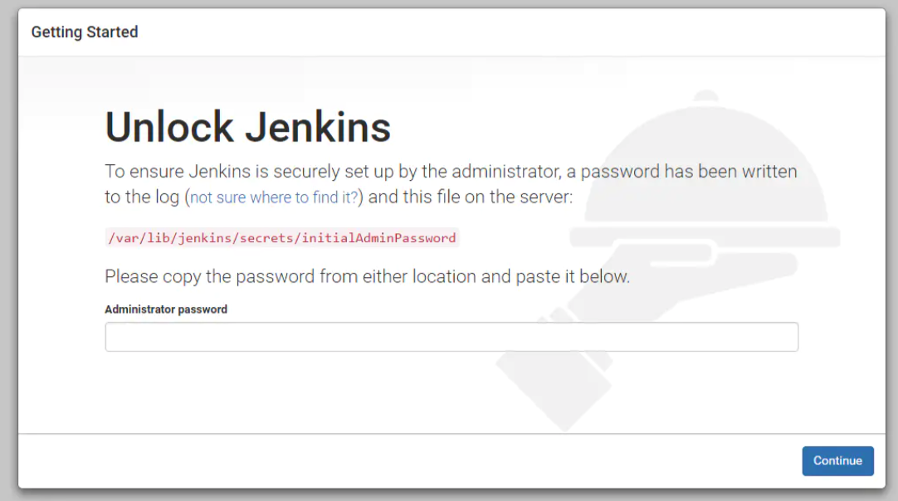
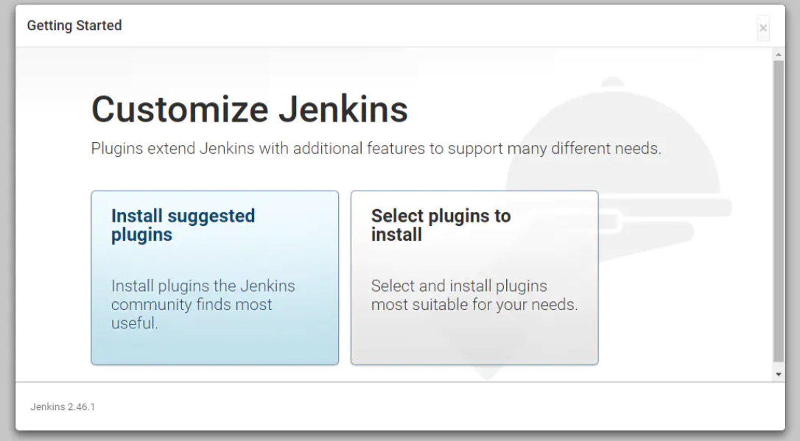
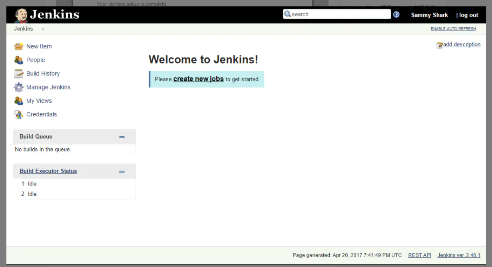

# Jenkins使用指南--入门基础

> Auth: 王海飞
>
> Data：2020-07-13
>
> Email：779598160@qq.com
>
> github：https://github.com/coco369/knowledge

------

### 前言

​	Jenkins是一个开源的、提供友好操作界面的持续集成(CI)工具，起源于Hudson（Hudson是商用的），主要用于持续、自动的构建/测试软件项目、监控外部任务的运行。

​	Jenkins 支持各种运行方式，可通过系统包、Docker 或者通过一个独立的 Java 程序。

#### 1、安装jdk

由于默认的更新源比较慢，修改为阿里云的更新源

```
vim /etc/apt/sources.list
```

清空文件内容，添加如下内容：

```
deb http://mirrors.aliyun.com/ubuntu/ xenial main restricted
deb http://mirrors.aliyun.com/ubuntu/ xenial-updates main restricted
deb http://mirrors.aliyun.com/ubuntu/ xenial universe
deb http://mirrors.aliyun.com/ubuntu/ xenial-updates universe
deb http://mirrors.aliyun.com/ubuntu/ xenial multiverse
deb http://mirrors.aliyun.com/ubuntu/ xenial-updates multiverse
deb http://mirrors.aliyun.com/ubuntu/ xenial-backports main restricted universe multiverse
deb http://mirrors.aliyun.com/ubuntu xenial-security main restricted
deb http://mirrors.aliyun.com/ubuntu xenial-security universe
deb http://mirrors.aliyun.com/ubuntu xenial-security multiverse
```

正式安装java jdk

```
apt-get update
sudo apt-get install openjdk-8-jdk
apt-get clean all
```

#### 1、安装Jenkins

**注意：这里我是单独用了一台服务器，来安装Jenkins**

 

包含在默认Ubuntu软件包中的Jenkins版本往往落后于项目本身的最新版本。 为了利用最新的修复和功能，我们将使用项目维护的软件包来安装Jenkins。

首先，我们将存储库密钥添加到系统。

```
wget -q -O - https://pkg.jenkins.io/debian/jenkins-ci.org.key | sudo apt-key add -
```

添加密钥后，系统将返回`OK` 。 接下来，我们将Debian包存储库地址附加到服务器的`sources.list` ：

```
echo deb http://pkg.jenkins.io/debian-stable binary/ | sudo tee /etc/apt/sources.list.d/jenkins.list
```

当这两个都到位时，我们将运行`update` ，以便`apt-get`将使用新的存储库：

```
sudo apt-get update
```

最后，我们将安装Jenkins及其依赖项，包括Java：

```
sudo apt-get install -y jenkins
```

 现在Jenkins及其依赖项已经到位，我们将启动Jenkins服务器
```
service jenkins restart
```

#### 2、使用Jenkins

​		要设置我们的安装，我们将使用服务器域名或IP地址访问Jenkins的默认端口`8080` ： `http:// ip:8080`。首先需要确保8080端口的防火墙已打开。



 然后选择安装插件



​	安装完成后，系统将提示您设置第一个管理用户。 可以跳过此步骤，并使用上面使用的初始密码作为`admin`继续，但是我们将花一点时间创建用户。

​    一旦第一个管理员用户到位，你应该看到一个“Jenkins准备好了！” 确认屏幕。 点击“开始使用Jenkins”来访问主要的Jenkins仪表板：




#### 3、使用Jenkins
```
//服务
sudo apt-get remove jenkins

//安装包，注意这里如果不是ubuntu那就yum
sudo apt-get remove --auto-remove jenkins

//配置和数据
sudo apt-get purge jenkins

sudo apt-get purge --auto-remove jenkins
```

#### 4、配置Jenkins

一般配置文件在两个地方：

```
/etc/init.d/jenkins

/etc/default/jenkins
```

​	默认情况下会创建一个jenkins用户，但是jenkins用户的权限不够，无法执行sh等脚本，所以需要创建新的账户，然后再给这个账户授予root权限：

```
# 创建vincent账号
useradd vincent

# 修改jenkins文件中的用户配置
vim /etc/default/jenkins
JENKINS_USER=vincent

# 给对应的文件件授予vincent账户访问的权限
chown -R vincent:vincent /var/lib/jenkins
chown -R vincent:vincent /var/log/jenkins
chown -R vincent:vincent /var/cache/jenkins

# 设置su vincent账户可以不需要密码即可切换
vim /etc/sudoers
vincent	ALL=(ALL:ALL) NOPASSWD:ALL

# 以下这句可以不考虑
chown -R vincent /home
```

**注意：**如果服务器重启了，那么jenkins需要重新启动，否则vincent用户没有root权限，无法执行sh脚本。重启命令为service jenkins restart