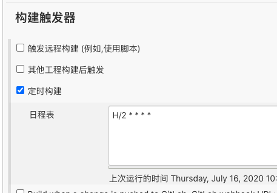
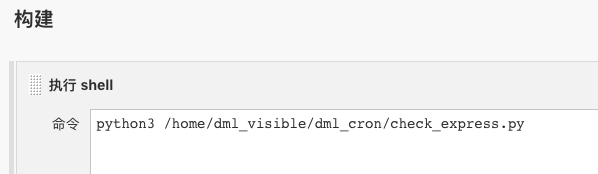
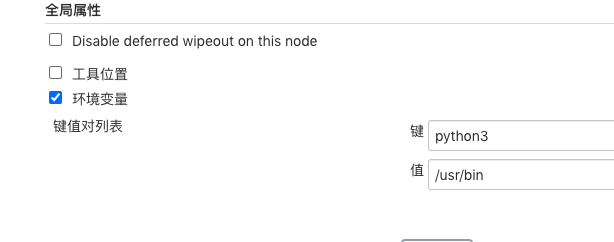
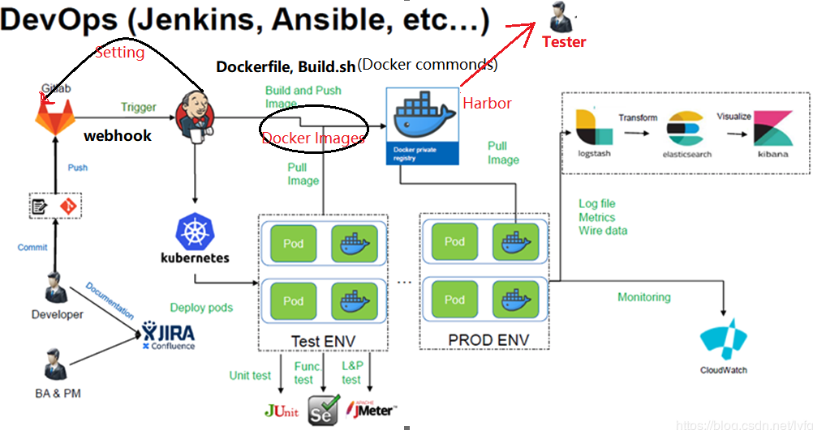

# Docker自动化部署使用指南

> Auth: 王海飞
>
> Data：2020-07-13
>
> Email：779598160@qq.com
>
> github：https://github.com/coco369/knowledge

------

#### 1. 执行定时任务

##### 1) 在jenkins中‘新建任务’ --> '构建一个自由风格的软件项目' 并在构建触发器中定时构建执行命令

##### 2）构建执行的python命令

##### 3）在‘系统管理’-->‘系统设置’中设置全局属性，配置python3的全局环境变量

#### 2. jenkins + docker + webhook实现自动化部署

**注意**：jenkins中需要安装gitlab hook plugin 、gitlab plugin插件。

