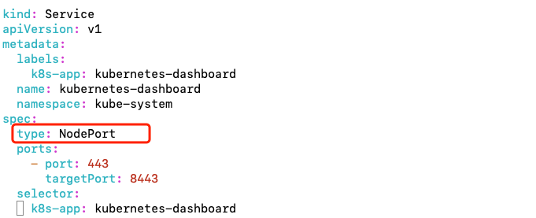
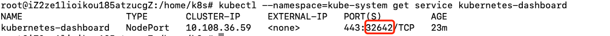

# Kubernetes-dashboard使用指南--安装使用

> Auth: 王海飞
>
> Data：2020-09-025
>
> Email：779598160@qq.com
>
> github：https://github.com/coco369/knowledge

------

### 前言

​	**K8S Dashboard**是官方的一个基于WEB的用户界面，专门用来管理K8S集群，并可展示集群的状态。K8S集群安装好后默认没有包含Dashboard，我们需要额外创建它。

### 1. 下载

先下载官方的kubernetes-dashboard.yaml，下载命令如下：

```
wget https://raw.githubusercontent.com/kubernetes/dashboard/v1.10.1/src/deploy/recommended/kubernetes-dashboard.yaml
```

编辑yaml文件

 ```
vim  kubernetes-dashboard.yaml
 ```

在kubernets-dashboard.yaml文件中添加type:NodePort字段，如下图所示：



如果需要自定义暴露到外网到端口，那么还需要配置nodePort端口，配置如下：

```
apiVersion: v1
kind: Service
metadata:
  name: demo
spec:
  type: NodePort
  ports:
  - port: 8080
    targetPort: 8080
    # 节点暴露给外部的端口（范围必须为30000-32767）
    nodePort: 30001
  selector:
    k8s-app: kubernetes-dashboard
```

### 2. 安装与使用

安装Dashboard命令

```
kubectl apply -f kubernetes-dashboard.yaml
```

启动成功后，即可通过 master节点ip地址+端口来访问，协议是https的

查看Dashboard端口信息命令：

```
kubectl --namespace=kube-system get service kubernetes-dashboard
```

通过命令可以看到默认的启动端口为32642。确保防火墙将该端口开启的情况下，通过访问IP:32642即可访问可视化界面，如下图所示：



