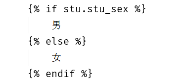
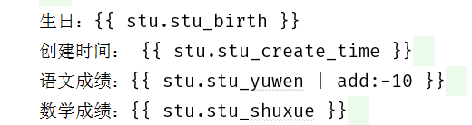
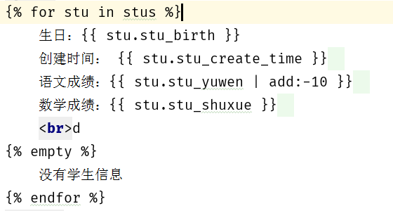
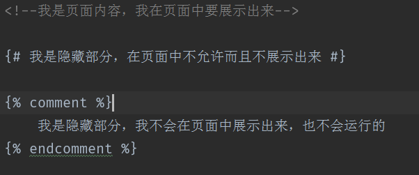
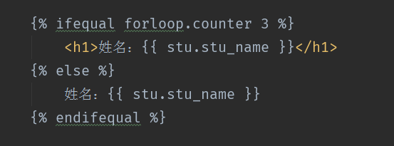
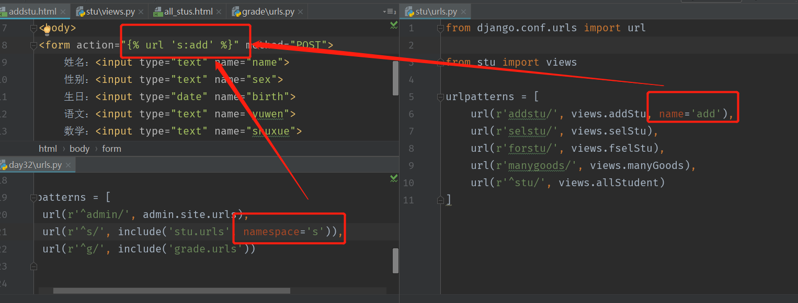
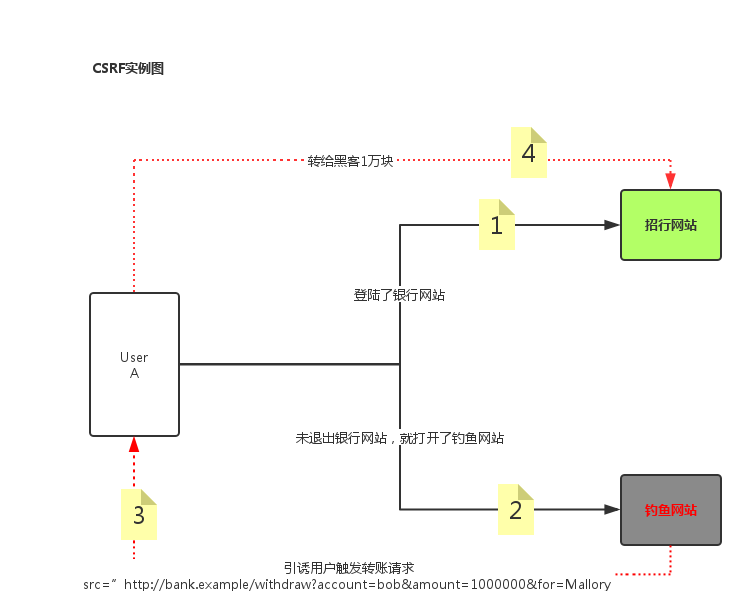

# 模板使用指南

>Auth: 王海飞
>Data：2018-04-24
>Email：779598160@qq.com
>github：https://github.com/coco369/knowledge


### 前言

　　在Django框架中，模板是可以帮助开发者快速生成呈现给用户页面的工具
　　模板的设计方式实现了我们ＭＶＴ重ＶＴ的解耦，ＶＴ有着Ｎ：Ｍ的关系，一个Ｖ可以调用任意Ｔ，一个Ｔ可以供任意Ｖ使用
   模板处理分为两个过程
    加载
    渲染

#### 1. 加载静态配置文件

    在settings.py中最底下有一个叫做static的文件夹，主要用来加载一些模板中用到的资源，提供给全局使用
    这个静态文件主要用来配置css，html，图片，文字文件等

    STATIC_URL = ‘/static/’
    STATICFILES_DIRS = [
        os.path.join(BASE_DIR, ‘static’)
    ]

    只后在模板中，首先加载静态文件，之后调用静态，就不用写绝对全路径了


#### 2. 使用静态配置文件

a) 加载渲染静态配置文件
模板中声明
```
 或者 
```

在引用资源的时候使用
```
 xxx就是相当于staticfiles_dirs的一个位置
```

b) 直接定义静态配置
```

```
其中: 展示static文件夹下有一个images文件夹，下面有一个mvc.png的图片

#### 3. 模板摘要

##### 3.1 模板主要有两个部分
```
HTML静态代码
动态插入的代码段（挖坑，填坑）也就是block
```

##### 3.2 动态填充

模板中的动态代码断除了做基本的静态填充，还可以实现一些基本的运算，转换和逻辑
如下:
<br>


模板中的变量：
    视图传递给模板的数据
    标准标识符规则
    语法 {{ var }}
    如果变量不存在，则插入空字符串

##### 3.3 模板重的点语法
```
对象.属性或者方法
索引  （student.0.name）
```
<br>



##### 3.4模板中的小弊端
    调用对象的方法，不能传递参数

##### 3.5 模板的标签
    语法 
    作用 a）加载外部传入的变量
         b）在输出中创建文本
         c）控制循环或逻辑

#### 4. if表达式
格式1：
```
    

    
```
格式2：
```
    

    

    
```
格式3：
```
    

    

    
```
<br>


#### 5. for表达式
格式1：
```
    

    

    
```
<br>



注意：当列表为空或者不存在时，执行empty之后的语句


##### 注意一下用法:
    {{ forloop.counter }} 表示当前是第几次循环，从1开始
    {{ forloop.counter0 }} 表示当前从第几次循环，从0开始
    {{forloop.revcounter}}表示当前是第几次循环，倒着数数，到1停
    {{forloop.revcounter0}}表示当前是第几次循环，倒着数数，到0停
    {{forloop.first}}是否是第一个      布尔值
    {{forloop.last}}是否是最后一个      布尔值

#### 6. 注释

##### 6.1 注释可见，可运行
```
<!-- 注释内容 -->
```

##### 6.1 单行注释注释不可见，不可运行
单行注释(页面源码中不会显示注释内容)
```
{# 被注释掉的内容 #}
```

##### 6.2 多行注释注释不可见，不可运行
```



```

<br>




#### 7. 过滤器
引入过滤器定义：{{var|过滤器}}， 作用：在变量显示前修改
过滤器有很多，比如add / lower / upper
##### 7.1 加法
```
    {{ p.page | add:5 }}
    没有减法的过滤器，但是加法里面可以加负数
    {{ p.page | add: -5 }}
```
##### 7.2 修改大小写
```
    lower / upper : {{ p.pname | lower }} 变为小写或者大写
```
##### 7.3 传参数
过滤器可以传递参数，参数需要使用引号引起来。比如join： {{ student | join ‘=’ }}
如果值为空则设置默认值：
```
    默认值：default，格式{{ var | default value }}
    如果变量没有被提供或者为False，空，会使用默认值
```
##### 7.4 定制日期格式
根据制定格式转换日期为字符串，处理时间的就是针对date进行的转换<br>
{{ dateVal | date: ‘y-m-d h:m:s’ }}<br>
如果过滤器，定义为小写的y，则返回的数据为两位的年。如果写的是大写的Y，则返回的是四位的年<br>
          定义小写的m，则返回数字的月份，如果定义大写的M，则返回英文<br>
          定义小写的h，则返回12小时制度的时，如果定义的是大写的H，则返回24小时制度的时<br>


##### 7.5 是否转义

HTML转义:
    将接收到的数据当成普通字符串处理还是当成HTML代码来渲染的一个问题
    渲染成html： {{ code | safe }}
还可以使用autoscape渲染:
    {{ autoscape off }}
    {{ endautoscape }}
不渲染的话:
    {{ autoscape on }}
    {{ endautoscape }}

##### 7.6 案例

	<!--1. 字符串‘Python’转化为大写,输出结果为：PYTHON-->
	{{ 'Python'|upper }}
	<!--2. 字符串‘PYTHON’转化为小写,输出结果为：python-->
	{{ 'PYTHON'|lower }}
	<!--3. 变量3增加4,输出结果为：7-->
	{{ 3|add:'4' }}
	<!--4. 第一个字符转化成大写形式,输出结果为：Python-->
	{{ 'python'|capfirst }}
	<!--5. 删除指定符号的值,输出结果为：studypythonisveryhappy -->
	{{ 'study python is very happy'|cut:' ' }}
	<!--6. 输出缺省值,输出结果为：nothing-->
	{{ ''|default:'nothing' }}
	<!--7. 返回第一个元素,输出结果为：p-->
	{{ 'python'|first }}
	<!--8. 返回最后一个元素,输出结果为：n-->
	{{ 'python'|last }}
	<!--9. 计算长度,输出结果为：6-->
	{{ 'python'|length }}
	<!--10. 随机一个元素,输出随机结果为：y-->
	{{ 'python'|random }}

##### 7.7 django内建过滤器大全

	1、add ：将value的值增加2。使用形式为：{{ value | add: "2"}}。
	2、addslashes：在value中的引号前增加反斜线。使用形式为：{{ value | addslashes }}。
	3、capfirst：value的第一个字符转化成大写形式。使用形式为：{{ value | capfirst }}。
	4、cut：从给定value中删除所有arg的值。使用形式为：{{ value | cut:arg}}。
	5、date: 格式化时间格式。使用形式为：{{ value | date:"Y-m-d H:M:S" }}
	6、default：如果value是False，那么输出使用缺省值。使用形式：{{ value | default: "nothing" }}。例如，如果value是“”，那么输出将是nothing
	7、default_if_none：如果value是None，那么输出将使用缺省值。使用形式：{{ value | default_if_none:"nothing" }}，例如，如果value是None，那么输出将是nothing
	8、dictsort：如果value的值是一个字典，那么返回值是按照关键字排序的结果
	使用形式：{{ value | dictsort:"name"}}，例如，
	如果value是：
	[{'name': 'python'},{'name': 'java'},{'name': 'c++'},]
	那么，输出是：
	[{'name': 'c++'},{'name': 'java'},{'name': 'python'}, ]
	9、dictsortreversed：如果value的值是一个字典，那么返回值是按照关键字排序的结果的反序。使用形式：与dictsort过滤器相同。
	10、divisibleby：如果value能够被arg整除，那么返回值将是True。使用形式：{{ value | divisibleby:arg}}，如果value是9，arg是3，那么输出将是True
	11、escape：替换value中的某些字符，以适应HTML格式。使用形式：{{ value | escape}}。例如，< 转化为 &lt;> 转化为 &gt;' 转化为  &#39;" 转化为  &quot;
	13、filesizeformat：格式化value，使其成为易读的文件大小。使用形式：{{ value | filesizeformat }}。例如：13KB，4.1MB等。
	14、first：返回列表/字符串中的第一个元素。使用形式：{{ value | first }}
	16、iriencode：如果value中有非ASCII字符，那么将其进行转化成URL中适合的编码，如果value已经进行过URLENCODE，改操作就不会再起作用。使用形式：{{value | iriencode}}
	17、join：使用指定的字符串连接一个list，作用如同python的str.join(list)。使用形式：{{ value | join:"arg"}}，如果value是['a','b','c']，arg是'//'那么输出是a//b//c
	18、last：返回列表/字符串中的最后一个元素。使用形式：{{ value | last }}
	19、length：返回value的长度。使用形式：{{ value | length }}
	20、length_is：如果value的长度等于arg的时候返回True。使用形式：{{ value | length_is:"arg"}}。例如：如果value是['a','b','c']，arg是3，那么返回True
	21、linebreaks：value中的"\n"将被<br/>替代，并且整个value使用</p>包围起来。使用形式：{{value|linebreaks}}
	22、linebreaksbr：value中的"\n"将被<br/>替代。使用形式：{{value |linebreaksbr}}
	23、linenumbers：显示的文本，带有行数。使用形式：{{value | linenumbers}}
	24、ljust：在一个给定宽度的字段中，左对齐显示value。使用形式：{{value | ljust}}
	25、center：在一个给定宽度的字段中，中心对齐显示value。使用形式：{{value | center}}
	26、rjust：：在一个给定宽度的字段中，右对齐显示value。使用形式：{{value | rjust}}
	27、lower：将一个字符串转换成小写形式。使用形式：{{value | lower}}
	30、random：从给定的list中返回一个任意的Item。使用形式：{{value | random}}
	31、removetags：删除value中tag1,tag2....的标签。使用形式：{{value | removetags:"tag1 tag2 tag3..."}}
	32、safe：当系统设置autoescaping打开的时候，该过滤器使得输出不进行escape转换。使用形式：{{value | safe}}
	33、safeseq：与safe基本相同，但有一点不同的就是：safe是针对字符串，而safeseq是针对多个字符串组成的sequence
	34、slice：与python语法中的slice相同。使用形式：{{some_list | slice:"2"}}
	37、striptags：删除value中的所有HTML标签.使用形式：{{value | striptags}}
	38、time：格式化时间输出。使用形式：{{value | time:"H:i"}}或者{{value | time}}
	39、title：转换一个字符串成为title格式。
	40、truncatewords：将value切成truncatewords指定的单词数目。使用形式：{{value | truncatewords:2}}。例如，如果value是Joel is a slug 那么输出将是：Joel is ...
	42、upper：转换一个字符串为大写形式
	43、urlencode：将一个字符串进行URLEncode
	46、wordcount：返回字符串中单词的数目
 

#### 8. 运算

##### 8.1 乘
```
    
```
如下例子： 求数学成绩的10倍的结果


##### 8.2 整除
{{ num|divisibleby:2 }}
注意：该语句的意思是，判断num值是否能被2整除，如果能的话返回True，不能的话返回False


##### 8.3 ifeuqal判断相等



<br>



#### 9. 反向解析
Url 反向解析




#### 10. 跨站请求CSRF(Cross Site Request Forgery)


csrf攻击说明

	1.用户C打开浏览器，访问受信任网站A，输入用户名和密码请求登录网站A;
	
	2.在用户信息通过验证后，网站A产生Cookie信息并返回给浏览器，此时用户登录网站A成功，可以正常发送请求到网站A;
	
	3.用户未退出网站A之前，在同一浏览器中，打开一个TAB页访问网站B;
	
	4.网站B接收到用户请求后，返回一些攻击性代码，并发出一个请求要求访问第三方站点A;
	
	5.浏览器在接收到这些攻击性代码后，根据网站B的请求，在用户不知情的情况下携带Cookie信息，向网站A发出请求。网站A并不知道该请求其实是由B发起的，所以会根据用户C的Cookie信息以C的权限处理该请求，导致来自网站B的恶意代码被执行。
	
csrf的攻击之所以会成功是因为服务器端身份验证机制可以通过Cookie保证一个请求是来自于某个用户的浏览器，但无法保证该请求是用户允许的。因此，预防csrf攻击简单可行的方法就是在客户端网页上添加随机数，在服务器端进行随机数验证，以确保该请求是用户允许的。Django也是通过这个方法来防御csrf攻击的。

理解如下图：


Django中防止跨站请求伪造使用CSRF, 即：客户端访问服务器端，在服务器端正常返回给客户端数据的时候，而外返回给客户端一段字符串，等到客户端下次访问服务器
端时，服务器端会到客户端查找先前返回的字符串，如果找到则继续，找不到就拒绝。

Django中配置：

1. 在表单中添加
    
2. 在settings中的中间件MIDDLEWARE中配置打开
    ‘django.middleware.csrf.CsrfViewMiddleware’

#### 11. 模板继承
##### 11.1 block挖坑不用看了

    关键字 block挖坑
    
    

##### 11.2 extends
    extends 继承，写在开头位置
    

##### 11.3 include
    include 加载模型进行渲染
    

#### 12. 模板继承实战

##### 12.1 定义基础模板base.html
	
	<!DOCTYPE html>
	<html lang="en">
	    <head>
	        <meta charset="UTF-8">
	        <title>
	            
	            
	        </title>
	        
	        
	        
	        
	    </head>
	    
	    
	    <body>
	
	    
	    
	
	    
	    
	    </body>
	</html>

##### 12.2 定义继承base.html的base_main.html模板

该base_main.html模板主要用于加载一些公共的js或者css，其余模板继承该模板后，可以直接加载定义好的公共的js或者css

	
	
	
	    <script type="text/javascript" src="/static/js/jquery.min.js"></script>
	


##### 12.3 定义首页index.html

在首页index.html中，我们在中使用{{ block.super }}去加载之前在base_main.html中定义好了的js文件，将它继承过来，那么在index.html中就会加载两个js文件了。实现了将公共的js文件或者css文件单独提炼出去，不需要再每个页面中重复的去写加载js的重复代码了。


	
	
	
		首页{{ user.username }}
	

	
		<link rel="stylesheet" type="text/css" href="/static/css/public.css" />
	
	
	
		{{ block.super }}
		<script type="text/javascript" src="/static/js/public.js"></script>
	
	
	
	<frameset rows="100,*" cols="*" scrolling="No" framespacing="0"
		frameborder="no" border="0">
		<frame src="" name="headmenu" id="mainFrame" title="mainFrame"><!-- 引用头部 -->
	<!-- 引用左边和主体部分 -->
		<frameset rows="100*" cols="220,*" scrolling="No"
		framespacing="0" frameborder="no" border="0">
			<frame src="" name="leftmenu" id="mainFrame" title="mainFrame">
			<frame src="" name="main" scrolling="yes" noresize="noresize"
		id="rightFrame" title="rightFrame">
		</frameset>
	</frameset>
	


