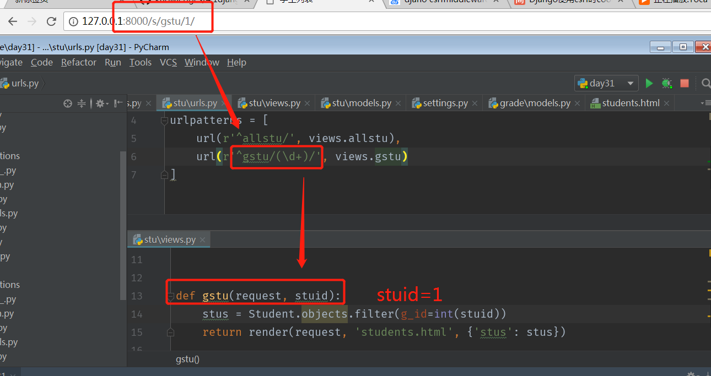
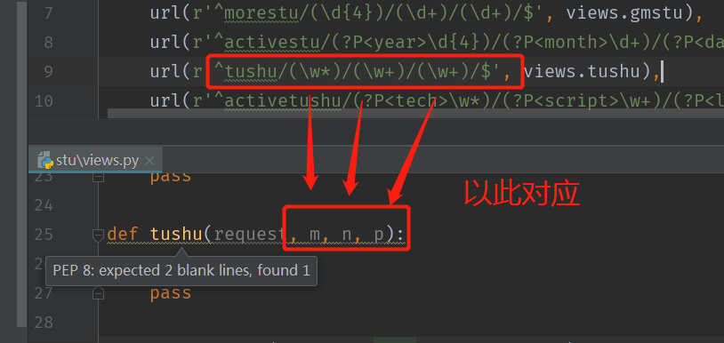
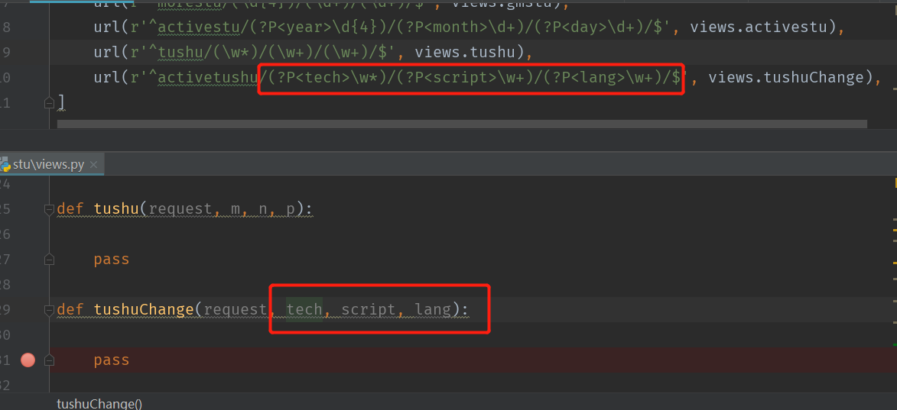
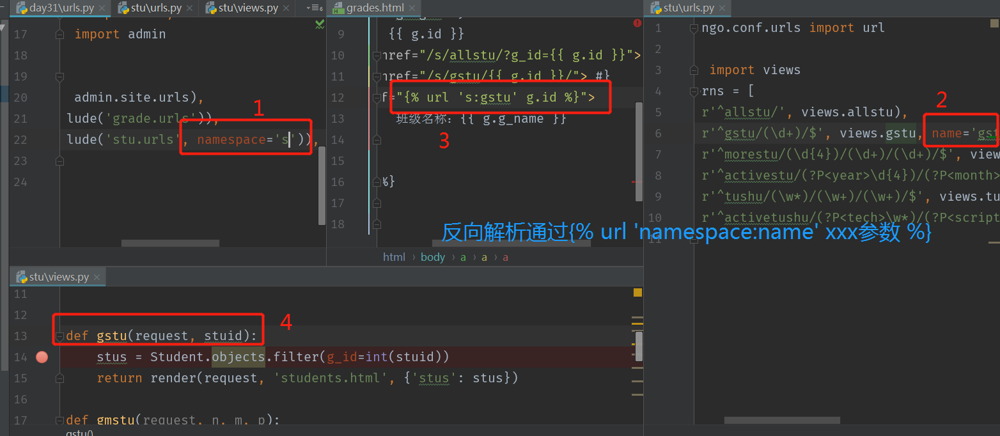
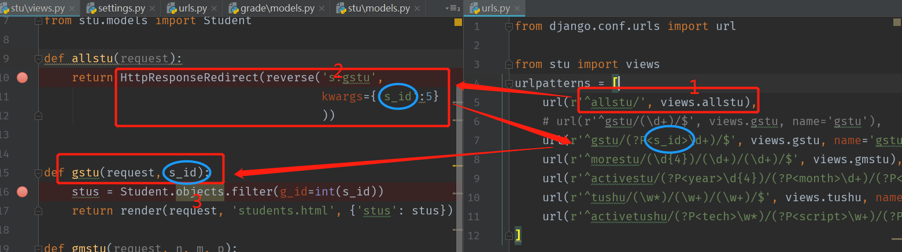
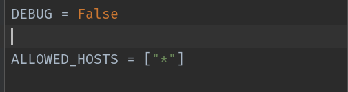
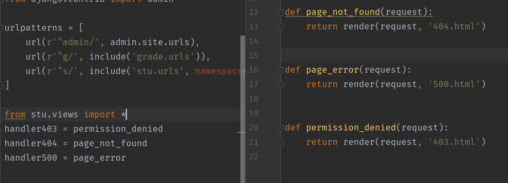
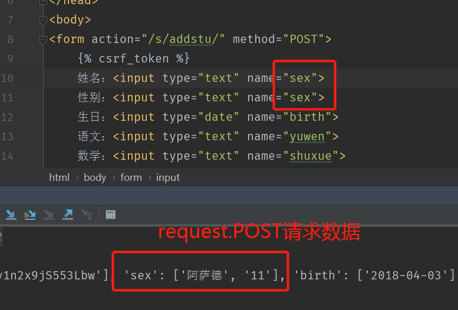

# 视图1使用指南

>Auth: 王海飞
>
>Data：2018-04-24
>
>Email：779598160@qq.com
>
>github：https://github.com/coco369/knowledge
>

### 前言
MVT模式中的V，V代表视图，在Django中的视图主要用来接受web请求，并做出响应。视图的本质就是一个python中的函数。

视图的响应分为两大类:

    1. 以json数据形式返回
    2. 以网页的形式返回
       		重定向到另一个网页
           错误视图页面（404,500等）
      视图响应的过程：浏览器中发送请求 → urls路由匹配 → 视图响应 → 回馈到浏览器

#### 1. url配置

##### 1.1 配置流程
    settings中制定根级url配置文件的路径，根路径配置变了为ROOT_URLCONF，默认为工程目录下的urls.py文件

##### 1.2 urlpatterns
    一个url实例的对象，全在根配置搞定，内部由url组成
    在django2.0以下的版本中定义url组成:
        url(r‘^learn/’, views.learn)
    在django2.0以上版本中定义path和re_path:
        from django.urls import path, re_path
        path(‘learn/’, views.learn)
        或
        re_path(‘learn/’, views.learn)  # re_path中定义的路由地址可以写正则表达式
##### 1.3 路由分发
    在工程目录的urls.py中编写配置规则，分别引入各各应用中创建的urls.py 文件
    在django2.0以下版本中定义路由分发:
        from django.conf.urls import include
        urlpatterns = [
        	url(r’^xxx/’, include(‘app.urls’))
        ]
    在django2.0以上版本中定义路由分发:
    	from django.urls import path, include
    	urlpatterns = [
            path('xxx/', include('app.urls'))
            或
            path('xxx/', include(('应用名.urls', '应用名')))
    	]
    	
    注意：
        路由配置规则注意事项：
            路由匹配时从上到下进行遍历，匹配到就不会继续向后查找了
            匹配的路由前方不需要加反斜杠

#### 2. 获取url路径的参数

##### 2.1 url传递一个参数

###### 2.1.1 Django2.0以下版本路由匹配一个参数的规则

```
如果需要从url中获取一个值，需要对正则加小括号
url(r‘^grade/(\d+)$’, views.getStudent)
注意，url匹配中添加了()取参，在请求调用的函数中必须接收 def getStudent(request, classid)
```


###### 2.1.2 django2.0以上版本路由匹配一个参数的规则

​	django2.0以上版本中定义路由时，可以使用path方式和re_path两种方式，如下定义以path形式定义路由。path方式中定义接收参数时，可以指定接受参数的类型:

```
定义接收参数的语法为: <转换器: 参数名>

定义接受参数的常用转换器为: int，str，uuid，path
```

例子如下：

定义接受整形的参数：path('params/<int: id>/', views.params)

定义接受字符串的参数：path('params/<str: name/', views.params)

定义接受uuid类型的参数：path('params/<uuid: uid>/', views.params)

定义接受路径path的参数：path('params/<path: path>/', views.params)

<span style='color:red;'>注意</span>：使用<转换器：参数名>的形式进行定义接受参数时，接受的类型由转换器指定，参数的值由指定参数名接受。

##### 2.2 url传递多个参数

###### 2.2.1 Django2.0以下版本路由匹配多个参数规则

1. 使用正在匹配路由中的参数

```
如果需要获取url路径中的多个参数，那就添加多个括号，默认按照顺序匹配路径名字，参数顺序必须固定
定义url中传递三个参数的地址：
    url(r‘^news/(\d{4})/(\d)+/(\d+)$’, views.getNews)
    实现方法：匹配年月日 def getNews(requests, year, month, day)
```

<br>

2. 使用关键词获取参数

参数也可以使用关键字参数形式,参数顺序可以任意
url(r’news/(?P<year>\d{4})/(?P<month>\d)+/(?P<day>\d+)$’, views.getNews)


<br>

<span style='color:red;'>注意</span>：定义路由时定义接受第一个参数的变量为year，接受第二个参数的变量为month，接受第三个参数的变量为day，因此在视图函数中定义接收参数的变量的顺序可以随意的定义。

###### 2.2.2 Django2.0以上版本路由匹配多个参数的规则

定义url中传递三个参数的地址：

```
path(‘params/<int: year>/<int: month>/<int: day>/’, views.params)
或者
re_path(’params/(?P<year>\d{4})/(?P<month>\d)+/(?P<day>\d+)$’, views.getNews)
或者
re_path(‘params/(\d{4})/(\d+)/(\d+)$’, views.params)
实现方法：匹配年月日 def params(requests, year, month, day)
```

<span style='color:red;'>注意</span>：定义路由时定义接受第一个参数的变量为year，接受第二个参数的变量为month，接受第三个参数的变量为day，因此在视图函数中定义接收参数的变量的顺序可以随意的定义。

#### 3. 反向解析

##### 3.1 在模板中进行反解析
关键字参数

###### 在Django2.0以下版本中定义包含url的include语法：：

```
在根urls中定义：
    url(r’^apps/’, include(‘App.urls’, namespace=’app’))
在子urls中定义：
    url(r’^hello/(\d+)’, views.hello, name=’sayhello’)
```

###### 在Django2.0以上版本中定义包含url的include语法：

```
在根urls中定义：
path(’apps/’, include((‘app.urls’, 'app'), namespace=’app’))
在应用app的子urls中定义：
path(’hello/<int：id>/’, views.hello, name=’sayhello’)
```

在模板中使用:
​        <a href=’’>
​        其中grade_id是参数，其中参数可以使用位置参数，也可以使用关键词参数，和配置urls一样




##### 3.2 在views中使用反向解析

使用反向解析优点
如果在视图中，模板中使用硬编码连接，在url配置发生改变时，需要变更的代码会非常多，这样导致我们的代码结构不是很容易维护，使用反向解析可以提高我们代码的扩展性和可维护性

```
    HttpResponseRedirect(reverse(namespace:name, kwargs = {key1 : value1, key2 : value2}))
    kwargs 是字典
```
<br>



<br>

#### 4. 视图

##### 4.1 错误视图
位置：通常在应用下的views.py中定义
错误视图：
​    404视图（页面没有被找到 page not found）
​    400视图（客户端操作错误 bad request）
​    403视图（权限错误 403 forbidden ）
​    500视图（服务器内部错误 server error）

##### 4.2 自定义错误视图

###### 4.2.1 修改debug模式

在工程的settings中修改debug模式：
注意：
​    需要在debug=False的情况下才可以
​    没有关闭debug的情况下会在界面中直接显示错误的信息
<br>



###### 4.2.2 在templates文件中定义自己的错误样式




#### 5.请求与响应

##### 5.1 HttpRequest定义
```
服务器在接收到http请求后，会根据报文创建HttpRequest对象
视图中第一个参数就是HttpRequest对象
Django框架会进行自己的包装，之后传递给视图
属性：
    path        请求的完整路径
    method   请求的方法，通常get，post
    Encoding 编码方式，常用utf-8
    Get          类似字典的参数，包含了get的所有参数
    post	       类似字典的参数，包含了post的所有参数
    Files         类似字典的参数，包含了上传的文件
    Cookies    字典，包含了所有的COOKIES
    Session    类似字典，表示会话
    方法： is_ajax()   判断是否是ajax()，通常在移动端和js中
```

##### 5.2 响应QueryDict类型
```
    1）类似字典的结构数据，与字典的区别，可以存在相同的键
    2）GET和POST都是QueryDict对象
    3）QueryDict中数据获取方式
        dict[‘name’] 或者dict.get(‘name’)
        获取指定key对应的所有值
        dict.getlist(‘name’)
```



如下，获取重复提交数据的方法：
<br>


##### 5.3 响应
    1）可以直接返回一个HttpResponse对象：
        服务器返回给客户端的数据，HttpResponse由程序员自己创建
        不使用模板，直接HttpResponse()
    2）可以返回模板
    调用模板，进行渲染，直接使用render一步到位
    返回表达式：
        render(request, template_name, context)
            request  请求体对象
            template_name  模板路径
            context  字典参数，用来填坑
    
    3）属性
        Content   返回的内容
        Charset   编码格式
        status_code  响应状态码（200,4xx,5xx）
            4xx 客户端的错误
            5xx 服务端的错误
        content_type   MIME类型，定义传输类型的，比如有xml，html，png等等，比如content_type=’image/jpg’
    4）方法
        init    初始化内容
        write(xxx) 直接写到文本
        flush 冲刷缓冲区
        set_cookie(key, value=’’, max_age=None, exprise=None)
        delete_cookie(key)   删除cookie，上面是设置
    4）重定向
        HttpResponseRedirect响应重定向：可以实现服务器内部的跳转
        Return HttpResponseRedirect(‘/xxx/xxx’)
        使用的时候推荐使用反向解析
        JsonResponse
        使用json数据的请求，通常用在异步请求上jsonResponse(dict)
        content_type是application/json
