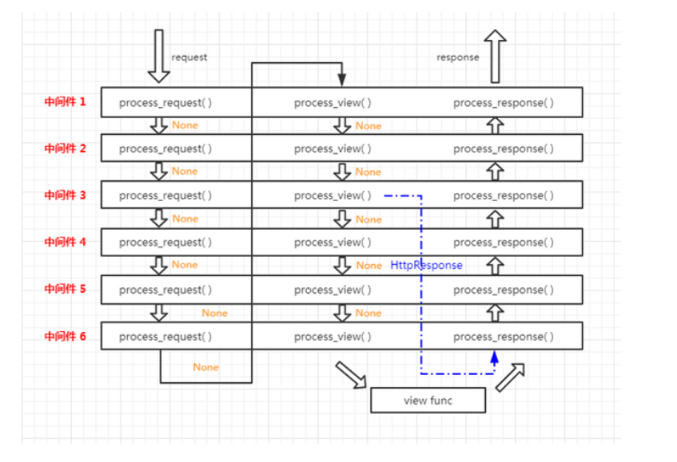
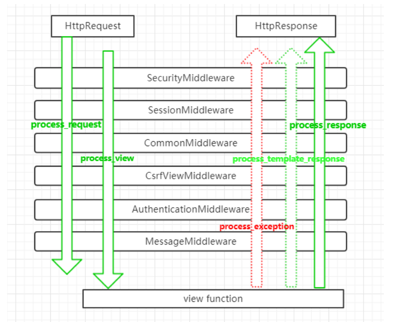

# django分页，中间件，验证码使用指南

>Auth: 王海飞
>
>Data：2018-04-27
>
>Email：779598160@qq.com
>
>github：https://github.com/coco369/knowledge 

### 前言

面向切面编程AOP中的中间件是一个最好的例子。官方的说法：中间件是一个用来处理Django的请求和响应的框架级别的钩子。它是一个轻量、低级别的插件系统，用于在全局范围内改变Django的输入和输出。

#### 1. 中间件Middleware描述

中间件：

1) 是一个轻量级的，底层的插件，可以介入Django的请求和响应的过程（面向切面编程)

2) 中间件的本质就是一个python类

注意：中间件是帮助我们在视图函数执行之前和执行之后都可以做一些额外的操作，它本质上就是一个自定义类，类中定义了几个方法，Django框架会在请求的特定的时间去执行这些方法。

思考：

什么是中间件，在settings.py中有很多的中间件，主要是用来做什么功能的呢，他们处理请求的url的过程在那些阶段呢，一般用来做那些数据的处理呢

#### 2. 中间件类函数描述

在Django项目中，在settings.py中可以查看到已经定义好的中间件，并加入我们自定义的两个中间件。

	MIDDLEWARE = [
	    'django.middleware.security.SecurityMiddleware',
	    'django.contrib.sessions.middleware.SessionMiddleware',
	    'django.middleware.common.CommonMiddleware',
	    'django.middleware.csrf.CsrfViewMiddleware',
	    'django.contrib.auth.middleware.AuthenticationMiddleware',
	    'django.contrib.messages.middleware.MessageMiddleware',
	    'django.middleware.clickjacking.XFrameOptionsMiddleware',
	   
	    'utils.middleware.TestMiddlware1',  # 加载中间件TestMiddlware1
	    'utils.middleware.TestMiddlware2',  # 加载中间件TestMiddlware2
	]

每个中间件是一个独立的类, 有几下几个方法

	1. process_request(self, request)
		执行时机在django接收到request之后, 但仍未解析出url以确定运行哪个视图函数view之前
	
	2. process_view(self, request, view_func, view_args, view_kwargs)
		执行时机在django执行完request预处理函数并确定待执行的view之后, 但在视图函数view之前
		request: HttpRequest对象
		view_fun: 是django将要调用的视图函数, 是真实的函数对象本身
		view_args: 将传入view的位置参数列表, 不包括request参数
		view_kwargs: 将传入view的字典参数

	3. process_response(self, request, response)
		该方法必须返回HttpResponse对象, 可以是原来的, 也可以是修改后的
	
		调用时机在django执行完view函数并生成response之后, 该中间件能修改response的内容, 常见用途比如压缩内容
		request是request对象
		response是从view中返回的response对象

	4. process_exception(self, request, exception)
		默认不主动调用，该方法只有在request处理过程中出了问题并且view函数抛出了一个未捕获的异常才会被调用, 可以用来发送错误通知, 将相关信息输出到日志文件, 或者甚至尝试从错误中自动恢复
		参数包括request对象, 还有view函数抛出的异常对象exception
		必须返回None或HttpResponse对象

	5. process_template_response(self, request, response)
		默认不主动调用，在视图执行render()返回后进行调用，必须返回None或HttpResponse对象

以上方法的返回值可以是None或一个HttpResponse对象，如果是None，则继续按照django定义的规则向后继续执行，如果是HttpResponse对象，则直接将该对象返回给用户。

#### 3. process_request()函数

process_request方法中有一个request参数，其表示请求。该方法中可以返回None或不用返回任何参数，或返回HttpResponse对象。如果返回None或不返回任何参数则表示继续执行其余中间件，如果是返回HttpResponse对象则直接返回HttpResponse对象给客户端，而不再执行视图函数。

访问index路由地址，在Pycharm的控制台中可以打印如下的内容： 	
	
	test1 process_request
	test2 process_request
	index views

从结果中可以发现，中间件TestMiddlware1的process_request比TestMiddlware2的process_request方法先执行，并且视图函数是最后才执行。
通过以上的打印可以得出总结：

	1）	中间件的process_request方法是按照在MIDDLEWARE中定义的先后顺序执行的。
	2）	视图函数在process_request方法执行之后才执行。

#### 4. process_response(self, request, response)函数

process_ response方法中两个参数，一个是请求request参数，一个是响应response参数，该response参数就是视图函数返回的HttpResponse对象。

修改中间件TestMiddlware1和TestMiddlware2，修改代码如下：

	class TestMiddlware1(MiddlewareMixin):
	
	    def process_request(self, request):
	        print('test1 process_request')
	
	    def process_response(self, request, response):
	        print('test1 process_response')
	        return response
	
	class TestMiddlware2(MiddlewareMixin):
	
	    def process_request(self, request):
	        print('test2 process_request')
	
	    def process_response(self, request, response):
	        print('test2 process_response')
	        return response

访问inde路由地址，在控制台中可以打印如下的内容: 

	test1 process_request
	test2 process_request
	index views
	test2 process_response
	test1 process_response

从结果中可以发现，中间件的process_request在访问视图函数之前执行，而process_reponse在视图函数之后执行。并且从执行顺序中可以得出以下结论:

	1）	多个中间件的process_request的执行顺序是按照在MIDDLEWARE中定义的先后顺序执行的。
	2）	多个中间件的process_response的执行顺序是按照MIDDLEWARE中定义的顺序逆序执行的。也就是说第一个中间件的process_request先执行，而第一个中间件的process_response最后执行。
	3）	视图函数在process_request之后执行。
	4）	视图函数在process_response之前执行。
	5）	process_response必须返回响应对象。

执行流程图:

#### 5.	process_view(self, view_func, view_args, view_kwargs) 讲解及处理流程

该方法接收四个参数:

	请求request
	view_func: 即将被执行的函数
	view_args：传递给视图函数的列表参数
	view_kwargs：传递给视图函数的字典参数

修改中间件TestMiddlware1和TestMiddlware2，修改代码如下：
	
	class TestMiddlware1(MiddlewareMixin):
	
	    def process_request(self, request):
	        print('test1 process_request')
	
	    def process_response(self, request, response):
	        print('test1 process_response')
	        return response
	
	    def process_view(self, request, view_func, view_args, view_kwargs):
	        print('test1 process_view')
	
	class TestMiddlware2(MiddlewareMixin):
	
	    def process_request(self, request):
	        print('test2 process_request')
	
	    def process_response(self, request, response):
	        print('test2 process_response')
	        return response
	
	    def process_view(self, request, view_func, view_args, view_kwargs):
	        print('test2 process_view')

访问index路由地址，在控制台中可以打印如下的内容: 

	test1 process_request
	test2 process_request
	test1 process_view
	test2 process_view
	index views
	test2 process_response
	test1 process_response

从结果中可以发现，中间件中的process_view方法在视图函数之前执行，在process_request方法之后执行，process_view执行的顺序按照MIDDLEWARE中定义中间件的顺序执行的。并且从执行的结果中可以得出以下结论:
	
	1）	process_request执行后才执行process_view
	2）	视图函数在process_view方法执行后执行
	3）	process_view方法在process_response方法之后执行，并且执行的顺序按照MIDDLEWARE中定义中间件的顺序执行

执行流程图:

#### 6.	process_template_response(self, request, response) 讲解及处理流程

该方法中接收两个参数，一个是请求request，一个是响应response，该响应response由视图函数产生。process_template_response方法默认是不执行的，只会在视图函数返回对象有一个render方法时才会被调用。

修改index视图函数
	def index(request):
		print(' index views')
	    def index_render():
	        return render(request, 'index.html')
	
	    rep = HttpResponse()
	    rep.render = index_render
	    return rep

修改中间件TestMiddlware1和TestMiddlware2，修改代码如下：

	class TestMiddlware1(MiddlewareMixin):
	
	    def process_request(self, request):
	        print('test1 process_request')
	
	    def process_response(self, request, response):
	        print('test1 process_response')
	        return response
	
	    def process_view(self, request, view_func, view_args, view_kwargs):
	        print('test1 process_view')
	
	    def process_exception(self, request, exception):
	        print('test1 process_except')
	
	    def process_template_response(self, request, response):
	        print('test1 process_template_response')
	        return response
	
	class TestMiddlware2(MiddlewareMixin):
	
	    def process_request(self, request):
	        print('test2 process_request')
	
	    def process_response(self, request, response):
	        print('test2 process_response')
	        return response
	
	    def process_view(self, request, view_func, view_args, view_kwargs):
	        print('test2 process_view')
	
	    def process_exception(self, request, exception):
	        print('test2 process_except')
	
	    def process_template_response(self, request, response):
	        print('test2 process_template_response')
	        return response

访问index路由地址，在控制台中可以打印如下的内容: 

	test1 process_request
	test2 process_request
	test1 process_view
	test2 process_view
	index views
	test2 process_template_response
	test1 process_template_response
	test2 process_response
	test1 process_response

从结果中可以得出以下结论:

	1）	process_template_response在视图函数执行完后。并且执行的顺序按照MIDDLEWARE中定义中间件的顺序逆序执行。
	2）	process_response方法是最后执行的，并且执行的顺序按照MIDDLEWARE中定义中间件的顺序逆序执行。

#### 7.	process_exception(self, request, exception) 讲解及处理流程

该方法中接收两个参数，一个是请求request，一个是异常exception，该exception是视图函数产生的异常Exception对象。process_exception方法默认是不执行的，只会在视图函数出现异常的情况才会执行。

修改index视图函数，使得index方法抛出一个异常:

	def index(request):
	    if request.method == 'GET':
	        print('index views')
	        1/0
        	return HttpResponse('我是index方法')

修改中间件TestMiddlware1和TestMiddlware2，修改代码如下：
	
	class TestMiddlware1(MiddlewareMixin):
	
	    def process_request(self, request):
	        print('test1 process_request')
	
	    def process_response(self, request, response):
	        print('test1 process_response')
	        return response
	
	    def process_view(self, request, view_func, view_args, view_kwargs):
	        print('test1 process_view')
	
	    def process_exception(self, request, exception):
	        print('test1 process_except')
	
	class TestMiddlware2(MiddlewareMixin):
	
	    def process_request(self, request):
	        print('test2 process_request')
	
	    def process_response(self, request, response):
	        print('test2 process_response')
	        return response
	
	    def process_view(self, request, view_func, view_args, view_kwargs):
	        print('test2 process_view')
	
	    def process_exception(self, request, exception):
	        print('test2 process_except')

访问index路由地址，在控制台中可以打印如下的内容: 

	test1 process_request
	test2 process_request
	test1 process_view
	test2 process_view
	index views
	test2 process_except
	test1 process_except
	test2 process_response
	test1 process_response

从结果中可以得出以下结论:

	1）	process_request最先执行。并且执行的顺序按照MIDDLEWARE中定义中间件的顺序执行。
	2）	process_view在视图函数之前执行，并且执行的顺序按照MIDDLEWARE中定义中间件的顺序执行。
	3）	视图函数在process_view方法执行后执行，在process_exception方法之前执行。
	4）	process_exception方法在process_response方法之前执行，并且执行的顺序按照MIDDLEWARE中定义中间件的顺序逆序执行。
	5）	process_response方法是最后执行的，并且执行的顺序按照MIDDLEWARE中定义中间件的顺序逆序执行。

执行流程图:

