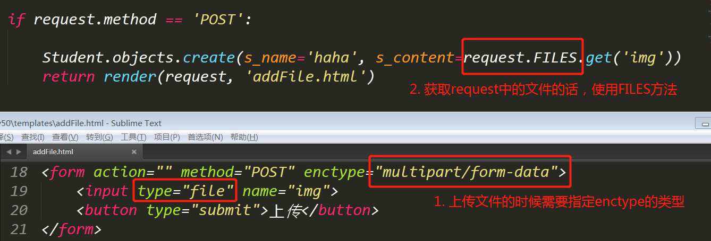

# django上传图片使用指南

>Auth: 王海飞
>
>Data：2018-05-01
>
>Email：779598160@qq.com
>
>github：https://github.com/coco369/knowledge 

### 前言

在很多的应用场景中都需要上传图片，图片可以作为头像，文章的展示图片，或者web的banner图片等等，这时候就需要了解django中怎么去设置图片上传，并且实现该上传图片的功能。

#### 1. 安装PIL库

```
pip install Pillow
```

#### 2. models中图片字段的定义

在定义的学生的models中我们创建学生头像的字段，用于上传头像图片


注意：在指定字段为ImageField类型的时候，要指定upload_to参数，表示上传的图片的保存路径

#### 3. 配置上传图片的保存路径

在工程目录下的settings.py中配置media_url和media_root路径


在工程目录下的urls.py文件中配置media的目录为静态目录

先导入static的包：


设置media：


#### 4. 在项目中创建media的目录


#### 5. 实现保存图片



注意：上传的时候，需要指定enctype=‘multipart/form-data’

#### 6. 页面中解析上传的图片信息

在数据库中用于保存图片的字段s_content的字段中存的是media下的upload/xxx.jpg地址，所以在页面解析的时候，需要加上media的目录，这样才能解析到图片在服务器中的路径


