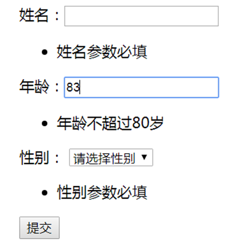

# DJANGO使用指南

>Auth: 王海飞
>
>Data：2019-01-10
>
>Email：779598160@qq.com
>
>github：https://github.com/coco369/knowledge

### 前言

Django表单的定义和模型的定义非常类似。表单的定义主要用于验证页面传递参数的正确性。比如账号注册页面，当用户在填写信息的时候，某些参数如果没有填写，或者填写错误，这些错误信息都可以通过表单校验展示出来。

#### 1. Django form表单的定义配置

##### 1.1 自定义验证字段的表单类
	
	from django import forms
	
	class StudentForm(forms.Form):
	    name = forms.CharField(max_length=10, required=True)
	    age = forms.IntegerField(required=True)
	    sex = forms.BooleanField(required=True)

注意: 定义的学生表单验证StudentForm类，该类继承form.Form

分析：示例中定义的表单类看起来和之前定义的模型类有点相识，不过它们是完全不同的模型，只是验证的字段方式，和字段的参数都是非常的类似而已。

##### 1.2 自定义验证所有字段的表单类

在Django中允许定义使用form.ModelForm来定义一个Form的子类，但它必须包含一个Meta的嵌套类，并且在Meta类中定义必填的属性model。在定义表单中继承于form.ModelForm后，该表单类会把模型中定义的变量全部'复制'到表单中来，并且字段默认设置为约束条件required=True。

在表单的Meta嵌套类中还可以定义两个可选的属性fields和exclude，这两个参数分别表示包含或者排除变量名的列表或者元组，并且fields和exclude只能选择其中一个来定义。
【示例8-37】创建表单，继承ModelForm。

class StudentModelForm(forms.ModelForm):

    class Meta:
        model = Student
		fields = ['s_name', 's_age', 's_sex']

注意: 定义了学生表单验证StudentModelForm类，继承ModelForm

分析：继承form.Form和继承form.ModelForm表单有一个重要的区别，那就是继承form.ModelForm的表单实例对象有一个save()方法。如果使用表单验证数据成功，则可以调用save()方法将信息保存到数据库中。

###### 使用表单StudenModelForm校验参数，并且保存在数据库中。

	data = {'s_name':’王五’, 's_age': 16, 's_sex': 1 }
	# 使用表单校验data中的参数
	form = StudentModelForm(data)
	# 使用save()方法保存数据
	form.save()

#### 2. 表单数据的验证

定义了name、age、sex字段组成的StudentForm表单，如下使用表单验证:

	# 在hello/app/views.py中定义创建学生的视图函数
	from app.forms import StudentForm
	
	def create_student(request):
	    if request.method == 'GET':
	        return render(request, 'stu_form.html')
	    if request.method == 'POST':
	        # 使用StudentForm表单校验request.POST中的参数
	        form = StudentForm(request.POST)
	        # 判断表单是否校验成功
	        if form.is_valid():
	            Student.objects.create(**request.POST)
	            return render(request, 'stu_form.html')
	        else:
	            # 如果表单没有校验成功，则可以从form.errors中获取到错误的信息
	            return render(request, 'stu_form.html', {'form': form})

stu_form.html页面定义的内容如下:

	在页面stu_form.html中定义如下内容
	<!DOCTYPE html>
	<html lang="en">
	<head>
	    <meta charset="UTF-8">
	    <title>添加学生页面</title>
	</head>
	<body>
	
	<form action="" method="post">
	    
	    
姓名：<input type="text" name="name">

	    
年龄：<input type="text" name="age">

	    
性别：
	    <select name="sex">
			<option value="">请选择性别</option>
	        <option value="1">男</option>
	        <option value="0">女</option>
	    </select>

	    
<input type="submit" value="提交">

	</form>
	
	</body>
	</html>

分析：如果请求为GET请求，则跳转到学生创建页面stu_form.html。当用户在学生创建页面中填写的学生姓名、年龄、性别并点击提交后，视图函数将接收POST请求，并做如下的处理。

接收POST请求，可以分以下三步骤分析：

<b>步骤1</b>：在POST请求中，通过请求request中的POST属性获取页面中通过表单form提交的数据，数据中包括姓名name、年龄age、性别sex。

<b>步骤2</b>： 使用StudentForm表单验证request.POST中提交的数据。在表单中定义了name、age、sex字段是必填字段，并且姓名的长度不能超过10个字符，如果在页面中没有填写其中任何一个参数，或者姓名字段填写太长，则表单验证不通过。

<b>步骤3</b>：判断表单是否验证通过，可以使用is_valid()方法。如果表单验证成功，则返回True，否则返回False。

<b>步骤4</b>：如果验证表单成功，则通过Student模型进行数据存储。如果验证失败，则返回stu_form.html页面，并将form参数传递给页面。

#### 3. 表单的错误提示

定义了校验页面中传递参数的StudentForm表单类，并且使用is_valid()方法判断表单校验是否成功。如果is_valid()的结果为False,则表示表单校验失败。form表单验证可以通过使用form.errors查询验证的错误信息。

创建学生页面，不填写任何的信息，直接提交，则StudentForm表单验证失败，在页面中错误信息打印。
	
	<!DOCTYPE html>
	<html lang="en">
	<head>
	    <meta charset="UTF-8">
	    <title>添加学生页面</title>
	</head>
	<body>
	
	<form action="" method="post">
	    
	    
姓名：<input type="text" name="name">{{ form.errors.name }}

	    
年龄：<input type="text" name="age">{{ form.errors.age }}

	    
性别：
	    <select name="sex">
	        <option value="">请选择性别</option>
	        <option value="1">男</option>
	        <option value="0">女</option>
	    </select>
	        {{ form.errors.sex }}
	    

	    
<input type="submit" value="提交">

	</form>
	
	</body>
	</html>

如果表单验证不通过，则可以从form.errors中获取到验证不通过的字段信息。通过form.errors.name、form.errors.age、form.errors.sex分别拿到姓名、年龄、性别的错误提示信息。但错误提示信息为英文"This field is required."，在页面中通常都是提示中文信息，因此需要自定义表单的错误信息。

##### 5. 自定义错误信息

重新定义StudentForm表单，并自定义错误信息。

	class StudentForm(forms.Form):
	    name = forms.CharField(max_length=10, min_length=3, required=True,
	                           error_messages={'required': '姓名参数必填',
	                                           'max_length': '最大长度为10个字符',
	                                           'min_length': '最小长度为3个字符'})
	    age = forms.IntegerField(required=True, max_value=80, min_value=0,
	                             error_messages={'required': '年龄参数必填',
	                                             'max_value': '年龄不超过80岁',
	                                             'min_value': '年龄不能小于0'})
	    sex = forms.BooleanField(required=True,error_messages={'required': '性别参数必填'})

分析：在示例中定义了参数error_messages，在error_messages中定义验证参数的过滤条件，如果该字段验证不通过，则从form.errors中获取的错误信息为error_messages中定义的错误信息。

1）在创建学生页面中，填写姓名字段如果超过十个字符，则提交表单后，在页面中则会提示'最大长度为10个字符'，如果填写姓名字段少于三个字符，则提交表单后，在页面中会提示'最小长度为3个字符'。

2）如果填写年龄字段大于80、或者小于0，则提示'年龄不超过80岁'或'年龄不能小于0'。

3）如果姓名、年龄、性别都没有填写，则在提交表单后，页面中会提示'姓名参数必填'或'年龄参数必填'或'性别参数必填'。
 如图8-9所示，展示部分错误信息：

