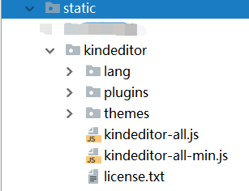
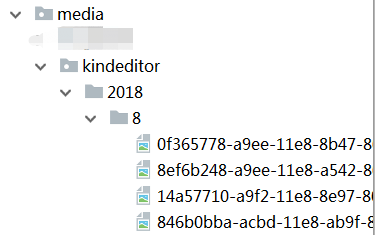

# django项目对接富文本编辑器kindeditor的使用

>Auth: 王海飞
>
>Data：2018-09-07
>
>Email：779598160@qq.com
>
>github：https://github.com/coco369/knowledge

## 前言

在Django中经常使用富文本编辑来编辑文本内容。富文本编辑器有很多可以选择，比如baiduEditor，tinymce，kindeditor等等。在此我选择使用kindeditor富文本编辑器，KindEditor 使用 JavaScript 编写，可以无缝地与 Java、.NET、PHP、ASP 等程序集成，很适合做网站的文本编辑器来使用。

### 1. kindeditor下载与配置

下载 KindEditor 最新版本，下载之后打开 examples/index.html 就可以看到演示。

步骤1： 下载[传送门地址](http://www.kindsoft.net/down.php)

步骤2： 将下载的kindeditor解压，并删除无用的asp、jsp、php等配置文件夹。

步骤3： 将kindeditor文件夹拷贝放在static中

如：
	

### 2. Django中配置

要使用kindeditor富文本编辑器需要在settings.py文件中配置静态static解析路径，以及media文件解析路径。并且在页面中进行相关js的加载，和上传路径的指定等。
	
#### 2.1 在settings.py中配置如下参数：

	STATIC_URL = '/static/'
	# 配置static的路径
	STATICFILES_DIRS = [
	    os.path.join(BASE_DIR, 'static')
	]
	
	MEDIA_URL = '/media/'
	# 配置media的路径
	MEDIA_ROOT = os.path.join(BASE_DIR, 'media')

#### 2.2 页面中加载富文本编辑器，引入js，定义uploadJson上传地址，实例化富文本输入框

步骤1：引入js, 定义上传图片等文件的地址

	
	    
	    

uploadJson参数为:'/util/upload/kindeditor'，该URL实现了上传文件的方法。该URL对应的视图函数，在步骤3中定义。

步骤2： 定义富文本编辑器的对象

	<textarea id="editor_id" name="content">

	</textarea>

步骤3：定义uploadJson实现的方法

a）在urls.py中定义处理上传文件的URL规则

	from utils.upload_image import upload_image

	 # kindeditor编辑器上传图片地址
    re_path(r'^util/upload/(?P<dir_name>[^/]+)$', upload_image, name='upload_image'),

b）在utils中定义upload_images文件，并定义upload_image函数

	# -*- coding: utf-8 -*-
	from django.http import HttpResponse
	from django.conf import settings
	from django.views.decorators.csrf import csrf_exempt
	import os
	import uuid
	import json
	import datetime as dt
	
	
	@csrf_exempt
	def upload_image(request, dir_name):
	    ##################
	    #  kindeditor图片上传返回数据格式说明：
	    # {"error": 1, "message": "出错信息"}
	    # {"error": 0, "url": "图片地址"}
	    ##################
	    result = {"error": 1, "message": "上传出错"}
	    files = request.FILES.get("imgFile", None)
	    if files:
	        result =image_upload(files, dir_name)
	    return HttpResponse(json.dumps(result), content_type="application/json")
	
	
	#目录创建
	def upload_generation_dir(dir_name):
	    today = dt.datetime.today()
	    dir_name = dir_name + '/%d/%d/' %(today.year,today.month)
	    if not os.path.exists(settings.MEDIA_ROOT + dir_name):
	        os.makedirs(settings.MEDIA_ROOT + dir_name)
	    return dir_name
	
	# 图片上传
	def image_upload(files, dir_name):
	    #允许上传文件类型
	    allow_suffix =['jpg', 'png', 'jpeg', 'gif', 'bmp']
	    file_suffix = files.name.split(".")[-1]
	    if file_suffix not in allow_suffix:
	        return {"error": 1, "message": "图片格式不正确"}
	    relative_path_file = upload_generation_dir(dir_name)
	    path=os.path.join(settings.MEDIA_ROOT, relative_path_file)
	    if not os.path.exists(path): #如果目录不存在创建目录
	        os.makedirs(path)
	    file_name=str(uuid.uuid1())+"."+file_suffix
	    path_file=os.path.join(path, file_name)
	    file_url = settings.MEDIA_URL + relative_path_file + file_name
	    open(path_file, 'wb').write(files.file.read()) # 保存图片
	    return {"error": 0, "url": file_url}

### 3. 文件上传media文件中的展示

