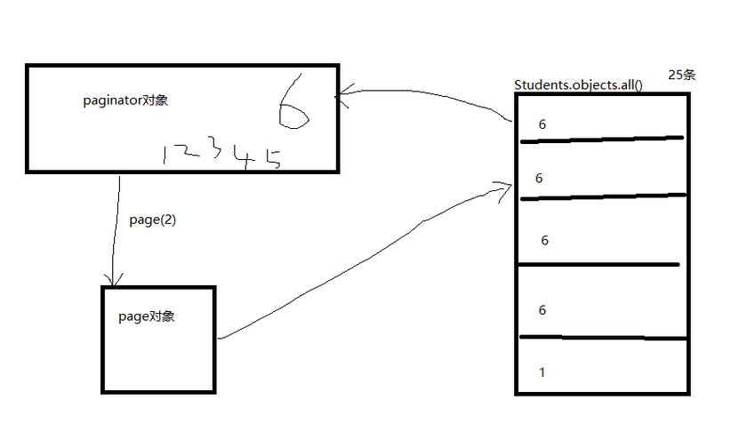
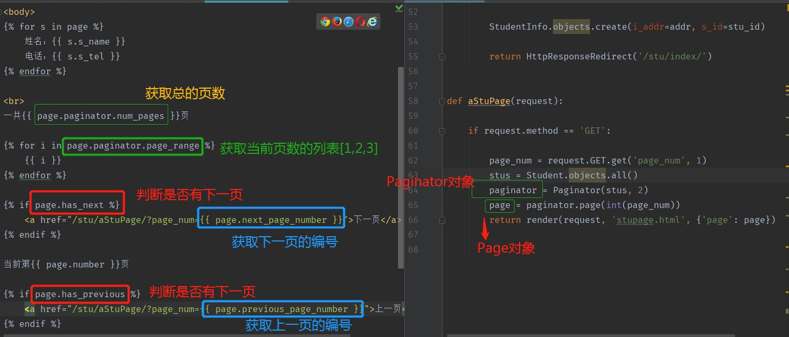

# django分页、验证码使用指南

>Auth: 王海飞
>
>Data：2018-04-27
>
>Email：779598160@qq.com
>
>github：https://github.com/coco369/knowledge 

### 前言
在django中提供了很多的插件功能，有利于开发者快速开发，比如中间件，分页器等
还提供了Pillow库，可以进行生成图片，用于登录的验证码图书设计。

#### 1.分页

##### 1.1 分页库Paginator的基本语法

django提供了分页的工具，存在于django.core中

	Paginator： 数据分页工具
	Page：具体的某一页

Paginator：

	对象创建： Paginator(数据集，每一页数据)

属性：

	count  计算和

	num_pages: 页面总和

	page_range: 页码列表，从1开始

方法：

	page(页码)：获取的一个page对象，页码不存在则抛出invalidPage的异常

##### 1.2 常见错误

	invalidPage：page()传递无效页码
	
	PageNotAnInteger：Page()传递的不是整数
	
	Empty:page()传递的值有效，但是没有数据

##### 1.3 page对象

page：

	对象获取，通过Paginator的page()方法获得

属性：

	object_list: 当前页面上所有的数据对象
	number： 当前页的页码值
	paginator: 当前page关联的Paginator对象

方法：

	has_next()   判断是否有下一页
	has_previous():  判断是否有上一页
	has_other_pages():  判断是否有上一页或下一页
	next_page_number();  返回下一页的页码
	previous_page_number(): 返回上一页的页码
	len(): 返回当前也的数据的个数

##### 1.4 Paginator对象和Page对象的关系

如下有学生表，学生表中有25条数据，通过分页，每一个6条数据，去实现分页的功能

 

##### 1.5 代码

#### 2. 验证码

在用户登录，注册以及一些敏感操作的时候，我们为了防止服务器被暴力请求，或爬虫爬取，我们可以使用验证码进行过滤，减轻服务器的压力。

验证码需要使用绘图Pillow

	Pip install Pillow
核心：

	image.ImageDraw.ImageFont

绘制流程：

	background = (10,20,30)  RGB颜色

	初始化画布 
	image = Image.new(‘RGB’,(100,50), background)

	获取画布中画笔对象
	draw = ImageDraw.Draw(image, ‘RGB’)

	绘制验证码，随机四个
	导入字体文件path表示路径
	font = ImageFont.truetype(‘path’, size)

	fontcolor = (20,40,60)
	draw.text((x,y), ‘R’, font.fontcolor)  x,y是文字左上角坐标

