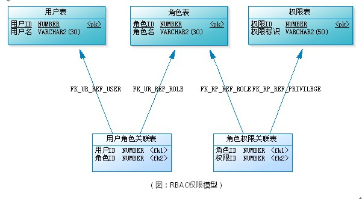
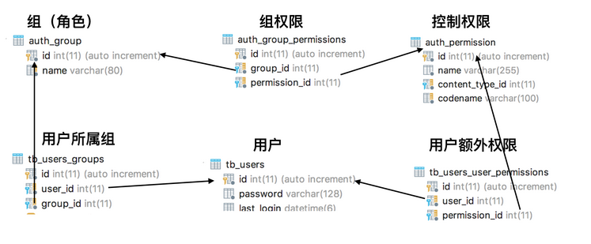
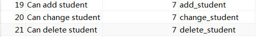
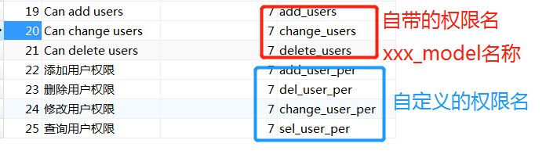

# 用户权限，用户角色使用指南

>Auth: 王海飞
>
>Data：2018-05-30
>
>Email：779598160@qq.com
>
>github：https://github.com/coco369/knowledge

### 前言

RBAC（Role-Based Access Control，基于角色的访问控制）就是用户通过角色与权限进行关联。简单地说，一个用户拥有若干角色，每一个角色拥有若干权限。这样，就构造成“用户-角色-权限”的授权模型。在这种模型中，用户与角色之间，角色与权限之间，一般者是多对多的关系。

<b>简单的权限</b>：如下就是一个简单的权限设计模式，其中包含了用户表，角色表，权限表。

<b>稍微复杂</b>一点的权限，可能设计到用户表、权限表、角色表、用户组表、额外的权限表，在django中提供了这一些列的权限相关模型，关于权限设计中表的关联关系如下：

#### 1. Django的权限项

Django用permission对象存储权限项，每个model默认都有三个permission，即add model, change model和delete model。例如，定义一个名为学生Student模型，当迁移表后，会在auth\_permission中自动创建相应的三个permission：add\_student, change\_student和delete\_student。Django还允许自定义permission。

#### 2. 创建权限

<b style="color:red;"> 1） 自定义权限 </b>

在自定义模型的Meta元中添加permissions参数，自定义权限的名称（‘codename’，‘name’）即codename为权限名，name为权限的描述。在数据库的auth_permission表中还有一个content_type字段，其表示prmission属于哪个model

	from django.db import models
	
	
	class Users(AbstractUser):
	    """
	    管理员---拓展User表
	    """
	    class Meta:
	        permissions = (
	            ('add_user_per', '添加用户权限'),
	            ('del_user_per', '删除用户权限'),
	            ('change_user_per', '修改用户权限'),
	            ('sel_user_per', '查询用户权限')
	        )

并在settings.py文件中添加如下设置：

	AUTH_USER_MODEL = 'users.Users'

 
注意：在数据库的auth_permission表中，会新增权限，包括自带的对Users管理的权限，和自定义的四个权限。

如下所示：

<b style="color:red;"> 2）创建权限 </b>

上面的方法是在定义模型的时候自定义权限，也可理解为创建系统的内置权限，如果涉及到在业务逻辑中创建权限，则可以通过Permission模型来创建权限
	
	url(r'^add_user_permission/', views.add_user_permission,name='add_user_permission'),

	from django.contrib.auth.models import Permission
	from django.contrib.contenttypes.models import ContentType
	from django.http import HttpResponse
	
	from users.models import Users
	
	
	def add_user_permission(request):
	    if request.method == 'GET':
	        # 获取当前Users模型的id值
	        content_type = ContentType.objects.get_for_model(Users)
	        # codename为权限名，name为描述，content_type为当前权限属于哪一个模型的ID
	        Permission.objects.create(codename='add_other_user_permission',
	                                  name='添加其他用户权限',
	                                  content_type=content_type)
	        return HttpResponse('创建权限成功')
	

#### 3.分配权限

<b style="color:red;"> 1）给用户直接添加某种权限 </b>

采用直接分配权限的方法，给用户添加额外的权限既用户表Users和权限Permission模型以及中间表user\_permission之间的关联关系。用户Users模型和权限Permission之间是ManyToManyField()多对多关联关系，关联字段为user_permission。

语法: 
	
添加权限：user对象.user_permission.add(permission对象1, permission对象2)

删除权限：user对象.user_permission.remove(permission对象1, permission对象2)

清空权限：user对象.user_permission.clear()

	
    url(r'^add_permission/', views.add_permission, name='add_permission'),

	from django.contrib.auth.models import Permission, User

	def add_permission(request):
	    if request.method == 'GET':
	        # 获取id=1d的用户对象
	        user = Users.objects.get(id=1)
	        # 给该用户添加权限
	        pers = Permission.objects.filter(codename__in=['add_user_per', 'del_user_per'])
	        for per in pers:
	            # 添加用户权限
	            user.user_permissions.add(per)
	            #删除权限
	            # user.user_permissions.remove(per)
	        # 清空权限
	        user.user_permissions.clear()
	        return HttpResponse('创建权限成功')

<b style="color:red;"> 2）创建组并分配对应组的权限 </b>

给组添加权限，涉及到组group表和permission权限表，以及中间关联表。其为ManyToManyFiled()关联关系，关联字段为permissions
语法: 
	
添加权限：group对象.permissions.add(permission对象1, permission对象2)

删除权限：group对象.permissions.remove(permission对象1, permission对象2)

清空权限：group对象.permissions.clear()

	
	url(r'^group_permission/', views.group_permission, name='group_permission'),
	
	def group_permission(request):
	    if request.method == 'GET':
	        # 创建超级管理用户组并给用户组增加对用户进行CRUD的权限
	        super_group = Group.objects.create(name='超级管理员')
	        pers = Permission.objects.filter(codename__in=['add_user_per', 'del_user_per', 'change_user_per', 'sel_user_per'])
	        for per in pers:
	            # 添加超级用户组的权限
	            super_group.permissions.add(per)
	            # 删除超级组的权限
	            super_group.permissions.remove(per)
	        # 清空组的权限
	        super_group.permissions.clear()
	        return HttpResponse('创建组权限')

<b style="color:red;"> 3）分配用户和权限组 </b>

给用户添加组权限，涉及到组group表和user用户表，以及中间关联表。其为ManyToManyFiled()关联关系，关联字段为groups
语法: 
	
添加权限：user对象.groups.add(groups对象1, groups对象2)

删除权限：user对象.groups.remove(groups对象1, groups对象2)

清空权限：user对象.groups.clear()

	url(r'^user_group/', views.user_group, name='user_group'),

	def user_group(request):
	    if request.method == 'GET':
	        # 给id为1的用户分配超级管理员组的权限
	        # 获取超级管理员组group对象
	        super_group = Group.objects.get(name='超级管理员')
	        # 获取id=1d的用户对象
	        user = Users.objects.get(id=1)
	        # 添加超级用户组的权限
	        user.groups.add(super_group)
	        # 删除超级组的权限
	        # user.groups.remove(super_group)
	        # 清空组的权限
	        # user.groups.clear()
	        return HttpResponse('创建用户组权限')

#### 4. 检测用户是否有某权限,和所有权限，组权限

语法：用户对象.has_perm('模型名.权限codename')

查询用户所有的权限：<b>user.get\_all\_permissions()</b>方法列出用户的所有权限，返回值是permission name

查询用户的组权限：<b>user.get\_group\_permissions()</b>方法列出用户所属group的权限，返回值是permission name

	def user_permission(request):
	    if request.method == 'GET':
	        # 获取id=1d的用户对象
	        user = Users.objects.get(id=1)
	        # 查看用户的所有权限
	        all_perm = user.get_all_permissions()
	        # 查看用户的组权限
	        group_perm = user.get_group_permissions()
	        # 查询用户是否有add_user_per权限
	        if user.has_perm('users.add_user_per'):
	            return HttpResponse('用户有add_user_per权限')
	        else:
	            return HttpResponse('用户没有add_user_per权限')

#### 5. 权限校验，使用permission_required装饰器

使用permission_required对权限进行校验，如果没有当前登录系统的用户没有该权限则跳转到登录页面，如果当前用户有该权限，则进行访问对应的视图函数。

语法：@permission_required('应用app名.权限名codename')
	
	url(r'^add_user_html/', views.add_user_html, name='add_user_html'),
	
	from django.contrib.auth.decorators import permission_required
	
	@permission_required('users.add_users')
	def add_user_html(request):
	    if request.method == 'GET':
	        return HttpResponse('该方法需要添加用户权限才可访问')

#### 6. 测试

定义登录的路由，并实现登录操作，当用户登录后，再次访问add_user_html路由地址，则可以访问到对应的视图函数，如果用户没有登录则因为权限问题访问不了add_user_html路由对应的视图函数。

#### 7. 首页index.html中通过权限控制按钮

在模版中使用：模版中使用全局变量perms存储当前用户的所有权限。通过{{ perms.应用名 }}可打印出所有的权限。

在模板中也可以直接通过{{ user }}获取当前登录系统的用户信息。

使用语法格式：

	
	    <!-- 这里是有权限才显示的内容 -->
	

首页index.html中如下控制按钮的权限：
	
	
	
	
	    首页
	
	
	

	    <!--模版中使用全局变量perms存储当前用户的所有权限-->
	    {{ perms.users }}
	    <!--判断当前用户是否为超级管理员-->
	    {{ user.is_superuser }}

	    
	        
添加用户管理

	    
	    
	        
删除用户管理

	    
	    
	        
修改用户管理

	    
	    
	        
查询用户管理

	    
	
