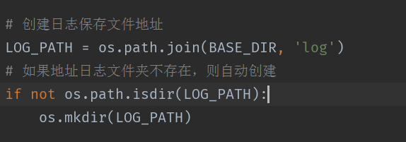
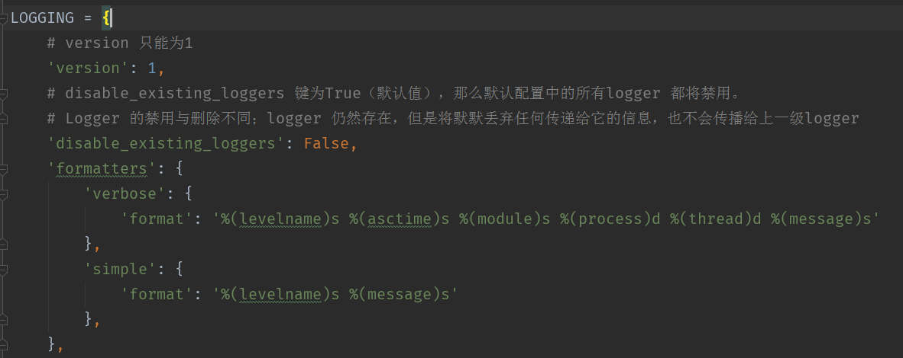
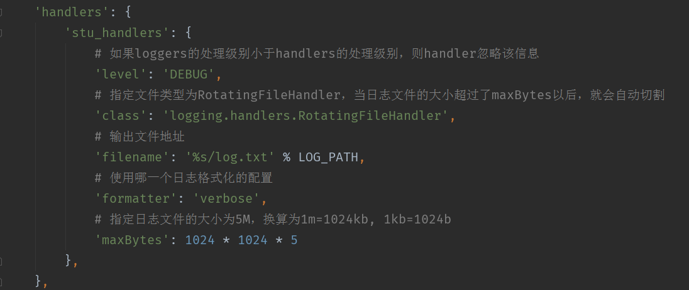
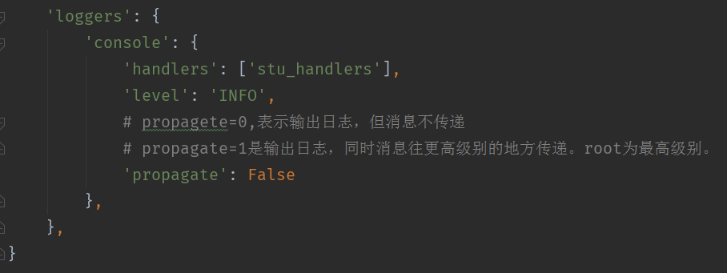
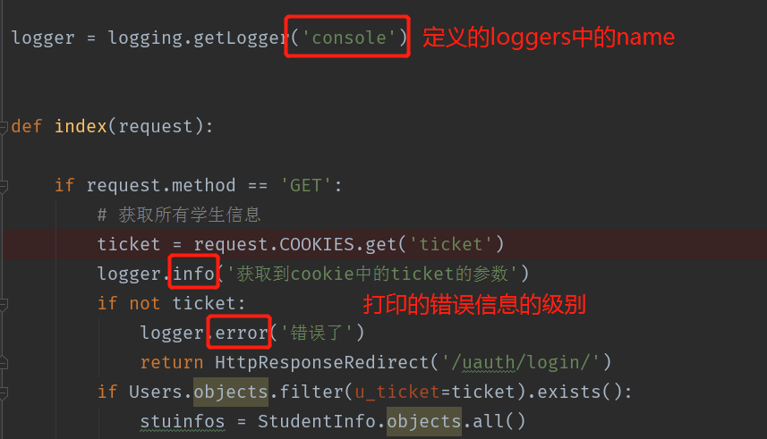
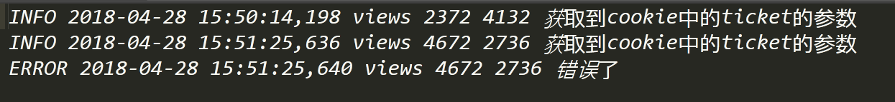

# 日志使用指南

>Auth: 王海飞
>
>Data：2018-04-28
>
>Email：779598160@qq.com
>
>github：https://github.com/coco369/knowledge 

### 前言
在django中对日志记录提供了很好的支持，日志文件在开发环境中以及在线上环境或者在测试环境中都可以很好的反应程序的执行情况，以及出现bug的时候，准确的定位bug的位置，请求方法，错误原因等。所以说日志对于程序猿来说是一个开发者必备的必须了解且精通的东西。一下就来大致讲解下日志的配置以及使用，以及调试等

#### 1. 日志logging模块

logging模块可以收集记录错误，警告等调试信息，在程序中可以捕获这些信息，并且甚至可以将错误的重要信息等都可以通过邮件发送给开发者

##### 1.1 logging的组成

	Loggers
	
	Handlers

	Filters

	Formatters

##### 1.1 Loggers
	
Logger 为日志系统的入口。每个logger 是一个具名的容器，可以向它写入需要处理的消息。

每个logger 都有一个日志级别。日志级别表示该logger 将要处理的消息的严重性。

Python 定义以下几种日志级别：

	DEBUG：用于调试目的的底层系统信息

	INFO：普通的系统信息

	WARNING：表示出现一个较小的问题。

	ERROR：表示出现一个较大的问题。

	CRITICAL：表示出现一个致命的问题。

日志级别等级CRITICAL > ERROR > WARNING > INFO > DEBUG > NOTSET

##### 1.2 Handlers

Handler 决定如何处理logger 中的每条消息。它表示一个特定的日志行为。

与logger 一样，handler 也有一个日志级别。<u>如果消息的日志级别小于handler 的级别，handler 将忽略该消息。</u>

Logger 可以有多个handler，而每个handler 可以有不同的日志级别。

##### 1.3 Filters

Filter 用于对从logger 传递给handler 的日志记录进行额外的控制。

##### 1.4 Formatters

日志记录需要转换成文本。

Formatter 表示文本的格式。Fomatter 通常由包含日志记录属性的Python 格式字符串组成；

你也可以编写自定义的fomatter 来实现自己的格式。

如下展示了formatters格式:

#### 2.配置logging模块

在settings.py文件中配置

##### 2.1 创建日志所在目录

##### 2.2 定义LOGGING的格式

##### 2.2 定义handler的格式

##### 2.2 定义loggers的格式

注意：loggers的level的级别一定要大于handlers的级别，否则handlers会忽略掉该信息的。

#### 3. 使用logging打印日志

#### 4. 查看log文件中日志打印的记录

