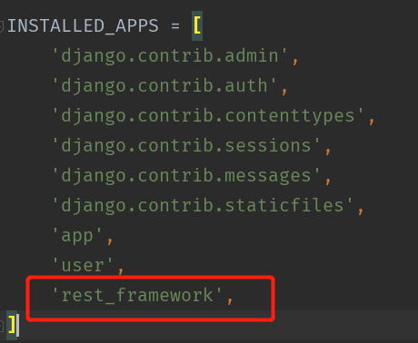
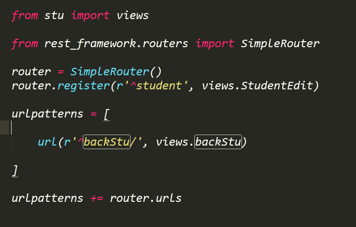

# restful使用指南1

>Auth: 王海飞
>
>Data：2018-05-03
>
>Email：779598160@qq.com
>
>github：https://github.com/coco369/knowledge 

### 前言

REST是所有Web应用都应该遵守的架构设计指导原则。 

Representational State Transfer，翻译是”表现层状态转化”。 

REST核心: <b>资源， 状态转移， 统一接口 </b>

<b>资源:</b> 是REST最明显的特征,是指对某类信息实体的抽象，资源是服务器上一个可命名的抽象概念，资源是以名词为核心来组织的，首先关注的是名词。

<b>状态转移:</b> 是指客户端痛服务端进行交互的过程中，客户端能够通过对资源的表述，实现操作资源的目的

<b>统一接口:</b> REST要求，必须通过统一的接口来对资源执行各种操作。对于每个资源只能执行一组有限的操作。 比如，客户端通过HTTP的4个请求方式(POST, GET, PUT, PATCH)来操作资源，也就意味着不管你的url是什么，不管请求的资源是什么但操作的资源接口都是统一的。

GET用来获取资源，POST用来新建资源（也可以用于更新资源），PUT(PATCH)用来更新资源，DELETE用来删除资源。

#### 1. api定义规范

	http://xxx.com/api/

#### 2. 资源

在RESTful架构中，每个网址代表一种资源（resource），所以网址中不能有动词，只能有名词，而且所用的名词往往与数据库的表格名对应。一般来说，数据库中的表都是同种记录的"集合"（collection），所以API中的名词也应该使用复数。

举例来说，有一个API提供动物园（zoo）的信息，还包括各种动物和雇员的信息，则它的路径应该设计成下面这样。

	
	https://api.example.com/v1/zoos
	
	https://api.example.com/v1/animals
	
	https://api.example.com/v1/employees

#### 3. http请求方式

	GET（SELECT）：从服务器取出资源（一项或多项）

	POST（CREATE）：在服务器新建一个资源

	PUT（UPDATE）：在服务器更新资源（客户端提供改变后的完整资源）

	PATCH（UPDATE）：在服务器更新资源（客户端提供改变的属性）

	DELETE（DELETE）：从服务器删除资源

例子：

	GET /zoos：列出所有动物园

	POST /zoos：新建一个动物园

	GET /zoos/ID：获取某个指定动物园的信息

	PUT /zoos/ID：更新某个指定动物园的信息（提供该动物园的全部信息）

	PATCH /zoos/ID：更新某个指定动物园的信息（提供该动物园的部分信息）

	DELETE /zoos/ID：删除某个动物园

	GET /zoos/ID/animals：列出某个指定动物园的所有动物

	DELETE /zoos/ID/animals/ID：删除某个指定动物园的指定动物

#### 4. filter过滤

	?page=2&per_page=100：指定第几页，以及每页的记录数。

	?sortby=name&order=asc：指定返回结果按照哪个属性排序，以及排序顺序。

	?animal_type_id=1：指定筛选条件

#### 5. 状态码

服务端向用户返回请求api的结果，在结果中包含了status codes 状态码的，可以通过状态码去判断请求api的状态是成功还是失败

	200 OK - [GET]：服务器成功返回用户请求的数据，该操作是幂等的（Idempotent）。
	
	201 CREATED - [POST/PUT/PATCH]：用户新建或修改数据成功。
	
	202 Accepted - [*]：表示一个请求已经进入后台排队（异步任务）
	
	204 NO CONTENT - [DELETE]：用户删除数据成功。
	
	400 INVALID REQUEST - [POST/PUT/PATCH]：用户发出的请求有错误，服务器没有进行新建或修改数据的操作，该操作是幂等的。
	
	401 Unauthorized - [*]：表示用户没有权限（令牌、用户名、密码错误）。
	
	403 Forbidden - [*] 表示用户得到授权（与401错误相对），但是访问是被禁止的。
	
	404 NOT FOUND - [*]：用户发出的请求针对的是不存在的记录，服务器没有进行操作，该操作是幂等的。
	
	406 Not Acceptable - [GET]：用户请求的格式不可得（比如用户请求JSON格式，但是只有XML格式）。
	
	410 Gone -[GET]：用户请求的资源被永久删除，且不会再得到的。
	
	422 Unprocesable entity - [POST/PUT/PATCH] 当创建一个对象时，发生一个验证错误。
	
	500 INTERNAL SERVER ERROR - [*]：服务器发生错误，用户将无法判断发出的请求是否成功。

#### 6. 错误处理

如果状态码是4xx，就应该向用户返回出错信息。一般来说，返回的信息中将error作为键名，出错信息作为键值即可。
	
	{
		error: '错误信息'
	}

#### 7. django中使用restful

	pip install djangorestframework

	pip install django-filter  # Filtering support

#### 8. settings.py配置的修改
	
在工程目录中的settings.py文件的INSTALLED_APPS中需要添加rest_framework

#### 9. 定义url

 

#### 10. 简单的CRUD

具体的详细介绍在[地址](django/9.1django_restful3.md)

导入相关的信息：

	from rest_framework import mixins, viewsets

CRUD对应的增删改查：
	
	增： POST http://127.0.0.1:8080/stu/addStu/
	
	删： DELETE http://127.0.0.1:8080/stu/addStu/1/
	
	改： UPDATE http://127.0.0.1:8080/stu/addStu/1/
	
	查： GET http://127.0.0.1:8080/stu/addStu/1/

