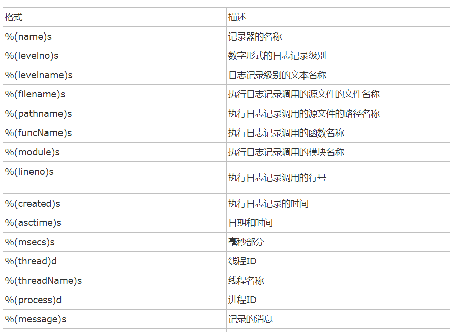

# 日志使用指南

>Auth: 王海飞
>
>Data：2018-04-28
>
>Email：779598160@qq.com
>
>github：https://github.com/coco369/knowledge 

### 前言
在django中对日志记录提供了很好的支持，日志文件在开发环境中以及在线上环境或者在测试环境中都可以很好的反应程序的执行情况，以及出现bug的时候，准确的定位bug的位置，请求方法，错误原因等。所以说日志对于程序猿来说是一个开发者必备的必须了解且精通的东西。一下就来大致讲解下日志的配置以及使用，以及调试等

#### 1. 日志logging模块

logging模块可以收集记录错误，警告等调试信息，在程序中可以捕获这些信息，并且甚至可以将错误的重要信息等都可以通过邮件发送给开发者

##### 1.1 logging的组成

	Loggers
	
	Handlers

	Filters

	Formatters

##### 1.1 Loggers
	
Logger 为日志系统的入口。每个logger 是一个具名的容器，可以向它写入需要处理的消息。

每个logger 都有一个日志级别。日志级别表示该logger 将要处理的消息的严重性。

Python 定义以下几种日志级别：

	DEBUG：用于调试目的的底层系统信息

	INFO：普通的系统信息

	WARNING：表示出现一个较小的问题。

	ERROR：表示出现一个较大的问题。

	CRITICAL：表示出现一个致命的问题。

日志级别等级CRITICAL > ERROR > WARNING > INFO > DEBUG > NOTSET

##### 1.2 Handlers

Handler 决定如何处理logger 中的每条消息。它表示一个特定的日志行为。

与logger 一样，handler 也有一个日志级别。<u>如果消息的日志级别小于handler 的级别，handler 将忽略该消息。</u>

Logger 可以有多个handler，而每个handler 可以有不同的日志级别。

##### 1.3 Filters

Filter 用于对从logger 传递给handler 的日志记录进行额外的控制。

##### 1.4 Formatters

日志记录需要转换成文本。

Formatter 表示文本的格式。Fomatter 通常由包含日志记录属性的Python 格式字符串组成；

你也可以编写自定义的fomatter 来实现自己的格式。

如下展示了formatters格式:

#### 2.配置日志

在settings.py文件中配置LOGGING日志信息：

步骤1： 先判断日志文件夹的地址是否存在，如果不存在则新建
	
	# 日志文件夹的路径
	LOG_PATH = os.path.join(BASE_DIR, 'logs')
	# 如果日志文件夹地址不存在，则自动创建
	if not LOG_PATH:
	    os.mkdir(LOG_PATH)

步骤2： 定义LOGGING中的信息，比如loggers，formatters，handlers等

	# 配置日志
	LOGGING = {
	    # 必须是1
	    'version': 1,
	    # 默认为True，禁用日志
	    'disable_existing_loggers': False,
	    # 定义formatters组件，定义存储日志中的格式
	    'formatters':{
	        'default': {
	            'format': '%(levelno)s %(name)s %(asctime)s'
	        }
	    },
	    # 定义loggers组件，用于接收日志信息
	    # 并且将日志信息丢给handlers去处理
	    'loggers':{
	        '':{
	            'handlers': ['console'],
	            'level': 'INFO'
	        }
	    },
	    # 定义handlers组件，用户写入日志信息
	    'handlers':{
	        'console':{
	            'level': 'INFO',
	            # 定义存储日志的文件
	            'filename': '%s/log.txt' % LOG_PATH,
	            # 指定写入日志中信息的格式
	            'formatter': 'default',
	            # 指定日志文件超过5M就自动做备份
	            'class': 'logging.handlers.RotatingFileHandler',
	            'maxBytes': 5 * 1024 * 1024,
	        }
	    }
	}

注意：loggers的level的级别一定要大于handlers的级别，否则handlers会忽略掉该信息的。

#### 3. 使用logging打印日志

1. 在程序中可以使用logging获取日志对象，然后进行日志打印：
	
		import logging
	
		# 获取logger，logger用于接收日志信息，并且丢给handlers进行处理
		logger = logging.getLogger(__name__)
	
		# logger接收日志信息的几个方法，如下:
		logger.debug()
		logger.info()
		logger.warning()
		logger.error()
		logger.critical()

2. 定义日志处理的中间件，进行日志的打印处理

定义日志中间件logMiddleware.py文件，定义LoggingMiddleware类，该类继承MiddlewareMixin，并重构process_request和proccess_response方法：

		import logging
		import time
		
		try:
		    # needed to support Django >= 1.10 MIDDLEWARE
		    from django.utils.deprecation import MiddlewareMixin
		except ImportError:
		    # needed to keep Django <= 1.9 MIDDLEWARE_CLASSES
		    MiddlewareMixin = object
		
		# 获取logger
		logger = logging.getLogger(__name__)
		
		class LogMiddleware(MiddlewareMixin):
		
		    def process_request(self, request):
		        # url到服务器的时候，经过中间件最先执行的方法
		        request.init_time = time.time()
		        request.init_body = request.body
		
		    def process_response(self, request, response):
		        try:
		            # 经过中间件，最后执行的方法
		            # 计算请求到响应的时间
		            count_time = time.time() - request.init_time
		            # 获取响应的状态码
		            code = response.status_code
		            # 获取请求的内容
		            req_body = request.init_body
		            # 获取想要的内容
		            res_body = response.content
		
		            msg = '%s %s %s %s' % (count_time, code, req_body, res_body)
		            # 写入日志信息
		            logger.info(msg)
		        except Exception as e:
		            logger.critical('log error, Exception:%s' % e)
		
		        return response

		
