# restful使用指南2

>Auth: 王海飞
>
>Data：2018-05-04
>
>Email：779598160@qq.com
>
>github：https://github.com/coco369/knowledge 

#### 1. 修改响应的结构

##### 1.1 修改settings.py中的返回数据结构的配置信息

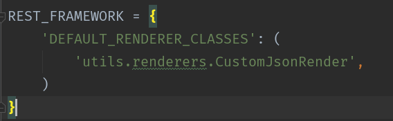

注意：定义default_renderer_classes参数，指定render的时候使用我们自定义的CustomJsonRender的类方法

##### 1.2 重构JSONRenderer下的render方法

该方法继承了JSONRenderer并且重构了render方法，修改了返回的数据结构

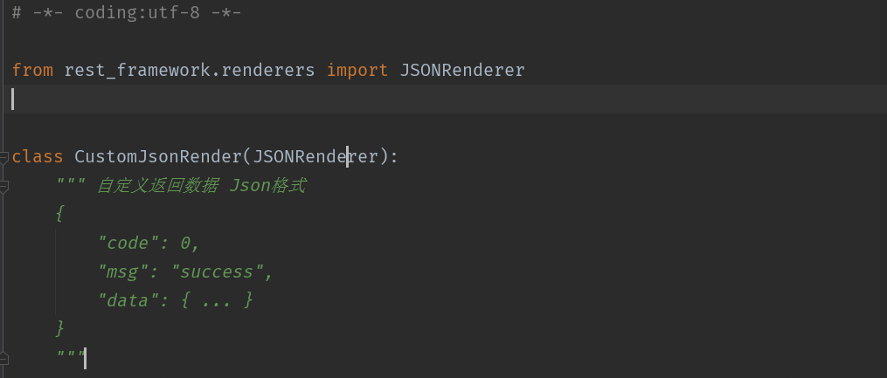

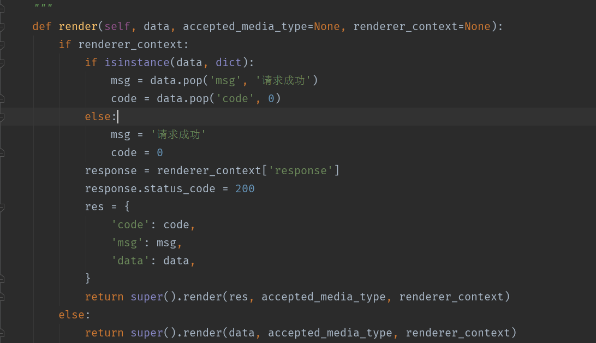
	

#### 2. 异常的响应的结构

自定义异常处理，一定需要继承from rest_framework.exceptions import APIException
中的APIException，在编写自己的异常处理的方法

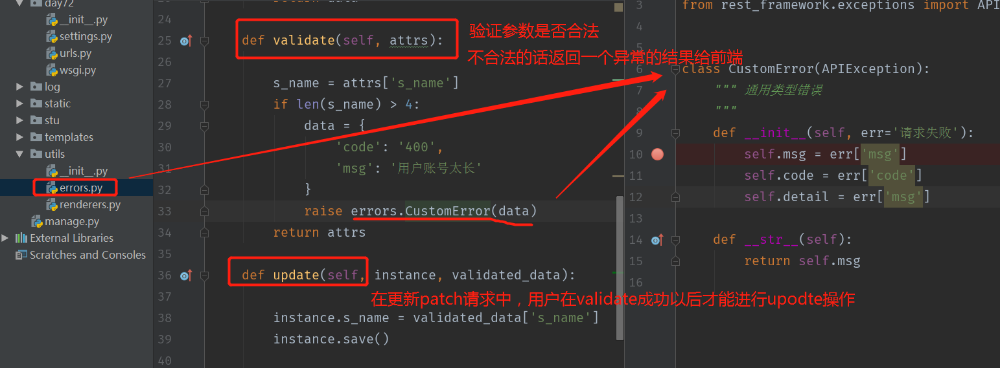

#### 3. PATCH请求，传入空置处理

##### 3.1 空置处理

该patch请求中，我们想要修改id为3的学生的姓名，但是姓名我们传递一个空置，查看返回结果如下:

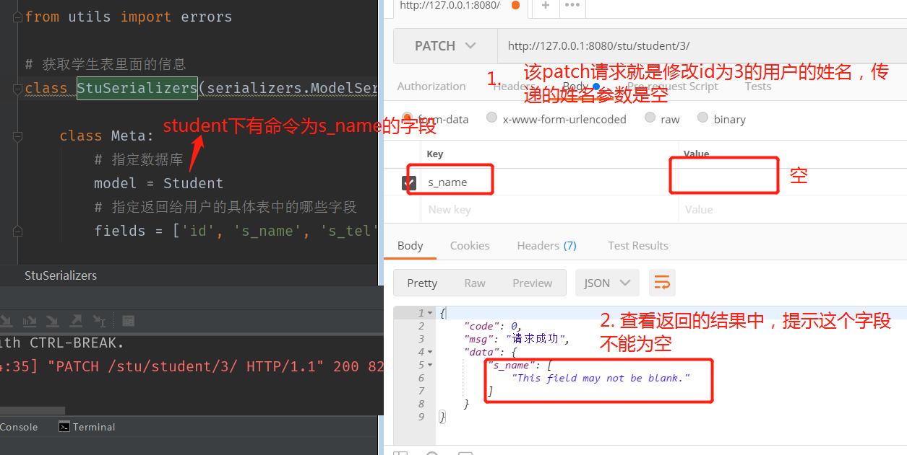

##### 3.2 修改

在serializer中定义s_name的序列化，指定错误的信息，为空的话，提示响应的错误信息

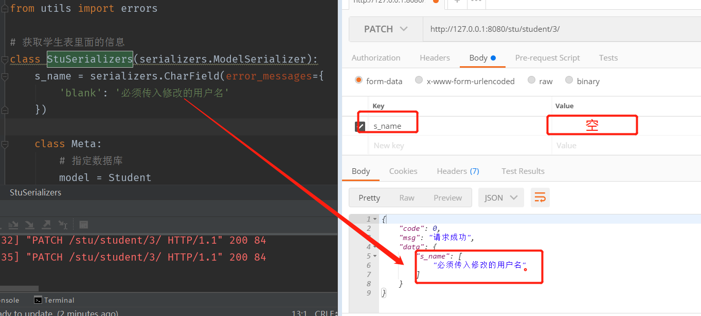

***

#### 4. 页面异步提交api接口请求，并且在前端通过js刷新页面

##### 4.1. 创建实例

###### 4.1.1 后端业务逻辑处理 

创建url，定义register，创建serializer_class等

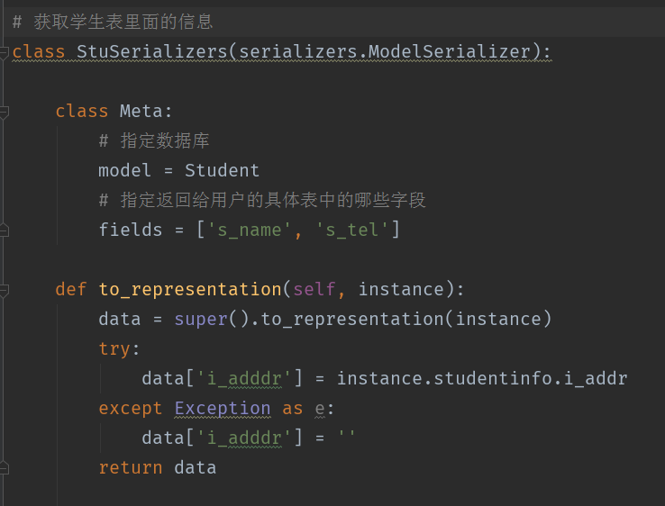

##### 4.2 前端ajax请求get获取数据并刷新

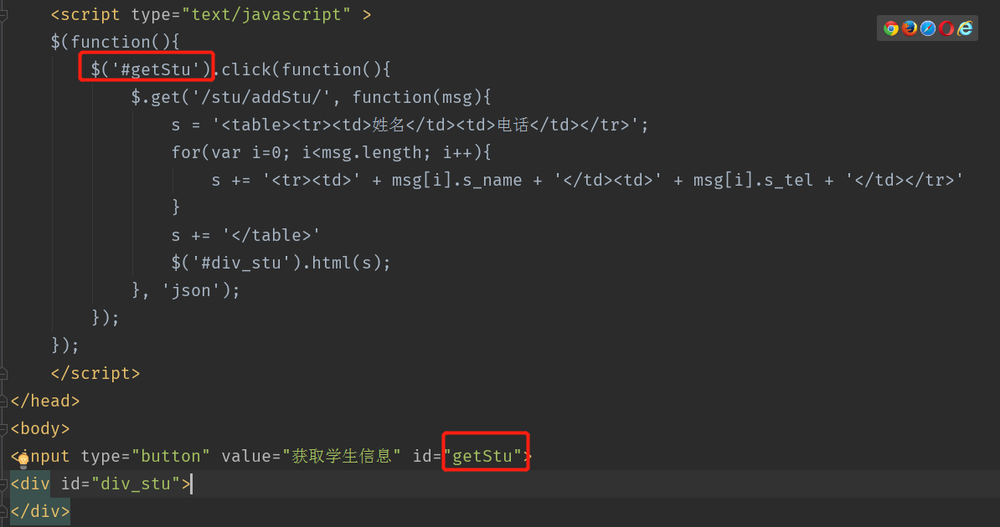

##### 4.3 前端ajax请求delete删除数据

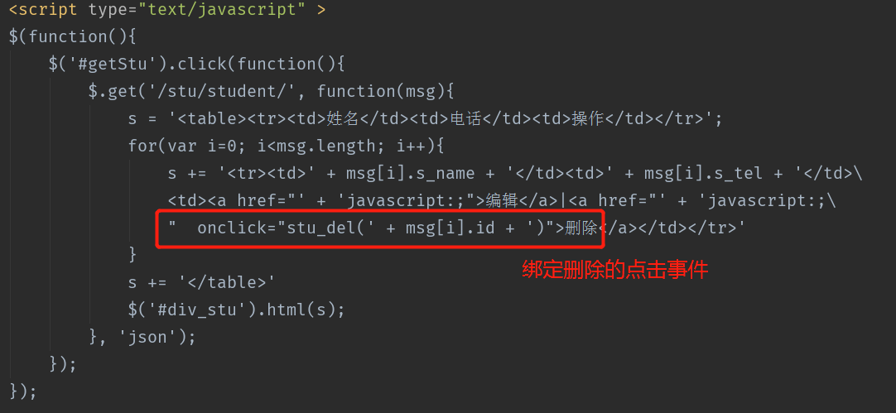

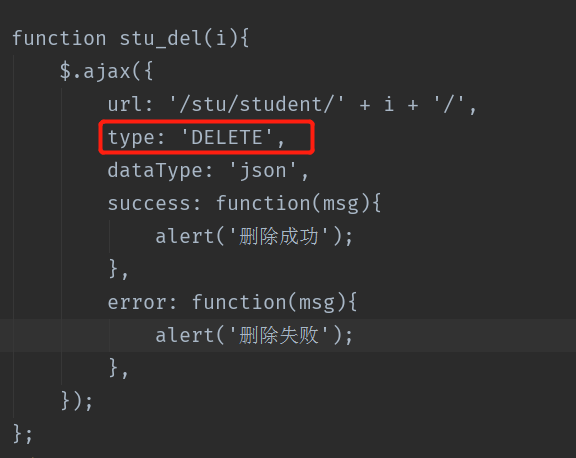

##### 4.4 直接放入ajax更新删除获取信息的代码

	<!DOCTYPE html>
	<html lang="en">
	<head>
    <meta charset="UTF-8">
    <title>展示所有学生的信息</title>
    
    

	</head>
	<body>
	
	<input id="showStus" value="获取所有学生的信息" type="button"></input>
	

	
	

	

	<a href="javascript:;" onclick="stu_add()">添加</a>
	</body>
	</html>

#### 5. 跨域请求

##### 5.1 什么是跨域

同源：是指相同的协议、域名、端口，三者都相同才属于同源。

同源策略：浏览器处于安全考虑，在全局层面禁止了页面加载或执行与自身来源不同的域的任何脚本，站外其他来源的脚本同页面的交互则被严格限制。

跨域由于浏览器同源策略，凡是发送请求url的协议、域名、端口三者之间任意一与当前页面地址不同即为跨域

#### 6. rest中的坑

在实际的django项目中，我们经常需要使用到用户表，但是基于django提供的User表的字段有限，开发者一般都不会使用django提供的User模型，而自己创建User模型，并且基于登录注册的功能，也都会自己去实现，而不会使用django提供的登录注册功能。

重点坑:在我们使用自定义的User模型进行用户的登录以及注册的时候，我们使用自定义的中间件进行对用户进行验证，如果验证通过了，就将当前登录的用户User对象绑定在request中，即request.user = user。这个时候坑就出现了，当我们使用restframework去写api接口的时候，会出现权限认证错误，如下提示：

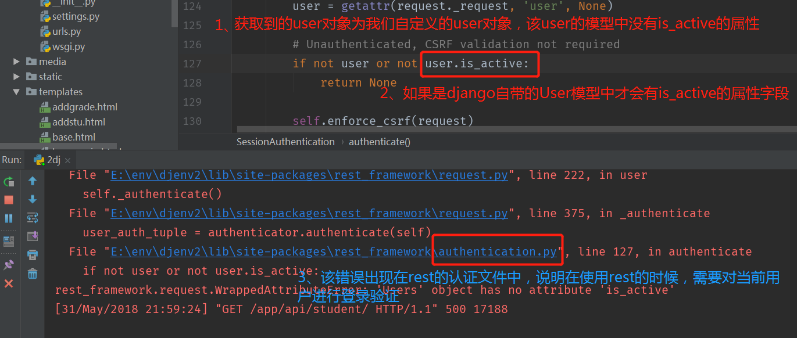

经过分析，可以判断是rest需要进行身份验证，所有我们在settings.py中设置rest的api接口不需要进行authentication的验证，具体配置如下：

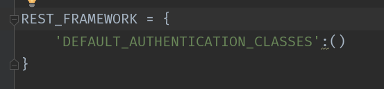