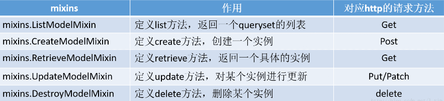
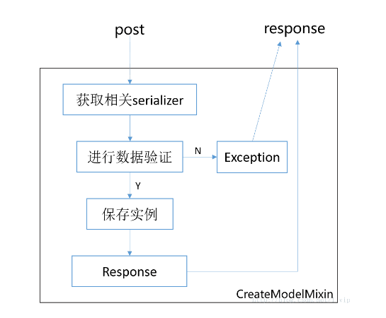

# djangorestframework总结

>Auth: 王海飞
>
>Data：2018-12-09
>
>Email：779598160@qq.com
>
>github：https://github.com/coco369/knowledge 

### 前言
django-rest-framework,是一套基于Django 的 REST 框架，是一个强大灵活的构建 Web API 的工具包。 使用django-rest-framework实现前后分离。

### rest总结目录

1. 安装与配置

2. 模型定义

3. 路由

4. 视图

5. 序列化
 
6. 条件过滤

7. 增删改查方法自定义

8. to_representation方法

9. get_queryset方法

10. get_object方法

11. 分页 

### 1. 安装与配置

1）安装djangorestframework

	pip install djangorestframework==3.4.6

2） 安装过滤

	pip install django-filter

3）配置settings.py文件

在工程目录中的settings.py文件的INSTALLED_APPS中需要添加rest_framework

	INSTALLED_APPS = [
		...
	
	    'rest_framework',
	]

### 2. 模型定义

定义文章模型类和文章分类的模型类，并指定分类和文章之间的一对多的关联关系

	from django.db import models
	
	
	class Atype(models.Model):
	    t_name = models.CharField(max_length=10)
	
	    class Meta:
	        db_table = 'a_type'
	
	
	class Article(models.Model):
	    title = models.CharField(max_length=10)
	    desc = models.CharField(max_length=100)
	    content = models.TextField()
	    is_delete = models.BooleanField(default=0)
	    create_time = models.DateTimeField(auto_now_add=True)
	    atype = models.ForeignKey(Atype, null=True)
	
	    class Meta:
	        db_table = 'article'

### 3. 路由

定义路由需要注意：

使用router.register注册的url为资源，而且资源只能为名词不能为动词。

定义的资源不要加'/'斜杠，在访问地址的时候，URL中会默认的添加反斜杠'/'

	from django.conf.urls import url
	
	from rest_framework.routers import SimpleRouter
	
	# 导入应用article中的views.py文件
	from article import views
	
	
	# 生成路由对象
	router = SimpleRouter()
	# 路由管理资源art
	router.register('art', views.ArticleView)
	
	urlpatterns = [
	    url(r'list/', views.list_art),
	]
	# router.urls生成资源对应的路由地址
	# 例如地址: /art/ 、 /art/id/
	urlpatterns += router.urls

### 4. 视图

定义基于类的视图ArticleView，可以通过继承父类来实现创建/检索/更新/删除等操作，而开发者只需要轻松地构造可重复使用的行为即可。而这些常见的创建/检索/更新/删除等操作是在REST框架的mixin类中实现的。
	
如下定义基于类的视图ArticleView，视图中实现序列化类ArticleSerializer和过滤类ArticleFiler:

	from rest_framework import mixins, viewsets
	
	from article.article_filter import ArticleFiler
	from article.article_serializer import ArticleSerializer
	from article.models import Article
	
	
	class ArticleView(viewsets.GenericViewSet,
	                  mixins.ListModelMixin,
	                  mixins.DestroyModelMixin,
	                  mixins.CreateModelMixin,
	                  mixins.UpdateModelMixin,
	                  mixins.RetrieveModelMixin):
	    # 查询返回的数据
	    queryset = Article.objects.filter(is_delete=0)
	    # 序列化返回的文章数据
	    serializer_class = ArticleSerializer
	    # 过滤
	    filter_class = ArticleFiler

分析:

<b>queryset</b>:指明在查询数据时使用的查询集。

<b>serializer_class</b>:指明该视图在进行序列化或反序列化时使用的序列化器。

<b>filter_class</b>: 指明过滤URL中传递参数的过滤器。

### 5. 序列化

定义序列化模型的ArticleSerializer类，并继承于serializers.ModelSerializer。其中可以自定义序列化字段的最大长度max_length和最小长度min_length以及错误信息的自定义error_messages。而fields字段表示序列化后用于展示的字段。

	from rest_framework import serializers
	
	from article.models import Article
	
	
	class ArticleSerializer(serializers.ModelSerializer):
	    desc = serializers.CharField(min_length=10,
	                                 max_length=100,
	                                 error_messages={
	                                     'required': '描述必填',
	                                     'max_length': '描述不超过100字符',
	                                     'min_length': '描述不少于10字符'
	                                 })
	    title = serializers.CharField(max_length=10,
	                                  error_messages={
	                                      'required': '标题必填',
	                                  })
	    content = serializers.CharField(min_length=10,
	                                    error_messages={
	                                      'required': '内容必填',
	                                    })
	
	    class Meta:
	        # 序列化的模型
	        model = Article
	        # 需要序列化的字段
	        fields = ['title', 'desc', 'content', 'id', 'atype']

分析:

<b>model</b>: 指明该序列化器处理的数据字段从模型类Article参考生成。

<b>fields</b>: 指明该序列化器包含模型类中的哪些字段，'__all__'指明包含所有字段。

### 6. 条件过滤

定义过滤模型的ArticleFiler类，并继承与filters.FilterSet。如下定义过滤的字段title、desc、content、min_time、max_time，且过滤的title、desc、content为模糊搜索。

定义如下的过滤字段，搜索的URL定义如下所示：

http://127.0.0.1/xxx/art/?title=小明&desc=django&content=学习&max_time=2018-12-12&min_time=2018-11-11。该URL表名模糊搜索标题title、desc、content，且创建时间大于2018-11-11且创建时间小于2018-12-12

	from rest_framework import filters
	import django_filters
	
	from article.models import Article
	
	
	class ArticleFiler(filters.FilterSet):
	    # 过滤URL中title参数
	    title = django_filters.CharFilter('title', lookup_expr='contains')
	    # 过滤URL中的desc参数
	    desc = django_filters.CharFilter('desc', lookup_expr='contains')
	    # 过滤URL中的content参数
	    content = django_filters.CharFilter('content', lookup_expr='contains')
	    # 过滤URL中时间最小值min_time
	    min_time = django_filters.DateTimeFilter('create_time', lookup_expr='gt')
	    # 过滤URL中时间最大值max_time
	    max_time = django_filters.DateTimeFilter('create_time', lookup_expr='lt')
	
	    class Meta:
	        model = Article
	        fields = ['title', 'desc', 'content', 'create_time']

### 7. 增删改查方法自定义

mixins在djangorestframework中主要配合viewsets共同使用，实现http方法与mixins的相关类与方法进行关联。djangorestframework中有5类Minxin，他们与http方法对应如下:

#### 1) CreateModelMixin

源码:

	class CreateModelMixin(object):
	    """
	    Create a model instance ==>创建一个实例
	    """
	    def create(self, request, *args, **kwargs):
	
	    # 获取相关serializer
	        serializer = self.get_serializer(data=request.data)
	
	        # 进行serializer的验证
	        # raise_exception=True,一旦验证不通过，不再往下执行，直接引发异常
	        serializer.is_valid(raise_exception=True)
	
	        # 调用perform_create()方法，保存实例
	        self.perform_create(serializer)
	
	        headers = self.get_success_headers(serializer.data)
	        return Response(serializer.data, status=status.HTTP_201_CREATED, headers=headers)
	
	    def perform_create(self, serializer):
	    # 保存实例
	        serializer.save()
	
	    def get_success_headers(self, data):
	        try:
	            return {'Location': str(data[api_settings.URL_FIELD_NAME])}
	        except (TypeError, KeyError):
	            return {}

创建的逻辑思路图如下:

分析: 由上图可以看出这个类的一个逻辑，其中，perform_create( )对serializer直接进行save保存，当在一些情境下，我们需要对perform_create( )进行重写。 

那么我们现在可能有一个下面的需要： 

假设现在有一个course课程model，里面维持了一个数，记录课程收藏数，还存在一个用户收藏userfav的model(外键course指向课程模型)，当一个用户对课程进行收藏，理论上现在post进来的应该是userfav的instance，显然，我们还需要对相应course的收藏数fav_num进行+1。 
　　这个时候，我们就需要重写perform_create( )方法！

	def perform_create(self, serializer):
	    # 重写save的逻辑
	    instance = serializer.save()
	    course = instance.course
	    course.fav_num += 1
	    course.save()

#### 2) ListModelMixin

源码:

	class ListModelMixin(object):
	    """
	    List a queryset.==> 列表页获取
	    """
	    def list(self, request, *args, **kwargs):
	        queryset = self.filter_queryset(self.get_queryset())
	
	        # 这是一个分页功能，如果在viewset中设置了pagination_class，那么这里就会起作用
	        # 获取当前页的queryset，如果不存在分页，返回None
	        page = self.paginate_queryset(queryset)
	
	        if page is not None:
	        # 分页不为空，那么不能简单的执行Response(serializer.data)
	        # 还需要将相关的page信息序列化在进行响应
	            serializer = self.get_serializer(page, many=True)
	            return self.get_paginated_response(serializer.data)
	
	        serializer = self.get_serializer(queryset, many=True)
	        return Response(serializer.data)

分析: ListModelMixin一般用来获取列表页，大多数情况下比较简单，不需要重写相关的方法。

#### 3) RetrieveModelMixin
源码:

	class RetrieveModelMixin(object):
	    """
	    Retrieve a model instance.==> 获取某一个对象的具体信息
	    """
	    def retrieve(self, request, *args, **kwargs):
	        # 一般访问的url都为/obj/id/这种新式
	        # get_object()可以获取到这个id的对象
	        instance = self.get_object()
	        serializer = self.get_serializer(instance)
	        return Response(serializer.data)

分析: 访问的URL都为/obj/id/这种新式才会调用该retrieve方法，其中get_object()可以获取到这个id的对象。开发中对retrieve这个方法的重写几率比较高，例如我们在增加点击数的时候，经常要对其进行一个重写。

#### 4) UpdateModelMixin

源码:
	
	class UpdateModelMixin(object):
	    """
	    Update a model instance.==> 更新某个具体对象的内容
	    """
	    def update(self, request, *args, **kwargs):
	        partial = kwargs.pop('partial', False)
	        instance = self.get_object()
	        serializer = self.get_serializer(instance, data=request.data, partial=partial)
	        serializer.is_valid(raise_exception=True)
	        self.perform_update(serializer)
	
	        if getattr(instance, '_prefetched_objects_cache', None):
	            # If 'prefetch_related' has been applied to a queryset, we need to
	            # forcibly invalidate the prefetch cache on the instance.
	            instance._prefetched_objects_cache = {}
	
	        return Response(serializer.data)
	
	    def perform_update(self, serializer):
	        serializer.save()
	
	    def partial_update(self, request, *args, **kwargs):
	        kwargs['partial'] = True
	        return self.update(request, *args, **kwargs)

分析: UpdateModelMixin实现逻辑基本整合了Create以及Retrieve，先得到具体的实例，再对其进行验证以及保存，如果需要对更新这个逻辑进行自定义，那么需要重写perform_update( )方法，而尽量少去重写update( )

#### 5) DestroyModelMixin

源码:

	class DestroyModelMixin(object):
	    """
	    Destroy a model instance.
	    """
	    def destroy(self, request, *args, **kwargs):
	        instance = self.get_object()
	        self.perform_destroy(instance)
	        return Response(status=status.HTTP_204_NO_CONTENT)
	
	    def perform_destroy(self, instance):
	        instance.delete()

DestroyModelMixin的逻辑也相对比较简单，当删除文章对象数据时，通过修改模型中的定义的is_delete字段，将is_delete字段置为1表示删除数据。因此重构perform_destroy方法，如下:

    def perform_destroy(self, instance):
        instance.is_delete = 1
        instance.save()

### 8. to_representation方法

概念:序列化器的每个字段实际都是由该字段类型的to_representation方法决定格式的，可以通过重写该方法来决定格式。

如下重定义to_representation方法，把每一列数据（其中instance代表每一列数据）进行修改重组，然后返回，如下示例将返回文章的类型字段进行修改再填充回数据中进行返回。

	from rest_framework import serializers
	
	from article.models import Article
	
	
	class ArticleSerializer(serializers.ModelSerializer):
	    desc = serializers.CharField(min_length=10,
	                                 max_length=100,
	                                 error_messages={
	                                     'required': '描述必填',
	                                     'max_length': '描述不超过100字符',
	                                     'min_length': '描述不少于10字符'
	                                 })
	    title = serializers.CharField(max_length=10,
	                                  error_messages={
	                                      'required': '标题必填',
	                                  })
	    content = serializers.CharField(min_length=10,
	                                    error_messages={
	                                      'required': '内容必填',
	                                    })
	
	    class Meta:
	        # 序列化的模型
	        model = Article
	        # 需要序列化的字段
	        fields = ['title', 'desc', 'content', 'id', 'atype']
	
	    def to_representation(self, instance):
	        # 序列化是会默认调用该方法，返回的结果为当前instance对象的序列化结果
	        data = super().to_representation(instance)
	        if instance.atype:
	            data['atype'] = instance.atype.t_name
	        return data

### 9. get_queryset方法

get_queryset(self)：返回视图使用的查询集，是列表视图与详情视图获取数据的基础，默认返回queryset属性，可以重写，例如对查询结果集进行再次过滤，可是如下重写：

	def get_queryset(self):
	    queryset = self.queryset
	    return queryset.filter(title__contains='django学习day01')
	
### 10. get_object方法

get_object(self): 返回详情视图所需的模型类数据对象。 在视图中可以调用该方法获取详情信息的模型类对象。

若详情访问的模型类对象不存在，会返回404。

### 11. 分页

restframework的分页需要在setting中配置REST_FRAMEWORK中的分页参数

#### 11.1 定义分页类为PageNumberPagination时，如下定义

	# 配置rest_framework的相关信息
	REST_FRAMEWORK = {
	    # 分页参数配置
		# 配置分页类
		'DEFAULT_PAGINATION_CLASS':'rest_framework.pagination.PageNumberPagination',
		# 配置每一页数据的条数
	    'PAGE_SIZE': 2,
	}

响应结果如下:

	"count": 22,
        "next": "http://127.0.0.1:8080/user/student/?page=2",
        "previous": null,
        "results": [
            {
                "s_name": "小明22",
                "s_gender": "男",
                "s_age": 23,
                "id": 4
            },
            {
                "s_name": "校花2",
                "s_gender": "男",
                "s_age": 18,
                "id": 5
            }
        ]

#### 11.2 定义分页类为LimitOffsetPagination时，如下定义
	
	# 配置rest_framework的相关信息
	REST_FRAMEWORK = {
	    # 分页参数配置
		# 配置分页类
		'DEFAULT_PAGINATION_CLASS':'rest_framework.pagination.LimitOffsetPagination',
		# 配置每一页数据的条数
	    'PAGE_SIZE': 2,
	}

响应结果如下:

	"count": 22,
        "next": "http://127.0.0.1:8080/user/student/?limit=2&offset=2",
        "previous": null,
        "results": [
            {
                "s_name": "小明22",
                "s_gender": "男",
                "s_age": 23,
                "id": 4
            },
            {
                "s_name": "校花2",
                "s_gender": "男",
                "s_age": 18,
                "id": 5
            }
        ]

分析: 使用分页类PageNumberPagination进行分页时，下一页的URL地址为:/user/student/?page=2, LimitOffsetPagination分页类进行分页时，下一页的URL地址为:/user/student/?limit=2&offset=2