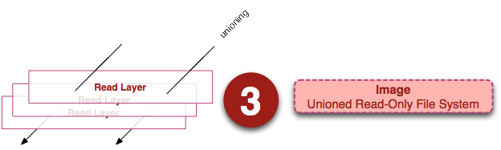
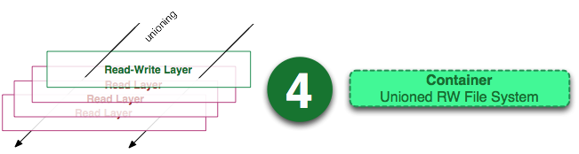
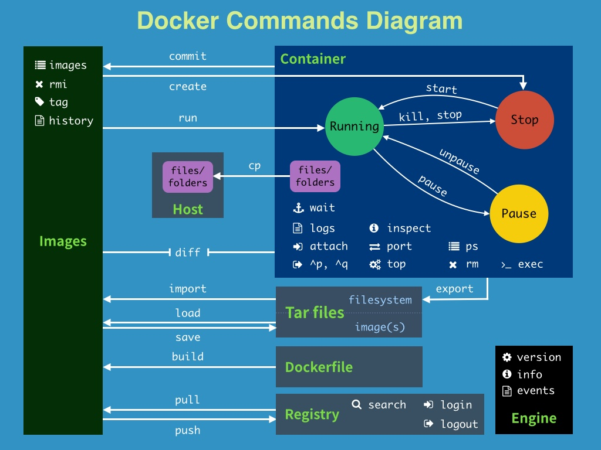

# DOCKER使用指南

>Auth: 王海飞
>Data：2018-03-20
>Email：779598160@qq.com
>github：https://github.com/coco369/knowledge

---


**前言**： 
> 什么是docker

引用百度搜索结果：Docker 是一个开源的应用容器引擎，让开发者可以打包他们的应用以及依赖包到一个可移植的容器中，然后发布到任何流行的 Linux 机器上，也可以实现虚拟化。容器是完全使用沙箱机制，相互之间不会有任何接口。

>那docker到底是什么东西呢：

```
1. 集装箱，可以把你的业务随意，无拘无束的运行在任何地方（Build，Ship，and Run Any App，Anywhere），即可移植性强
2. 用于不同项目隔离不同的开发环境，开发库等
3. 执行环境可移植，运维部署只需要你提供注入了代码的docker容器即可
```


>学习docker，基础知识掌握

docker包含的三个基本概念，<u>镜像(Images)、容器(Container)和仓库(Repository)</u>。 
镜像就是docker运行容器的前提，仓库是存放镜像的场所，可见镜像是docker的核心。

>什么是镜像

```
docker镜像可以看作是一个特殊的文件系统，除了提供容器运行时必须要的程序，库，资源，配置等文件外，还提供为运行时准备的一些配置参数(如匿名卷，环境变量等)。镜像不包含任何动态数据，其内容在构建之后也不会被改变
```

>自己还没研究透，先暂时引用第三方的文章： [地址](http://dockone.io/article/783)



要点：容器 = 镜像 + 读写层。并且容器的定义并没有提及是否要运行容器。


***

###### 贴一张docker命令导图


***
##### 使用docker命令完成以下操作：

###### 安装docker

1. 在ubuntu15.04系统中，安装docker
下载/更新curl
```
sudo apt-get update $ sudo apt-get install curl
```
获取最新的docker包
```
curl -ssl https://get.docker.com/ | sh
```

***
###### 制作镜像
2. 运行交互式容器
```
docker run (--name=容器名称，自定义) -it ubuntu /bin/bash
```


3. 进入进行中的容器，安装相关py库(pip install -r xxx.txt)
```
docker exec -it 容器名或者容器的id /bin/bash
```

4. 将安装好插件的容器编译好镜像并上传镜像
```
docker commit -a 作者 -m '注解' 容器名 镜像名:镜像版本号
docker push 镜像名:镜像版本号
```

***
###### 容器基本操作

5. 查看运行中的容器
```
docker ps
```

6. 查看建立的容器
```
docker ps -a 或者 -l
```


7. 停止守护式容器
```
docker stop 容器id/容器名(停止容器，需要等容器处理完逻辑才停止)
docker kill 容器id/容器名(直接停止容器)
```

8. 重新启动停止的容器
```
docker start 容器id/容器名
```

9. 删除容器
```
docker rm 容器id/容器名
```

10. 删除镜像
```
docker rmi 镜像id/镜像名
```


***
>docker学习网站

http://www.docker.org.cn/


