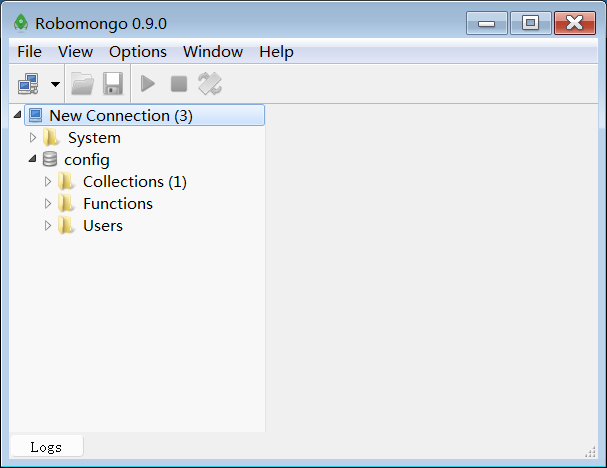

# DOCKER使用指南

> Auth: 王海飞
>
> Data：2019-06-12
>
> Email：779598160@qq.com
>
> github：https://github.com/coco369/knowledge
>
>

------

## 前言

​        docker hub是一个docker容器管理平台，其完全可以满足我们对镜像管理的需求，而且使用也非常方便，但是上传的镜像任何人都可以访问，其中有很多基础镜像，如mysql、mongo等

### mongo容器的搭建

操作如下：

#### 1)  拉取mongo镜像，命令为：docker pull mongo

```
# 拉取基础镜像mongo
docker pull mongo
```

#### 2）基于mongo镜像运行容器

```
# 基于基础镜像mongo创建容器
docker run -itp 27017:27017 docker.io/mongo:latest
```

**参数说明**
-it：在容器中打开一个伪终端进行交互操作，并在后台运行；
-p：映射端口；
docker.io/mongo:latest：这个是刚才pull下来的镜像；

#### 3）可视化工具robomongo的使用



