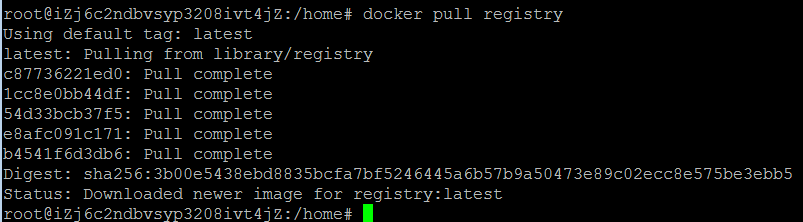
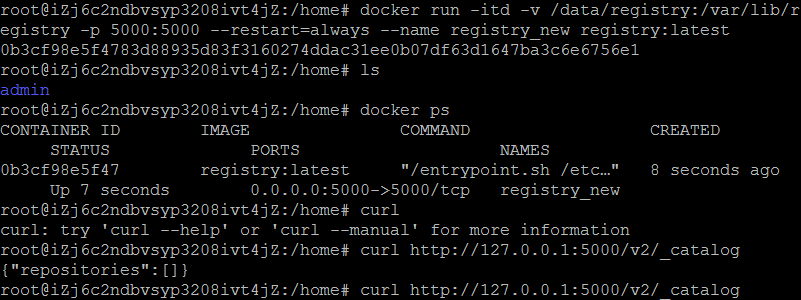
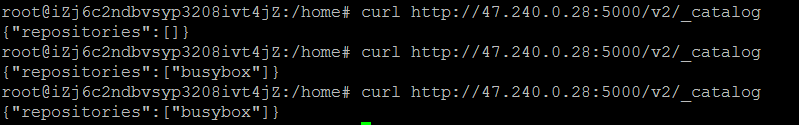
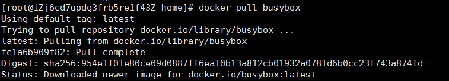
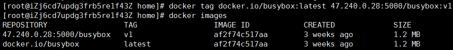
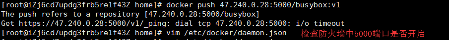
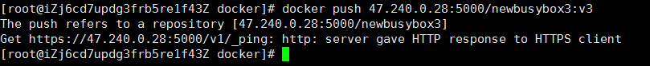
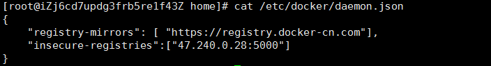
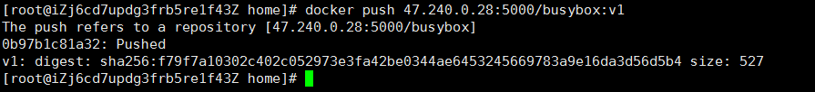

# DOCKER使用指南

> Auth: 王海飞
>
> Data：2019-04-28
>
> Email：779598160@qq.com
>
> github：https://github.com/coco369/knowledge
>
>

------

## 前言

​        docker hub是一个docker容器管理平台，其完全可以满足我们对镜像管理的需求，而且使用也非常方便，但是上传的镜像任何人都可以访问，其次docker hub的私有仓库又是收费的，所以从安全和商业两方面考虑，企业必须搭建自己的私有镜像仓库。

 	官方的Docker Hub registry用于储存Docker镜像，因此本文将介绍如何配置一个私有的Docker registry，在此上传的镜像是私密的，我们可以从另一个联网的主机以安全的方式下载此私有docker仓库中的镜像。

### 1. 私有docker仓库的搭建

搭建docker私有仓库服务器，再该私有仓库服务器上运行registry容器并管理镜像。操作如下：

#### 1)  拉取registry镜像，命令为：docker pull registry

#### 2）基于registry镜像运行名为registry_new容器

**参数说明**
-itd：在容器中打开一个伪终端进行交互操作，并在后台运行；
-v：把宿主机的/data/registry目录绑定 到 容器/var/lib/registry目录(这个目录是registry容器中存放镜像文件的目录)，来实现数据的持久化；
-p：映射端口；访问宿主机的5000端口就访问到registry容器的服务了；
--restart=always：这是重启的策略，假如这个容器异常退出会自动重启容器；
--name registry_new：创建容器命名为registry_new；
registry:latest：这个是刚才pull下来的镜像；

#### 3）测试镜像仓库中是否有上传的镜像

**注意:** 初始化私有仓库中镜像为空，当上传了镜像后，则镜像仓库中将出现上传的镜像。如上图所示，busybox就为上传到私有仓库的镜像。

### 2. 镜像的PUSH与使用

​        步骤1中的操作用于创建私有docker仓库，其用于保存公司中所有项目所依赖的镜像文件。因此其他服务器可以自定义镜像并提交或拉取该私有docker仓库中的镜像。如下操作实现镜像的push提交。

#### 1）下载一个体积小的busybox镜像

****

#### 2）根据busybox镜像打包成新镜像

**注意：**基于拉取的镜像而运行容器，并在容器中安装项目所依赖的各种包和开发环境，最终将容器打包成新的镜像，以待项目使用。

本文档中将忽略在容器中安装依赖，并打包成镜像。而是直接将busybox镜像重新打包成新的镜像。

打标签命令：**docker tag 老的镜像名:版本 docker私有仓库地址/新的镜像名:版本**， 注意其中的'docker私有仓库地址'可以写IP:端口的形式也可以写域名的形式

#### 3）上传新镜像到私有docker仓库中

步骤1: 将打包好的镜像push到私有docker仓库中，如果出现上传失败，则可以通过以下两点进行分析：

- docker私有仓库的5000端口是否在防火墙中打开
- daemon.json文件中提交镜像的地址是否修改为私有docker仓库的地址

如果出现以下错误，则表示防火墙没开：

如果出现以下截图错误，则表示daemon.json文件中的docker私有仓库地址没定义:

步骤2: 出现上图所示错误，则修改/etc/docker/daemon.json中的内容，添加镜像仓库地址insecure-registries参数，内容修改如下：

步骤3: 再次push镜像，成功提示如下：

