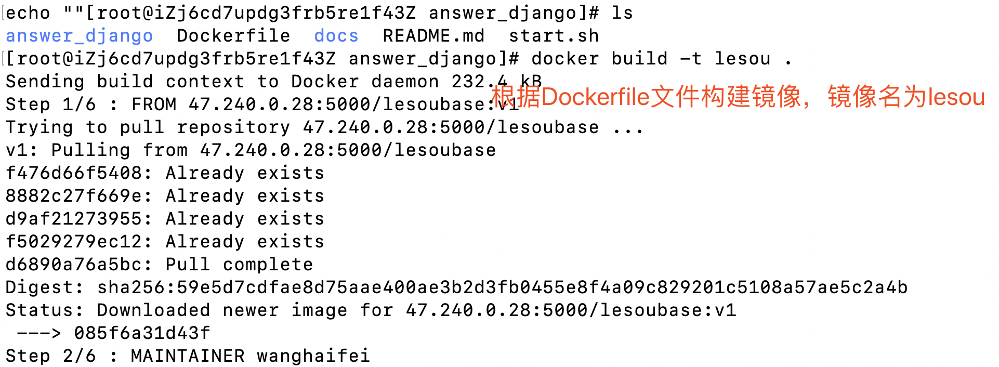
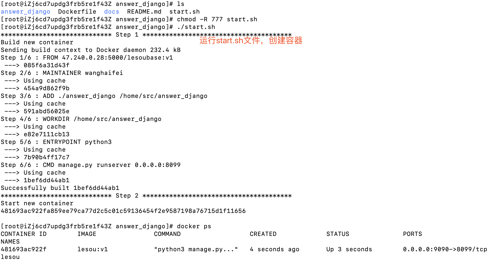

# DOCKER使用指南--部署

> Auth: 王海飞
>
> Data：2019-05-01
>
> Email：779598160@qq.com
>
> github：https://github.com/coco369/knowledge
>
>

***

 部署分为**直接部署**、或通过配置文件**Dockerfile文件**进行部署。

### 1. 简单粗暴的部署方式

#### 1） 下拉基础镜像
```
docker pull ubuntu
```

#### 2） 创建容器
```
docker run -it 镜像名:版本 /bin/bash
```

#### 3)  在容器中安装python3、pip3、项目的依赖包
```
apt install python3

apt install python3-pip

pip3 install -r requirment.txt
```
#### 4）将服务器中的代码拷贝到容器中
```
docker cp 服务器中代码的路径 容器ID:容器中保存代码的路径
```

#### 5）映射端口

<1> 删除之前创建的容器，重新创建容器，并指定映射端口
```
docker run -i -t -d -p 公网IP:容器内部映射端口  镜像名:版本
```
<2>修改现有容器的配置文件，并重启整个docker(不推荐，因为会重启整个docker) 

#### 6）配置blognginx.conf文件，并监听映射公网IP端口
```
server{
    listen    80;
    server_name 149.129.117.194;

	location / {
    	proxy_pass http://149.129.117.194:5000;
	}
}
```

**注意**: 需要在/etc/nginx/nginx.conf中include导入自定义的blognginx.conf文件，并重启systemctl restart nginx。

#### 7) 进入容器，并启动项目即可

**注意** 

- 在整个操作过程中会安装工具: 如安装vim（apt install vim）、安装netstat（apt install net-tools），还有宿主的数据库的安装与访问。

 - 容器内的项目链接的数据库如果要访问宿主的mysql数据库，需注意数据库的远程访问配置、防火墙等细节内容。


### 2. Dockerfile文件定义

```
FROM 47.240.0.28:5000/lesoubase:v1

MAINTAINER wanghaifei

ADD ./answer_django /home/src/answer_django
WORKDIR /home/src/answer_django


ENTRYPOINT ["python3"]
CMD ["manage.py", "runserver", "-h", "0.0.0.0", "-p", "8099"]
```



### 2.start.sh文件定义

```
#!/usr/bin/env bash

echo "***************************** Step 1 ***************************************"

echo "Build new container"
docker build -t lesou:v1 .

echo "***************************** Step 2 ***************************************"
echo "Start new container"
docker run --restart="always" -d -p 9090:8099 \
    -e 'LANG=zh_CN.UTF-8' \
    -e 'LANGUAGE=zh_CN.UTF-8' \
    -e 'LC_ALL=zh_CN.UTF-8' \
    --name lesou \
    lesou:v1
echo ""
```

