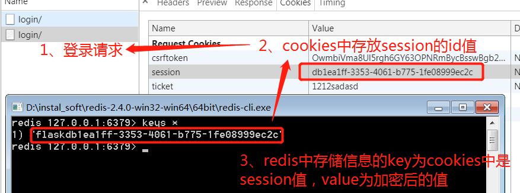

# flask使用操作指南之session/cookie

>Auth: 王海飞
>
>Data：2018-05-14
>
>Email：779598160@qq.com
>
>github：https://github.com/coco369/knowledge 

### 前言

访问者的标识问题服务器需要识别来自同一访问者的请求。这主要是通过浏览器的cookie实现的。 访问者在第一次访问服务器时，服务器在其cookie中设置一个唯一的ID号——会话ID(session)。 这样，访问者后续对服务器的访问头中将自动包含该信息，服务器通过这个ID号，即可区 隔不同的访问者。

### 1. Cookie

概念：

	a）客户端会话技术，浏览器的会话技术

	b）数据全部存储在客户端中

	c）存储使用的键值对结构进行存储

	特性：
		支持过期时间
		默认会自动携带本网站的cookie
		不能跨域名
		不能跨浏览器

创建：

	Cookie是通过服务器创建的Response来创建的

	设置：set_cookie('key', value, max_ages='', expires='')

	删除, 有三种删除方式
		
		1. 直接清空浏览器的cookie
		2. del_cookie('key') 直接使用del_cookie函数
		3. set_cookie('key','',expires=0) 重新设置key的值为空，过期时间为0

获取：

	在每次请求中，url都会向服务器传递Request，在request中可以获取到cookie的信息

	request.cookies.get('name')

例子1，设置cookie：

	import datetime

	@blue.route('/setcookie/')
	def set_cookie():
	    temp = render_template('index.html')
	    response = make_response(temp)
		outdate=datetime.datetime.today() + datetime.timedelta(days=30)
		# 设置cookie中的name的存在时长，设置为30天才过期  
	    response.set_cookie('name','cocoococo',expires=outdate)
	    return response

例子2，删除cookie中的值

	@blue.route('/setcookie/')
	def set_cookie():
	    temp = render_template('index.html')
	    response = make_response(temp)
		# 第一种方式，通过set_cookie去删除
	    response.set_cookie('name','',expires=0)
		# 第二种方式，del_cookie删除
		response.del_cookie('name')
	    return response

例子3，获取cookie中的值

	@blue.route('/getcookie/')  
	def get_cookie():
	    name=request.cookies.get('name')  
	    return name

### 2. Session

flask-session是flask框架的session组件

该组件则将支持session保存到多个地方

如：

	redis：保存数据的一种工具，五大类型。非关系型数据库
	
	memcached
	
	mongodb
	
	sqlalchmey：那数据存到数据库表里面

#### 2.1 安装

	pip install flask-session

如果指定存session的类型为redis的话，需要安装redis

	pip install redis

#### 2.2 语法

设置session：

	session['key'] = value

读取session：

	result = session['key'] ：如果内容不存在，将会报异常

	result = session.get('key') ：如果内容不存在，将返回None

删除session：

	session.pop('key')

清空session中所有数据：

	session.clear
	

#### 2.2 使用

我们在初始化文件中创建一个方法，通过调用该方法来获取到Flask的app对象
	
	def create_app():
	    app = Flask(__name__)
	    # SECRET_KEY 秘钥
	    app.config['SECRET_KEY'] = 'secret_key'
		# session类型为redis
	    app.config['SESSION_TYPE'] = 'redis'
		# 添加前缀
    	app.config['SESSION_KEY_PREFIX'] = 'flask'
	    
	    # 加载app的第一种方式
	    se = Session()
	    se.init_app(app=app)
	    #加载app的第二种方式
	    Session(app=app)
	    app.register_blueprint(blueprint=blue)
	
	    return app

#### 2.3 案例

定义一个登陆的方法，post请求获取到username，直接写入到redis中，并且在页面中展示出redis中的username

a）需要先启动redis，开启redis-server，使用redis-cli进入客户端

b）定义方法

	@blue.route('/login/', methods=['GET', 'POST'])
	def login():
	    if request.method == 'GET':
	        username = session.get('username')
	        return render_template('login.html', username=username)
	    else:
	        username = request.form.get('username')
	        session['username'] = username
	
	        return redirect(url_for('first.login'))

c）定义模板
	
	<body>
	<h3>欢迎:{{ username }}</h3>
	<form action="" method="POST">
	    用户名:<input type="text" name="username" placeholder="请输入你的名字">
	    <input type="submit" value="提交">
	</form>
	</body>

d）redis中数据

注意：我们在定义app.config的时候指定了SESSION_KEY_PREFIX为flask，表示存在session中的key都会加一个前缀名flask

e) cookie和session的联系

访问者在第一次访问服务器时，服务器在其cookie中设置一个唯一的ID号——会话ID(session)。 这样，访问者后续对服务器的访问头中将自动包含该信息，服务器通过这个ID号，即可区 隔不同的访问者。然后根据不同的访问者来获取其中保存的value值信息。