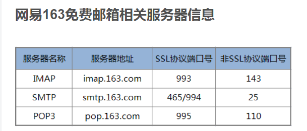

# flask使用操作指南之邮件发送

>Auth: 王海飞
>
>Data：2018-10-08
>
>Email：779598160@qq.com
>
>github：https://github.com/coco369/knowledge 

### 前言

在程序中经常使用到邮件发送功能，如何使用flask进行邮件发送呢？Flask是一个扩展性极强的框架，在Flask核心代码上可以自由的扩展功能。比如邮件发送功能，就有flask-mail库，使用该库可以简单的实现邮件发送功能。

### 1. 开启163发送邮件功能

我们使用163的电子邮箱服务器作为发送邮件者，所以需要开启客户端授权码，并设置授权码。

设置如下:

### 2. 使用flask-mail库实现邮件发送功能

#### 2.1 安装

	pip install flask-mail

#### 2.2 功能实现

	from flask import Flask
	from flask_mail import Mail, Message
	
	app = Flask(__name__)
	
	app.config["MAIL_SERVER"] = "smtp.163.com"
	app.config["MAIL_PORT"] = 465  # 设置邮箱端口为465，默认为25，由于阿里云禁止了25端口，所以需要修改
	app.config["MAIL_USE_SSL"] = True  # 163邮箱需要开启SSL
	app.config["MAIL_USERNAME"] = "wanghaifei36@163.com"
	app.config["MAIL_PASSWORD"] = "wanghai135588"
	
	mail = Mail(app)
	
	
	@app.route("/send_mail")
	def send_mail():
	    """
	    发送邮件， sender为发送者邮箱， recipients为接受者邮箱
	    """
	    message = Message("测试邮件标题122", sender=app.config["MAIL_USERNAME"], recipients=["779598160@qq.com"])
	    message.body = "测试邮件的内容122"
	
	    send_email(message)
	
	    return "发送成功"
	
	
	def send_email(msg):
	    mail.send(msg)
	
	
	if __name__ == "__main__":
	    app.run(port=8080)

设置的参数定义如下:

  MAIL_SERVER: 电子邮件服务器的主机名或IP地址， 默认为localhost

  MAIL_PORT: 电子邮件服务器的端口，默认为25

  MAIL_USE_TLS： 启用传输层安全协议，默认为False

  MAIL_USE_SSL： 启用安全套接层协议， 默认为False

  MAIL_USERNAME： 邮件账户的用户名

  MAIL_PASSWORD：邮件账户的密码，为在163中设置的授权码

### 3. 网易163免费邮箱相关服务器信息如下：

