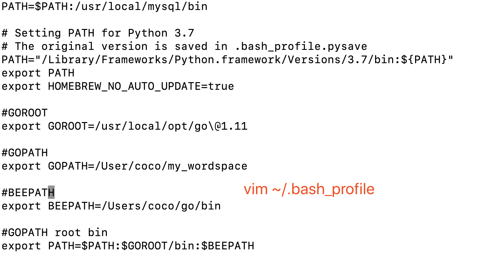

# Go使用指南--beego基础语法

> Auth: 王海飞
>
> Data：2019-08-12
>
> Email：779598160@qq.com
>
> github：https://github.com/coco369/knowledge

### 前言


### 1.安装Go环境


```
# 安装go
brew install go

# 升级go
brew upgrade go
```

### 2.安装或者升级Beego和Bee的开发工具

```
# 安装beego
go get github.com/astaxie/beego

# 安装bee工具
go get github.com/beego/bee
```


### 3.添加环境变量

​	作者将beego下载安装在/User/coco/go目录中名，因此编辑bash_profile文件，并添加刚下载的bee文件配置，如下添加BEEPATH变量：



### 4. 创建beego项目

