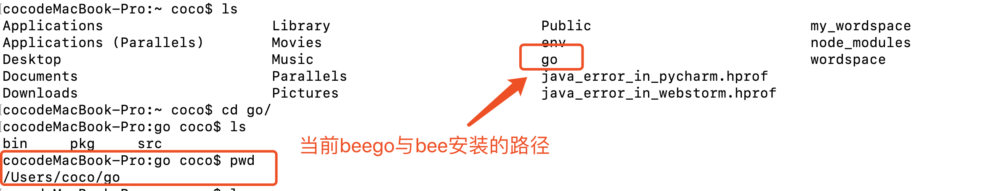
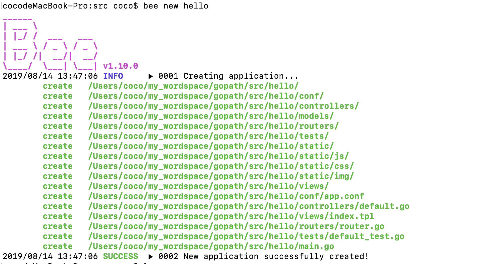

# Go使用指南--beego框架安装

> Auth: 王海飞
>
> Data：2019-08-12
>
> Email：779598160@qq.com
>
> github：https://github.com/coco369/knowledge

### 前言

​	本人在安装beego和bee工具时遇到了各种配置的坑，此文章用于记录自己安装过程中遇到的问题，已经解决办法。

### 1.安装Go环境


```
# 安装go
brew install go

# 升级go
brew upgrade go
```

注意：我安装的路径如下图所示：


### 2.安装或者升级Beego和Bee的开发工具

```
# 安装beego
go get github.com/astaxie/beego

# 安装bee工具
go get github.com/beego/bee
```

​	如下截图为安装后的文件位置，go文件夹下有bin、pkg、src文件夹。其中bin下是bee的启动文件、src文件夹下是安装的beego与bee工具。



**注意：**非常坑的地方为通过go get去下载beego与bee的时候，最好用vpn，否则很容易卡住，导致无法安装成功。我都在这儿安装了4天才成功。当然中间也有环境变量没配置好，导致删了重新安装等问题。

### 3.添加环境变量

​	作者将beego下载安装在/User/coco/go目录中名，因此编辑bash_profile文件，并添加刚下载的bee文件配置，如下添加BEEPATH变量：


**注意：**编辑bash_profile的命令为：vim ～/.bash_profile, 修改完成后执行source ～/.bash_profile命令让配置的环境变量生效。需要注意$HOME的值为/User/coco

### 4. 创建beego项目

创建命令为： bee new 项目名。如下图所示，项目将存放在项目的存储路径下的src文件夹中。如我的beego项目，将放在/User/coco/my_wordspace/gopath/src中。

