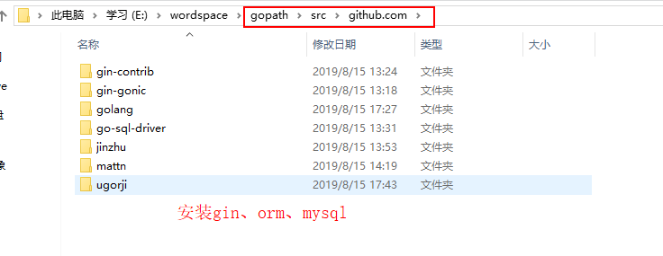
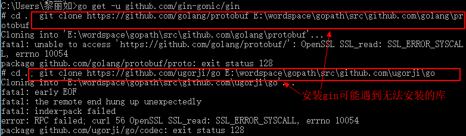
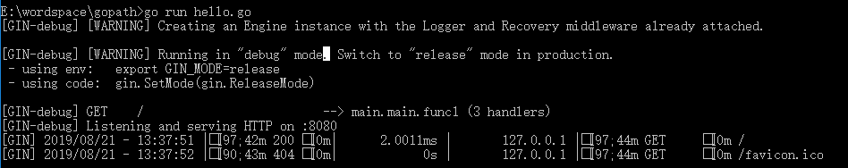

# Go使用指南--gin框架安装

> Auth: 王海飞
>
> Data：2019-08-15
>
> Email：779598160@qq.com
>
> github：https://github.com/coco369/knowledge

### 前言

​		[gin框架中文文档](https://github.com/skyhee/gin-doc-cn)，Gin是一个golang的微框架，封装比较优雅，API友好。具有快速灵活，容错方便等特点。Gin自身的net/http足够简单，性能也非常不错。

安装gin之前需要配置好go的环境变量：GOROOT和GOPATH。如下图所示，在windows中配置的参数如下:


注意：我的go安装在E:\install_soft\Go文件夹下，而项目路径gopath指定为E:\wordspace\gopath。当使用go get进行安装各种库时，其将存放在E:\wordspace\gopath\src文件夹中，如下图所示：



### 1. 安装gin、gorm、mysql

安装`gin`web框架和`gorm`作为ORM层，然后利用`go-sql`数据库驱动

```
//使用github上的gin托管地址
$ go get -u github.com/gin-gonic/gin
$ go get -u github.com/jinzhu/gorm
$ go get github.com/go-sql-driver/mysql
```

​		在执行go get -u github.com/gin-gonic/gin的命令时，绝大多数的情况下都将出现下载不成功的情况。如下我在安装gin的时候，遇到了安装protobuf与ugorji/go不成功的情况。如下所示：



从上图中可以发现protobuf与ugorji/go在clone时出现无法下载的情况，所以我手动的在E:\wordspace\gopath\src\github.com\golang文件夹下执行git clone命令，进行安装protobuf。

.png)

如下也是在对应的目录中安装ugorji/go的内容，如下图所示：

.png)


### 2. 创建gin项目

​		创建hello.py文件，并配置如下内容：
```
package main
import (
    "github.com/gin-gonic/gin"
    "net/http"
)
func main() {
    router:=gin.Default()
    router.GET("/", func(c *gin.Context) {
        c.String(http.StatusOK,"Hello World")
    })
    router.Run(":8080")
}
```

代码分析：

1、`router:=gin.Default()`：这是默认的服务器。使用gin的`Default`方法创建一个路由`Handler`；

2、然后通过Http方法绑定路由规则和路由函数。不同于`net/http`库的路由函数，gin进行了封装，把`reques`t和`response`都封装到了`gin.Context`的上下文环境中。

3、最后启动路由的Run方法监听端口。还可以用`http.ListenAndServe(":8080", router)`，或者自定义Http服务器配置。

####  2.1运行

命令源码文件:含有 main函数 的文件
库源码文件:不包含 main函数 的文件, 主要用于编译成静态文件.供其他包调用

运行hello.go文件，命令如下：
```
go run hello.go命令：用于对源码文件做编译，一般用于调试程序

go build hello.go命令:  用于测试编译包
```
对 库源码文件 go build, 不会产生文件, 只是测试编译包是否有问题
对 命令源码文件 go build, 会在当前执行 go build 命令的目录下产生可执行文件

如下截图所示，使用go build hello.go命令启动项目，并在浏览器中输入127.0.0.1:8080即可看到"Hello World"字符串:

