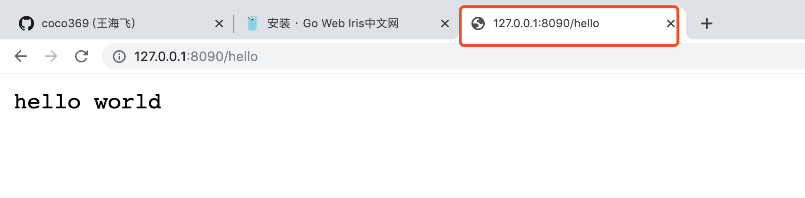

# Go使用指南--iris框架安装

> Auth: 王海飞
>
> Data：2019-12-09
>
> Email：779598160@qq.com
>
> github：https://github.com/coco369/knowledge

### 前言

​   [iris框架中文文档](https://www.studyiris.com/doc/),Go语言是谷歌推出的一种全新的编程语言，可以在不损失应用程序性能的情况下降低代码的复杂性。谷歌首席软件工程师罗布派克(Rob Pike)说：我们之所以开发Go，是因为过去10多年间软件开发的难度令人沮丧。

   谷歌资深软件工程师罗布·派克(Rob Pike)表示，“Go让我体验到了从未有过的开发效率。”派克表示，和今天的C++或C一样，Go是一种系统语言。他解释道，“使用它可以进行快速开发，同时它还是一个真正的编译语言，我们之所以现在将其开源，原因是我们认为它已经非常有用和强大。”


### 1. iris安装

在Mac OS系统中安装iris需要先设置代理，或者翻墙，要不然下载iris会卡住。设置如下所示：

    # Enable the go modules feature
    export GO111MODULE=on
    # Set the GOPROXY environment variable
    export GOPROXY=https://goproxy.io

Or, write it into the .bashrc or .bash_profile file.


其次使用go mod管理本地项目，命令设置如下所示:

    go mod init irissys
    
    go get github.com/kataras/iris
    

### 2。 最简单的web应用

```
package main

import (
	"github.com/kataras/iris"
)

func main() {
	// 生成iris对象
	app := iris.New()

	// 定义路由和方法的关联关系
	app.Get("/hello", func(ctx iris.Context) {
		// 写入返回给前端的数据："hello world"
		ctx.WriteString("hello world")
	})

	// 启动，并指定启动的端口为8090
	app.Run(iris.Addr(":8090"))

}
```
    
在浏览器中访问http://127.0.0.1:8090/，可以看到如下的截图：


    
### 3. 模板渲染

使用iris渲染页面，并向页面中传递两个参数，代码如下：

```
package main

import "github.com/kataras/iris"

func main() {
	app := iris.New()

	// 生成模板引擎
	// iris.HTML(解析的文件路径，解析文件的后缀)
	htmlEngine := iris.HTML("./templates", ".html")
	// 注册模板引擎
	app.RegisterView(htmlEngine)

	app.Get("/hello", func(ctx iris.Context) {
		// 向前端页面中传递两个变量，title和data
		ctx.ViewData("title", "测试页面")
		ctx.ViewData("data", "hello world! 😂哈哈哈")
		// 指定渲染的页面
		ctx.View("hello.html")
	})
	// 启动
	app.Run(iris.Addr(":8080"))
}

```

创建文件夹templates并创建hello.html页面，页面中通过{{ .变量名 }}来解析变量的值
```
<!DOCTYPE html>
<html lang="en">
<head>
    <meta charset="UTF-8">
    <title>{{ .title }}</title>
</head>
<body>
    {{ .data }}
</body>
</html>
```
    
    