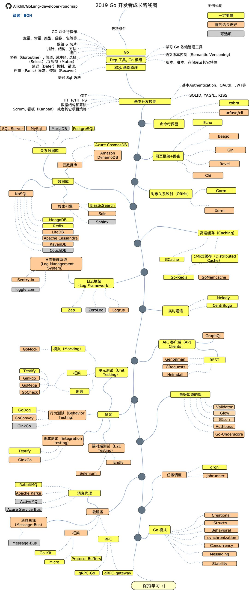

# Go使用指南--学习路线

> Auth: 王海飞
>
> Data：2019-08-03
>
> Email：779598160@qq.com
>
> github：https://github.com/coco369/knowledge

### 前言

​	本文档提供了Go学习的详细进阶路线图，列出了学习Go开发所需的各类知识和技能，而且每个知识点也附上啦相应的学习资源。相信无论是零基础的新手，还是对Go语言有一定了解的开发者，都能够有所收获。

## 给我一个 Star！ ⭐️

如下图所示

**学习资源整理**

**1、先决条件**

1）Go：https://golangbot.com/

2）Dep工具，Go模组：https://github.com/golang/dep

3）SQL：https://www.w3schools.com/sql/default.asp

**2、基本开发技能**

1）学习Git，在GitHub上建立一些仓库，与他人分享你的代码：https://www.w3schools.com/sql/default.asp

2）了解HTTP(S)协议，request方法(GET,POST,PUT,PATCH,DELETE,OPTIONS)

3）不要害怕使用Google——Google搜索的力量：http://www.powersearchingwithgoogle.com/

4）看一些和数据结构及算法有关的书

5）学习关于认证的基础实现

6）学习面向对象原则

**3、命令行工具**

1）cobra：https://github.com/spf13/cobra

2）urfave/cil：https://github.com/urfave/cli

**4、网络框架/路由**

1）Echo：https://github.com/labstack/echo

2）Beego：https://github.com/astaxie/beego

3）Gin：https://github.com/gin-gonic/gin

4）Revel：https://github.com/revel/revel

5）Chi：https://github.com/go-chi/chi

**5、数据库**

1）关系型

SQLServer：https://www.microsoft.com/en-us/sql-server/sql-server-2017

PostgreSQL：https://www.postgresql.org/

MariaDB：https://mariadb.org/

MySQL：https://www.mysql.com/

2）云数据库

CosmosDB：https://docs.microsoft.com/en-us/azure/cosmos-db

DynamoDB：https://aws.amazon.com/dynamodb/

3）搜索引擎

ElasticSearch：https://www.elastic.co/

Solr：http://lucene.apache.org/solr/

Sphinx：http://sphinxsearch.com/

4）NoSQL

MongoDB：https://www.mongodb.com/

Redis：https://redis.io/

ApacheCassandra：http://cassandra.apache.org/

LiteDB：https://github.com/mbdavid/LiteDB

RavenDB：https://github.com/ravendb/ravendb

CouchDB：http://couchdb.apache.org/

**6、对象关系的映射框架**

Gorm：https://github.com/jinzhu/gorm

Xorm：https://github.com/go-xorm/xorm

**7、高速缓存**

GCache：https://github.com/bluele/gcache

**分布式缓存**

Go-Redis：https://github.com/go-redis/redis

GoMemcached：https://github.com/bradfitz/gomemcache

**8、日志**

1）日志框架

Zap：https://github.com/uber-go/zap

ZeroLog：https://github.com/rs/zerolog

Logrus：https://github.com/sirupsen/logrus

2）日志管理系统

Sentry.io：http://sentry.io/

Loggly.com：https://loggly.com/

**9、实时通讯**

Socket.IO：https://socket.io/

**10、客户端**

1）REST

Gentelman：https://github.com/h2non/gentleman

GRequests：https://github.com/kennethreitz/grequests

heimdall：https://github.com/heimdal/heimdal

2）GraphQL：https://graphql.org/

**11、最好知道的库**

Validator：https://github.com/chriso/validator.js/

Glow：https://github.com/pytorch/glow

GJson：https://github.com/tidwall/gjson

Authboss：https://github.com/volatiletech/authboss

Go-Underscore：https://github.com/ahl5esoft/golang-underscore

**12、测试**

1）单元，行为，集成测试

GoMock：https://github.com/golang/mock

Testify：https://github.com/stretchr/testify

GinkGo：https://github.com/onsi/ginkgo

GoMega：https://github.com/onsi/gomega

GoCheck：https://github.com/go-check/check

GoDog：https://github.com/DATA-DOG/godog

GoConvey：https://github.com/smartystreets/goconvey

2）端对端测试

Selenium：https://github.com/tebeka/selenium

Endly：https://github.com/viant/endly

**13、任务调度**

Gron：https://github.com/roylee0704/gron

JobRunner：https://github.com/bamzi/jobrunner

**14、微服务**

1）消息代理

RabbitMQ：https://www.rabbitmq.com/tutorials/tutorial-one-javascript.htmlhttps://www.npmjs.com/package/kafka-node

ApacheKafka：https://www.npmjs.com/package/kafka-node

ActiveMQ：https://github.com/apache/activemq

AzureServiceBus：https://docs.microsoft.com/en-us/azure/service-bus-messaging/service-bus-messaging-overview

2）消息总线

Message-Bus：https://github.com/vardius/message-bus

3）框架

GoKit：https://github.com/go-kit/kit

Micro：https://github.com/micro/go-micro

4）RPC

ProtocolBuffers：https://github.com/protocolbuffers/protobuf

gRPC-Go：https://github.com/grpc/grpc-go

gRPC-Gateway：https://github.com/grpc-ecosystem/grpc-gateway

**5、Go模式：**https://github.com/tmrts/go-patterns

> GitHub项目地址：
>
> https://github.com/Alikhll/golang-developer-roadmap/blob/master/i18n/ReadMe-zh-CN.md