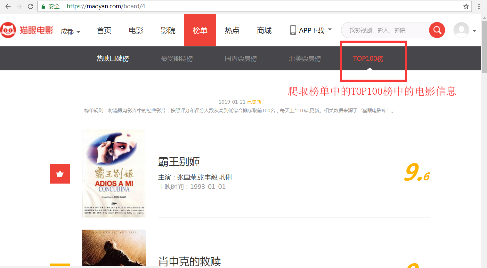
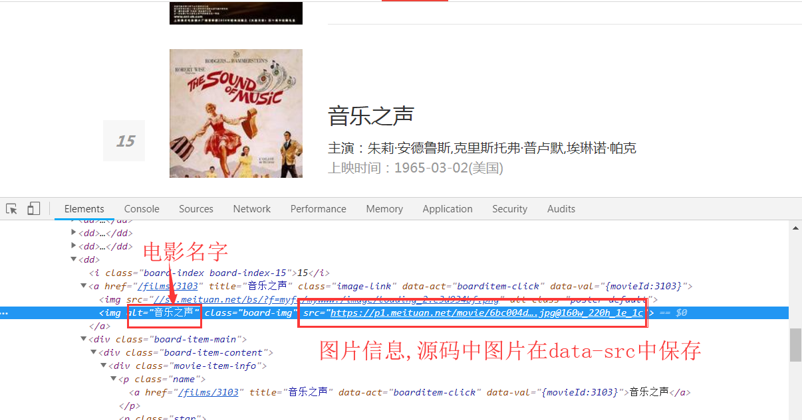
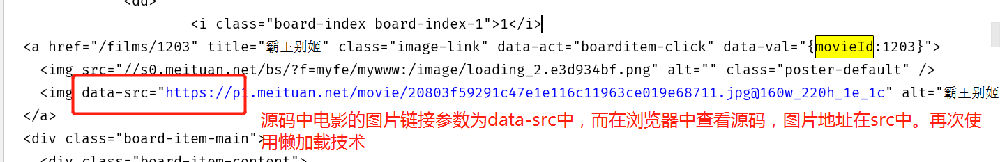

# 爬虫学习使用指南—猫眼应用案例

> Auth: 王海飞
>
> Data：2019-01-16
>
> Email：779598160@qq.com
>
> github：https://github.com/coco369/knowledge 

### 1. 实战案例: 爬取猫眼榜单中的电影信息 

分析猫眼榜单地址(https://maoyan.com/board)，榜单页面效果图如下:

分析该页面可以得到如下结论:

	1. 榜单中每一页10条信息，共有10页。
	2. 榜单第二页的请求地址为: https://maoyan.com/board/4?offset=10
	3. 榜单第三页的请求地址为: https://maoyan.com/board/4?offset=20
依次类推榜单的URL地址，可以发现请求中的参数offset的规律为: （页码 * 10）

### 2. 实现的效果展示

将猫眼伴当TOP100中的100个电影信息进行爬取并保存成maoyan.json文件。文件内容如下所示:

	[{"title": "霸王别姬", "actor": "主演：张国荣,张丰毅,巩俐", "release_time": "上映时间：1993-01-01", "score": "9.6", "rank": "1", "pic": "https://p1.meituan.net/movie/20803f59291c47e1e116c11963ce019e68711.jpg@160w_220h_1e_1c", "detail_url": "/films/1203"}, {"title": "肖申克的救赎", "actor": "主演：蒂姆·罗宾斯,摩根·弗里曼,鲍勃·冈顿", "release_time": "上映时间：1994-10-14(美国)", "score": "9.5", "rank": "2", "pic": "https://p0.meituan.net/movie/283292171619cdfd5b240c8fd093f1eb255670.jpg@160w_220h_1e_1c", "detail_url": "/films/1297"}]

文件中以字典的形式去组装每一个电影的信息，电影信息包含:

	title名称
	actor演员
	release_time上映时间
	score评分
	rank排名
	pic封面图
	detail_url详情地址

### 3. 实现代码

如下实现爬取猫眼TOP100中的电影信息，并保存在maoyan.json文件中:

	import requests
	import re
	import json

	def get_page(url):
	    # 获取单个网页
	    headers = {
	        "User-Agent": "Mozilla/4.0 (compatible; MSIE 7.0; Windows NT 5.1; 360SE)" 
	    }
	
	    response = requests.get(url, headers=headers)
	    if response.status_code == 200:
	        return response.text
	    return None

	def get_all_pages():
	    # 获取所有网页
	    result_all_list = []
	    for i in range(10):
	        page = i * 10
	        # 构建请求TOP100榜单的地址
	        url = 'http://maoyan.com/board/4?offset=%d' % page
	        # 获取每个页面的源码
	        html = get_page(url)
	        print(html)
	        # 解析页面的源码
	        result_list = parse_page(html)
	        result_all_list.extend(result_list)
	    return result_all_list

	def strips(l):
	    result_list = []
	    for item in l:
	        result_list.append(item.strip())
	    return result_list
	
	# 取评分
	def parse_score(score_html):
	    pattern = re.compile('<i class="integer">(.*?)</i><i class="fraction">(.*?)</i>', re.S)
	    score = re.findall(pattern, score_html)
	    return score
	
	# 保存json数据
	def save_json(result_list):
	    result_json_str = json.dumps(result_list, ensure_ascii=False)
	    with open('maoyan.json', 'w', encoding='utf-8') as f:
	        f.write(result_json_str)

	def parse_page(html):
	    # 解析网页
	    result_list = []
	
	    # 演员
	    pattern = re.compile('
(.*?)
', re.S)
	    actors = re.findall(pattern, html)
	    actors = strips(actors)
	
	    # 片名
	    pattern = re.compile('movieId.*?>.*?(.*?)
', re.S)
	    release_times = re.findall(pattern, html)
	    # print(release_times)
	
	    # 评分
	    pattern = re.compile('
(.*?)
', re.S)
	    score_ps = re.findall(pattern, html)
	    score_list = []
	    for score_html in score_ps:
	        scores = parse_score(score_html)
	        score = ''.join(scores[0])
	        score_list.append(score)
	    # print(score_list)
	
	    # 排名
	    # 演员
	    pattern = re.compile('<i class="board-index board-index.*?">(.*?)</i>', re.S)
	    ranks = re.findall(pattern, html)
	    # print(ranks)
	
	    # 图片链接
	    pattern = re.compile('movieId.*?>.*?.*?
<a href="(.*?)" title.*?', re.S)
	    detail_urls = re.findall(pattern, html)

	    # 组合结果列表
	    for i in range(len(movie_names)):
	        item = {}
	        item['title'] = movie_names[i]
	        item['actor'] = actors[i]
	        item['release_time'] = release_times[i]
	        item['score'] = score_list[i]
	        item['rank'] = ranks[i]
	        item['pic'] = pic_urls[i]
	        item['detail_url'] = detail_urls[i]
	        result_list.append(item)
	
	    return result_list

	def main():
	    # 解析所有页面，并将结果装成成[{title:xxx, actor:xxx},{title:xxx, actor:xxx}]这种格式
	    result_list = get_all_pages()
	    # 将爬取的结果存储为json文件
	    save_json(result_list)

	if __name__ == '__main__':
	    # 启动
	    main()

注意: 获取页面中的电影图片pic参数时，页面使用懒加载技术来渲染页面中的图片信息，因此获取图片的正则表达式需要做一定的调整。

<b>对比以下浏览器中的图片源码信息和使用requests获取的源码信息，可以发现在浏览器中的图片地址在src参数中，而源码中的图片地址在data-src中，因此代码中使用正则匹配图片的地址应该匹配源码中data-src中的地址信息。</b>

图1, 浏览器中查看图片源码:

图2，获取页面源码:

