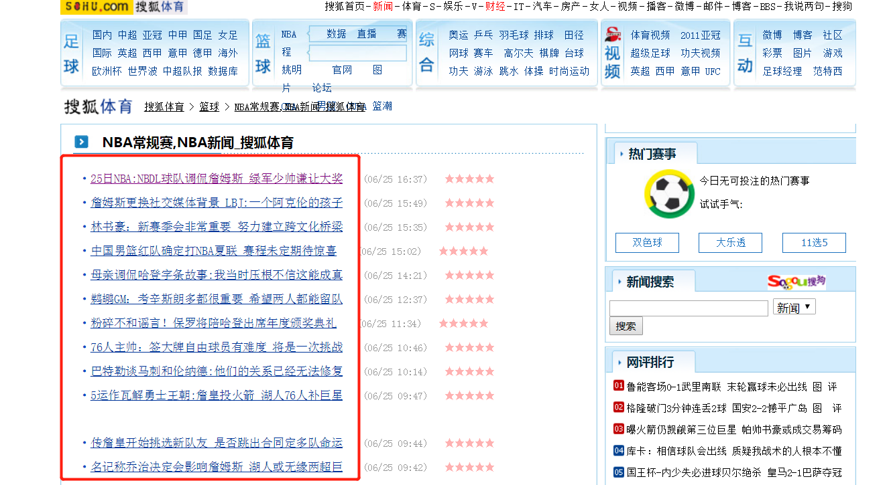
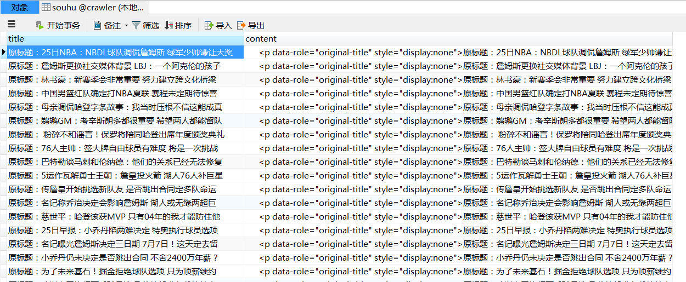

# 爬虫学习使用指南

>Auth: 王海飞
>
>Data：2018-06-25
>
>Email：779598160@qq.com
>
>github：https://github.com/coco369/knowledge>

### 2. 获取搜狐体育的新闻信息

爬取搜狐体育中的新闻列表信息，并且获取每一个新闻中的详情介绍。使用mysql数据库将数据持久化。

#### 案例代码:

	# coding=utf-8
	
	import re
	import urllib.request
	
	import pymysql

​	
	def decode_html(page_bytes, charsets=('utf-8', 'gbk')):
	    # 解码页面内容
	    page_html = None
	
	    for charset in charsets:
	        try:
	            # 判断源码编码如果正常解析的话，跳出循环
	            page_html = page_bytes.decode(charset)
	            break;
	        except UnicodeDecodeError:
	            print('网页解码错误')
	    return page_html

​	
	def get_matched_parts(page_html, pattern_str, pattern_ignore_case=re.S):
	    # 从页面中提取需要的部分(通常是链接也可以通过正则表达式进行指定)
	    pattern_regex = re.compile(pattern_str, pattern_ignore_case)
	    return pattern_regex.findall(page_html) if page_html else []

​	
	def get_html(url):
	    header = {
	        'User-Agent': 'Mozilla/5.0 (Windows NT 6.1; WOW64) AppleWebKit/537.36 (KHTML, like Gecko) Chrome/65.0.3325.181 Safari/537.36'
	    }
	    res = urllib.request.Request(url=url, headers=header)
	    r = urllib.request.urlopen(res)
	    # 解析网页源码
	    page_html = decode_html(r.read())
	    return page_html

​	
	def get_mysql_conn(sql, param_list):
	
	    conn = pymysql.connect(host='localhost', port=3306, database='crawler',
	                           user='root', password='123456', charset='utf8')
	    cursor = conn.cursor()
	    cursor.executemany(sql, param_list)
	    conn.commit()
	    cursor.close()

​	
	def start_crawl(url, match_pattern):
	    page_html = get_html(url)
	    # 正则获取网页信息
	    links_list = get_matched_parts(page_html, match_pattern)
	    sql = 'insert into souhu values (%s, %s)'
	    param_list = []
	    for link in links_list:
	        # 获取新闻的链接地址
	        page_html = get_html(link)
	        # 获取标题
	        title = get_matched_parts(page_html, '
(.*?)
')
	        # 获取内容
	        article = get_matched_parts(page_html, '<article class="article" id="mp-editor">(.*)</article>')
	
	        if title and article:
	            title = title[0]
	            article = article[0]
	            param_list.append([title, article])
	
	    print(param_list)
	    get_mysql_conn(sql, param_list)

​	
	if __name__ == '__main__':
	    url = 'http://sports.sohu.com/nba_a.shtml'
	    match_pattern = "<a test=a href='(.*?)'"
	    start_crawl(url, match_pattern)

分析：

在获取网页源代码的时候，直接获取的源代码为bytes类型的。在页面源码中meta中指定了页面源码的编码charset=utf-8或者gbk。这个时候我们在获取到bytes类型的源码的时候需要转码，需要对源码进行utf-8或者gbk编码

#### 运行结果：

