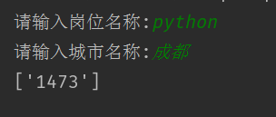

# 爬虫学习使用指南---简单应用案例

>Auth: 王海飞
>
>Data：2018-06-06
>
>Email：779598160@qq.com
>
>github：https://github.com/coco369/knowledge 


### 1. 分析百度的搜索

当我们通过百度搜索引擎去搜索python语言的时候，可以发现百度搜索的url中有很多无用的参数，过滤掉无用的参数，最后的请求url可以展示为，如下的信息：

	https://www.baidu.com/s?wd=python%E8%AF%AD%E8%A8%80

其中搜索的是python语言，中文被编码为3个字符表示

#### 1.1 使用urllib进行中文的编码和解码

	from urllib import parse
	
	# 编码
	enstr = parse.urlencode({'kd': '千峰'})
	# 打印的结果为 kd=%E5%8D%83%E5%B3%B0
	print(enstr)
	
	# 解码
	destr = parse.unquote(enstr)
	# 解码的结果为 kd=千峰
	print(destr)

#### 1.2 简单案例--百度搜索(search_spider03.py)

自定义百度的搜索url，获取页面源码。以下案例中，我搜索王海飞，查看一下搜索e的结果页面如何。
```
import urllib.request
from urllib import parse

def baidu_api(search):
    url = 'https://www.baidu.com/s?' + search
    header = {
    'User-Agent': 'Mozilla/5.0 (Windows NT 6.1; WOW64) AppleWebKit/537.36 (KHTML, like Gecko) Chrome/65.0.3325.181 Safari/537.36'
    }
    res = urllib.request.Request(url=url, headers=header)
    r = urllib.request.urlopen(res)
    print(r.read().decode('utf-8'))

if __name__ == '__main__':

    search = input('请输入搜索的数据:')
    wd = parse.urlencode({'wd': search})
    baidu_api(wd)
```

#### 1.3 智联岗位爬取(zhilian_spider04.py)

```
import urllib.request
import re
from urllib import parse

def zhaopin_msg(url):
	"""
	获取智联上招聘信息
	1. 获取职位的个数
    <span class="search_yx_tj">
    共<em>1473</em>个职位满足条件
    </span>
    """
    header = {
    'User-Agent': 'Mozilla/5.0 (Windows NT 6.1; WOW64) AppleWebKit/537.36 (KHTML, like Gecko) Chrome/65.0.3325.181 Safari/537.36'
	    }
    req = urllib.request.Request(url=url, headers=header)
    res = urllib.request.urlopen(req)
	
    # 正则匹配，查询的结果为职位的个数
    count_job = re.findall('<em>(\d+)</em>', res.read().decode('utf-8'))
	
    return count_job

if __name__ == '__main__':
	
    # 获取从客户端接收到的参数
    job_name = input('请输入岗位名称:')
    city_name = input('请输入城市名称:')
    
    # 将输入参数进行编码，输入参数，python和成都，输出结果为:jl=%E6%88%90%E9%83%BD&kw=python
    search_params = parse.urlencode({'jl': city_name, 'kw': job_name})
    # urllib进行解析的网站的url
    url = 'https://sou.zhaopin.com/jobs/searchresult.ashx?%s' % search_params
	# 进行解析地址
    result = zhaopin_msg(url)
    print(result)
```

调试：搜索成都的python岗位的职位个数




