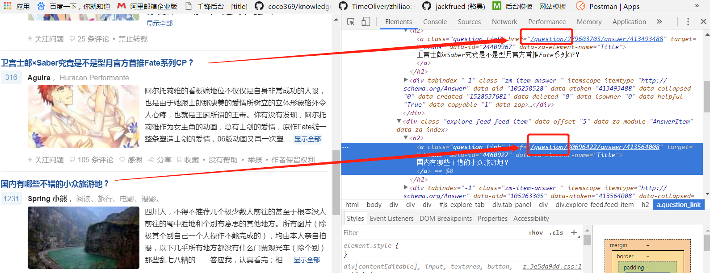
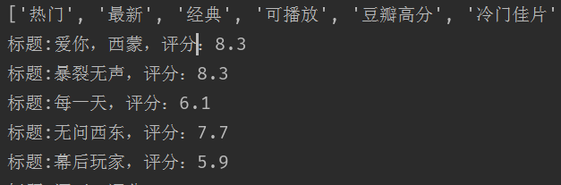
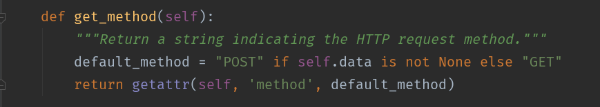

# 爬虫学习使用指南

>Auth: 王海飞
>
>Data：2018-06-15
>
>Email：779598160@qq.com
>
>github：https://github.com/coco369/knowledge 


### 1 简单案例，爬取知乎发现里面的提问的链接数，和链接地址

分析页面，发现我们需要知道的知乎问题的地址，可以在审查元素中都可以查看到：



代码：
```
from urllib.parse import urljoin

import re
import requests

from bs4 import BeautifulSoup

def main():
	headers = {'user-agent': 'Baiduspider'}
	proxies = {
		'http': 'http://122.114.31.177:808'
	}
	base_url = 'https://www.zhihu.com/'
	seed_url = urljoin(base_url, 'explore')
	resp = requests.get(seed_url, headers=headers)
	soup = BeautifulSoup(resp.text, 'lxml')
	# 正则表达式，匹配以/questio开头的
	href_regex = re.compile(r'^/question')
	# 设置link_set为一个集合，利用集合的去重属性
	link_set = set()
	# 查看href包含正则匹配的a标签的结果
	for a_tag in soup.find_all('a', attrs={'href': href_regex}):
	print(a_tag.attrs)
	# a_tag的结果为匹配出的结果，如{'class': ['question_link'], 'href': '/question/281169995', 'target': '_blank', 'data-id': '24758240', 'data-za-element-name': 'Title'}这种
	if 'href' in a_tag.attrs:
		href = a_tag.attrs['href']
		full_url = urljoin(base_url, href)
		# 向集合中添加完整的知乎问题的地址
		link_set.add(full_url)
	print(link_set)
	print('Total %d question pages found.' % len(link_set))

if __name__ == '__main__':
	main()
```

查看返回结果：

	{'https://www.zhihu.com/question/276922254/answer/413447521', 'https://www.zhihu.com/question/30696422/answer/413564008', 'https://www.zhihu.com/question/274007785/answer/392894546', 'https://www.zhihu.com/question/277104164/answer/393020512', 'https://www.zhihu.com/question/279603703/answer/413493488', 'https://www.zhihu.com/question/277321156/answer/392774717', 'https://www.zhihu.com/question/277411517/answer/413642909', 'https://www.zhihu.com/question/277307983/answer/392905933', 'https://www.zhihu.com/question/281169995', 'https://www.zhihu.com/question/280307875/answer/413407063', 'https://www.zhihu.com/question/264443853/answer/393002238'}
	
	Total 11 question pages found.


改进代码：

查询匹配a标签中的href值，修改该部门的查询方式如下，运行结果不变

	def main():
	    headers = {'user-agent': 'Baiduspider'}
	
	    base_url = 'https://www.zhihu.com/'
	    seed_url = urljoin(base_url, 'explore')
	    resp = requests.get(seed_url,
	                        headers=headers)
	    soup = BeautifulSoup(resp.text, 'lxml')
	
		# 查询a标签下的，class样式为question_link的样式信息
	    a = soup.find_all('a', 'question_link')
	    # 设置link_set为一个集合，利用集合的去重属性
	    link_set = set()
	    for i in a:
	        href_regex = re.compile('href=\"(.+?)\"')
	        href = href_regex.findall(str(i))
	        full_url = urljoin(base_url, href[0])
	        # 向集合中添加完整的知乎问题的地址
	        link_set.add(full_url)
	    print(link_set)
	    print('Total %d question pages found.' % len(link_set))


### 2 爬取豆瓣电影的电影名、评分等信息(douban_movie05.py)

```
	import urllib.request
	from urllib import parse
	import json
	
	"""
	获取豆瓣电影中的电影资源
	豆瓣电影url地址：https://movie.douban.com/explore#!type=movie&tag=%E7%83%AD%E9%97%A8&sort=recommend&page_limit=20&page_start=0
	分析：
	    1. 该页面中的的电影资源信息都是通过ajax异步加载进行刷新出来的
	    2. 在F12下的network中过滤XHR(XMLHTTPRESPONSE)请求，可以查看到真正的异步的请求地址如下
	        https://movie.douban.com/j/search_subjects?type=movie&tag=%E7%83%AD%E9%97%A8&sort=recommend&page_limit=20&page_start=20
	    3. 正在的请求地址中，type为类型，tag为标签（热门、经典、最新、爱情、科幻等等），sort为排序，page_limit为每一个的条数，page_start为开始的条数下标
	    4. 获取tag类型的url地址为： https://movie.douban.com/j/search_tags?type=movie&source=
	"""

	def urllib_open(url):
	    """
	    公共的处理代码
	    """
	    header = {
	        'User-Agent': 'Mozilla/5.0 (Windows NT 6.1; WOW64) AppleWebKit/537.36 (KHTML, like Gecko) Chrome/65.0.3325.181 Safari/537.36'
	    }
	    req = urllib.request.Request(url=url, headers=header)
	    res = urllib.request.urlopen(req)
	
	    return res.read().decode('utf-8')

	def get_movie_tag(url):
	    """
	    获取电影的分类tag
	    """
	    tag_res = urllib_open(url)
	    # 返回的tag_res的结果为'{"tags":["热门","最新","经典","可播放","豆瓣高分","冷门佳片","华语","欧美","韩国","日本","动作","喜剧","爱情","科幻","悬疑","恐怖","成长"]}'
	    # 其结果为一个字符串类型的数据，需要将之转化为字典类型的
	    result = json.loads(tag_res)
	    content = result['tags']
	    return content

	def get_movies(tag_url, movies_url):
	    tag_content = get_movie_tag(tag_url)
	    # 循环tag的内容，拼接出指定tag的电影内容
	    # movies_url中指定电影类型的参数是tag=热门或者最新等等，所以需要进行tag的内容的编码
	    tag_list = []
	    print(tag_content)
	    for tag in tag_content:
	        data = {'tag': tag}
	        search_tag = parse.urlencode(data)
	        tag_list.append(search_tag)
	
	    for search_tag in tag_list:
	        seatch_url = movies_url
	        seatch_url = seatch_url % (search_tag)
	        movies_res = urllib_open(seatch_url)
	        res = json.loads(movies_res)
	        result = res['subjects']
	        for res in result:
	            print('标题:%s，评分：%s' % (res['title'], res['rate']))
	
	if __name__ == '__main__':
	    tag_url = 'https://movie.douban.com/j/search_tags?type=movie&source='
	    movies_url = 'https://movie.douban.com/j/search_subjects?type=movie&%s&sort=recommend&page_limit=20&page_start=0'
	    get_movies(tag_url, movies_url)
```



其中：如果需要传递post请求的时候，需要传递post请求的参数，urllib.request.Request(rul, data, headers)

查看urllib.request下的Request.py文件可以看到以下源码，如果有data参数，则表示该请求url为POST请求：



