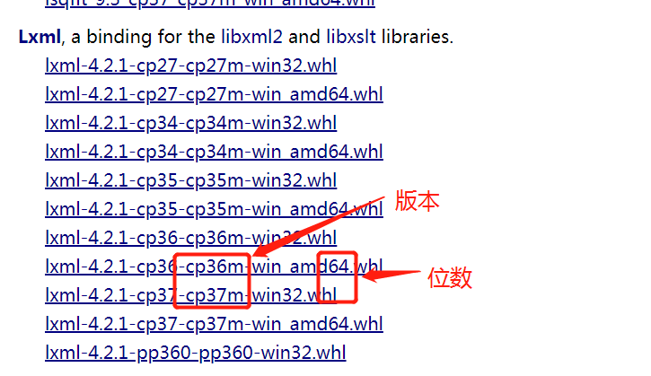
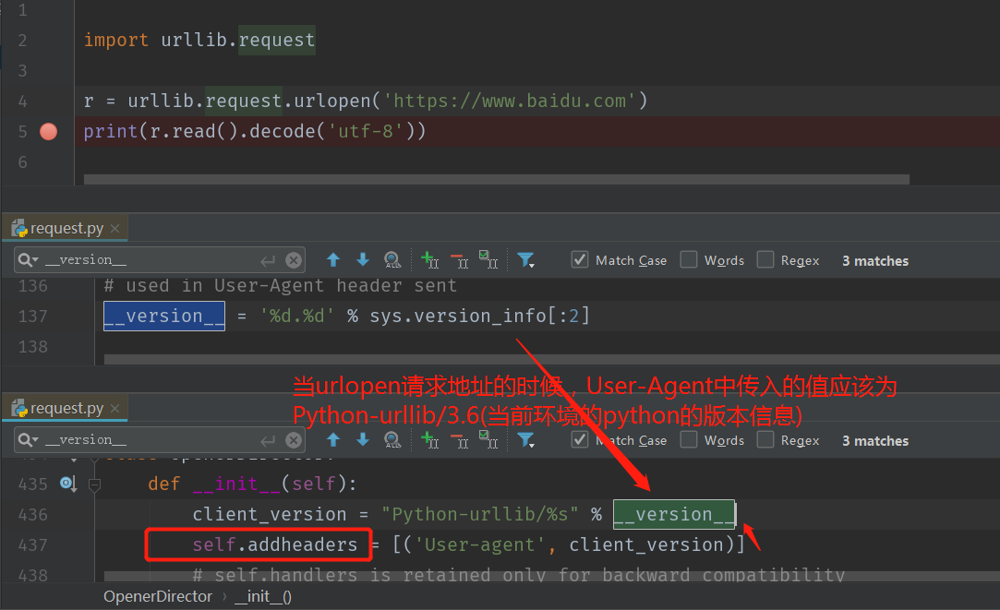

# 爬虫学习使用指南

>Auth: 王海飞
>
>Data：2018-06-04
>
>Email：779598160@qq.com
>
>github：https://github.com/coco369/knowledge 


### 前言

爬虫涉及技术：数据采集--分析--存储


### 1. 数据分析和采集

本爬虫教程中使用的python版本统一为python3.X的版本

#### 1.1 数据分析

爬取网页信息可以使用很多的技术：

1. 获取网页信息：urllib、urllib3、requests

		requests为第三方的库，需要安装才能使用

		pip install requests

2. 解析网页信息：beautifulsoup4(bs4)、re、xpath、lxml

		bs4为第三方的库，需要安装才能使用

		pip install beautifulsoup4
		
		使用的时候 from bs4 import BeautifulSoup 这样导入

	Python 标准库中自带了 xml 模块，但是性能不够好，而且缺乏一些人性化的 API，相比之下，第三方库 lxml 是用 Cython 实现的，而且增加了很多实用的功能。

		安装lxml，在新版本中无法使用from lxml import etree
		
		pip install lxml 并不推荐这样去安装lxml
		
		推荐安装的方法：访问网站(https://www.lfd.uci.edu/~gohlke/pythonlibs/#lxml)下载lxml的安装whl文件，然后进行安装。

我这儿下载的是lxml-4.2.1-cp36-cp36m-win_amd64.whl，安装命令如下

		pip install lxml-4.2.1-cp36-cp36m-win_amd64.whl

截图：




3. 动态数据解析

	通用：selenium(自动化测试框架)


#### 1.2 数据采集

4. 存储：mysql、redis、mongodb、sqlalchemy

5. 序列化：json

6. 调度器：进程、线程、协程


### 2. 请求头分析

	# 浏览器告诉服务器可以接收的文本类型, */*表示任何类型都可以接收
	Accept: text/html, */*;q=0.8
	 
	# 浏览器告诉服务器，数据可以压缩，页面可以解压数据然后进行渲染。做爬虫的时候，最好不要写该参数
	Accept-Encoding: gzip, deflate 
	
	# 语言类型
	Accept-Language: zh-CN,zh;q=0.9 
	
	Cache-Control: max-age=0
	
	# 保持连接
	Connection: keep-alive 
	
	# 会话 
	Cookie: Hm_lvt_3bfcc098e0da26d58c321ba579b04b2f=1527581188,1528137133
	
	# 域名
	Host: www.cdtopspeed.com 
	
	Upgrade-Insecure-Requests: 1
	
	# 用户代理, 使得服务器能够识别请求是通过浏览器请求过来的，其中包含浏览器的名称/版本等信息
	User-Agent: Mozilla/5.0 (Windows NT 6.1; WOW64) AppleWebKit/537.36 (KHTML, like Gecko) Chrome/65.0.3325.181 Safari/537.36

其中在爬虫中最重要的就是User-Agent

### 3. urllib的使用

#### 3.1 语法1

#####         urllib.request.urlopen(url, data, timeout) ，其中传入data则表示发送POST请求，不传入data则表示发送GET请求

3.1.1 传入url参数
```
import urllib.request
import urllib.error
import urllib.parse

# 只传入地址url的情况
url = 'http://www.baidu.com'
response = urllib.request.urlopen(url)
print(response)
# read()读取响应内容，默认格式为bytes
text = response.read().decode('utf-8')

# 传入地址url和参数data的情况
# 参数放在url地址中，请求方式为GET
url = 'http://www.baidu.com/s?wd=python'
response = urllib.request.urlopen(url)
text = response.read().decode('utf-8')
```
3.1.2 传入url参数和data参数
```
# 参数放在urlopen(data)中，表示请求方式为POST
url = 'http://www.baidu.com/s'
data = {
    'wd': 'python'
}
# urlencode()方法将字典转化为key=value的形式
data = urllib.parse.urlencode(data)
# bytes()方法将data转化为bytes类型
data = bytes(data, encoding='utf-8')
response = urllib.request.urlopen(url, data)
text = response.read().decode('utf-8')
```
3.1.3 传入url参数和timeout参数
```
# 传入timeout参数
url = 'http://www.baidu.com'
try:
    response = urllib.request.urlopen(url, timeout=0.01)
    text = response.read().decode('utf-8')
    print(text)
except urllib.error.URLError as e:
    print('超时')
```

#### 3.2 语法
##### urlopen()方法接收一个请求参数request对象：

##### 	request = urllib.request.Request(url, data, headers, method)

##### 	urllib.request.urlopen(对象request)

3.2.1 传入地址url的情况

```
# Request(url)只传入地址url的情况
url = 'https://movie.douban.com/top250'
request = urllib.request.Request(url)
response = urllib.request.urlopen(request)
text = response.read().decode('utf-8')
```

3.2.2 Request(url, data)传入地址url和参数data的情况
```
# data是bytes类型，请求为POST
url = 'http://www.baidu.com/s'
data = {
    'wd': 'python'
}
data = urllib.parse.urlencode(data)
data = bytes(data, encoding='utf-8')
request = urllib.request.Request(url, data)
response = urllib.request.urlopen(request)
text = response.read().decode('utf-8')
```

3.2.3 Request(url, headers), headers表示请求头，如User_Agent参数
```
# User_Agent参数可被服务端获取进行判断，判断该请求为爬虫还是人工

url = 'http://httpbin.org/get'
headers = {
    'User-Agent': 'Mozilla/5.0 (Windows NT 6.1; WOW64) AppleWebKit/537.36 (KHTML, like Gecko) Chrome/73.0.3683.86 Safari/537.36'
}
request = urllib.request.Request(url, headers=headers)
response = urllib.request.urlopen(request)
text = response.read().decode('utf-8')
print(text)
```

3.2.4 修改代理IP
```
url = 'http://httpbin.org/get'
proxies = {
    'http': 'http://113.120.63.179:9999'
}
proxy_handler = urllib.request.ProxyHandler(proxies=proxies)
opener = urllib.request.build_opener(proxy_handler)
# 设置User-Agent
# 设置User-Agent方法1
opener.addheaders = [('User-Agent', '')]
opener.open(url)
# 设置User-Agent方法2
request = urllib.request.Request(url, headers=headers)
response = opener.open(request)

text = response.read().decode('utf-8')
print(text)
```

注意:  如果用户代理User-Agent参数不修改，则默认User-Agent参数为‘Python-urllib/3.7’，从源码中可以发现如下代码，如下图所示：




#### 4. ssl认证


什么是 SSL 证书？

SSL 证书就是遵守 SSL 安全套接层协议的服务器数字证书。

而 SSL 安全协议最初是由美国网景 Netscape Communication 公司设计开发的，全称为：安全套接层协议 (Secure Sockets Layer) ， 它指定了在应用程序协议 ( 如 HTTP 、 Telnet 、 FTP) 和 TCP/IP 之间提供数据安全性分层的机制，它是在传输通信协议 (TCP/IP) 上实现的一种安全协议，采用公开密钥技术，它为 TCP/IP 连接提供数据加密、服务器认证、消息完整性以及可选的客户机认证。由于此协议很好地解决了互联网明文传输的不安全问题，很快得到了业界的支持，并已经成为国际标准。

SSL 证书由浏览器中“受信任的根证书颁发机构”在验证服务器身份后颁发，具有网站身份验证和加密传输双重功能。

如果能使用 https:// 来访问某个网站，就表示此网站是部署了SSL证书。一般来讲，如果此网站部署了SSL证书，则在需要加密的页面会自动从 http:// 变为 https:// ，如果没有变，你认为此页面应该加密，您也可以尝试直接手动在浏览器地址栏的http后面加上一个英文字母“ s ”后回车，如果能正常访问并出现安全锁，则表明此网站实际上是部署了SSL证书，只是此页面没有做 https:// 链接；如果不能访问，则表明此网站没有部署 SSL证书。


案例:

访问加密的12306的网站

如果不忽略ssl的安全认证的话，网页的源码会提示ssl认证问题，需要提供ssl认证。我们在做爬虫的时候，自动设置忽略掉ssl认证即可。代码如下：

```
import ssl
import urllib.request

def main():
    url = 'https://www.12306.cn/mormhweb/'
    # 忽略未经审核的ssl认证
    context = ssl._create_unverified_context()
    res = urllib.request.urlopen(url, context=context)
    print(res.read().decode('utf-8'))


if __name__ == '__main__':
	main()
```

```

```