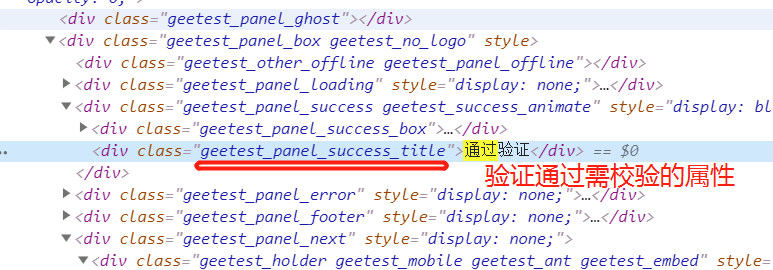

# 爬虫学习使用指南---极验验证码破解

> Auth: 王海飞
>
> Data：2019-06-16
>
> Email：779598160@qq.com
>
> github：https://github.com/coco369/knowledge 

### 前言

​	在爬虫中极验验证码是一种通过分析用户完成拼图过程中的行为特征，通过数据分析来判断是人还是机器。对用户来说，用户不必面对眼花缭乱的英文字符或汉字，从而整个验证过程变的像游戏一样有趣。 但是对于爬虫开发者来说，整个爬取数据的过程将变得异常痛苦。如下示例将以破解<b>B站登录的极验验证码</b>为例进行讲解。

#### 1. 破解极验验证码思路

第一: 找到带有缺口的验证码图片img1。

第二: 找到不带有缺口的原始验证码图片img2。

第三: 对比img1和img2两张图片，找到缺口位置。

第四: 使用selenium模拟人的拖拽行为，拖动滑块进行校验

第五: 判断拖拽结果是否成功，失败则重复拖拽行为。

#### 2. B站登录界面

​	缺口图和原始图的截取可通过从保存的大图中获取。如下示例，先演示如何在B站登录界面中点击出现极验验证码拖拽窗口。

```
import time
from io import BytesIO

from PIL import Image
from selenium import webdriver
from selenium.webdriver import ActionChains
from selenium.webdriver.support.wait import WebDriverWait
from selenium.webdriver.common.by import By
from selenium.webdriver.support import expected_conditions as EC

class CrackBilibili():
    def __init__(self):
        # 初始化函数
        self.url = 'https://passport.bilibili.com/login'
        self.browser = webdriver.Chrome()
        self.wait = WebDriverWait(self.browser, 10)
        self.email = '779598160@qq.com'
        self.password = 'wang135588'
        
    def __del__(self):
        # 析构函数，关闭浏览器窗口
        self.browser.close()
	
    def open(self):
        # 打开浏览器,并输入账号和密码
        self.browser.get(self.url)
        email = self.wait.until(
            EC.presence_of_element_located((By.CSS_SELECTOR, '#login-username'))
        )
        password = self.wait.until(
            EC.presence_of_element_located((By.CSS_SELECTOR, '#login-passwd'))
        )
        # 输入账号
        email.send_keys(self.email)
        # 输入密码
        password.send_keys(self.password)
        # 登陆按钮
        button = self.wait.until(
            EC.presence_of_element_located((By.CSS_SELECTOR, '#geetest-wrap > ul > li.btn-box > a.btn.btn-login'))
        )
        button.click()
```

分析:  类CrackBilibili中的__init__方法为初始化初始参数信息，启动open方法为打开浏览器，并打开B站的登录界面，登录地址为:https://passport.bilibili.com/login。具体步骤分析如下:

步骤1： Chrome浏览器打开登录界面。

步骤2:  显式等待，并获取账号和密码输入框，并输入账号和密码信息，并点击登陆按钮（极验验证码是填写账号和密码信息后点击登陆按钮后才出现的）

步骤3: 分析页面中的带有缺口的极验验证码，并保存。代码实现如下。

#### 3. 极验缺口图和原始图的截取

```
def get_geetest_img(self, name=None, n=None):
    # 以下的判断是为了解决元素没有被加载，而被截图的情况
    if n == 1:
        # 获取带有缺口的图片位置
        canvas = self.wait.until(
            EC.presence_of_element_located((By.CSS_SELECTOR, 'body > div.geetest_panel.geetest_wind > div.geetest_panel_box.geetest_no_logo.geetest_panelshowslide > div.geetest_panel_next > div > div.geetest_wrap > div.geetest_widget > div > a > div.geetest_canvas_img.geetest_absolute > div > canvas.geetest_canvas_bg.geetest_absolute'))
        )
        captcha_name = 'bili_captcha.png'
    else:
        # 获取没有缺口的图片位置
        # 等待原图效果被加载
        canvas = self.wait.until(
            EC.presence_of_element_located((By.CSS_SELECTOR,
                                            'body > div.geetest_panel.geetest_wind > div.geetest_panel_box.geetest_no_logo.geetest_panelshowslide > div.geetest_panel_next > div > div.geetest_wrap > div.geetest_widget > div > a > div.geetest_canvas_img.geetest_absolute > canvas'))
        )
        # 执行js，将原图的display属性修改为block
        self.browser.execute_script(
            'document.getElementsByClassName("geetest_canvas_fullbg")[0].style.display="block"')
        captcha_name = 'bili_captcha1.png'

    # 保存大图
    time.sleep(2)
    screenshot = self.browser.get_screenshot_as_png()
    screenshot = Image.open(BytesIO(screenshot))
    screenshot.save(name)
    # 扣出小图
    x1, y1, x2, y2 = self.get_postion(canvas)
    captcha = screenshot.crop((x1, y1, x2, y2))
    captcha.save(captcha_name)
    return captcha

def get_postion(self, canvas=None):
	# 获取抠图的位置
    location = canvas.location
    size = canvas.size
    x1, y1, x2, y2 = location['x'] * 1.27, \
                     location['y'] * 1.27,\
                     location['x'] * 1.25 + size['width'] * 1.25,\
                     location['y'] * 1.25 + size['height'] * 1.25
    return x1, y1, x2, y2
```

分析: get_geetest_img()方法实现功能为保存有缺口的验证码小图和没有缺口的验证码小图功能。其中get_postion()方法为确认极验图片的位置，并返回坐标。其中具体代码分析如下步骤所示:

步骤1:  get_geetest_img()方法中n变量为1和2，其n==1时，表示定位B站登录界面中带有缺陷图的元素，并获取该元素。该图片的位置如下图所示:


步骤2:  get_geetest_img()方法中n变量为2时，表示定位B站登录界面中验证码的原图。只不过需要执行execute_script('document.getElementsByClassName("geetest_canvas_fullbg")[0].style.display="block"')将canvas的display属性修改为block。

步骤3: 分别在n==1和n==2的情况下，执行截图操作self.browser.get_screenshot_as_png()方法，将整个大图保存下来。

步骤4: 定位canvas变量确定验证码元素的位置，并通过crop()方法将刚保存的大图中的验证码小图抠出来。

#### 4. 对比缺陷图和原始图的像素，确定拖拽的像素

```
def get_gap(self, image1, image2):
    """
    对比图片获取缺口的偏移量
    image1: 有缺口图片
    image2: 没有缺口图片
    """
    # 获取图片的大小，如image1.size打印的内容为(宽, 高)
    print(image1.size)
    # 定义变量，表示跳过横轴指定像素后才进行缺口对比
    left = 60
    for i in range(60, image1.size[0]):
        # 循环横坐标
        for j in range(image1.size[1]-20):
            print(i,j)
            # 循环纵坐标
            # 对比两个图片中的像素点，判断是否相同
            if not self.is_pixel_equal(image1, image2, i, j):
                # 如果像素点不同，则返回false，则偏移量为i值
                left = i
                return left
    return left

def is_pixel_equal(self, image1, image2, i, j):
    """
    判断两个像素点是否相同
    :param image1: 带有缺口的图
    :param image2: 没有缺口的图
    :param i: 横坐标
    :param j: 纵坐标
    :return: True或者False，用于判断是否是相同的像素点
    """
    print(image1.load())
    # image1.getpixel((i,j)) 等同于 image1.load()[i,j]  表示: 返回给定位置的像素值
    # print(image1.getpixel((i,j)))
    # print(image2.getpixel((i,j)))

    pixel1 = image1.load()[i, j]
    pixel2 = image2.load()[i, j]
    print(pixel1)
    print(pixel2)
    # 通过load()[横,纵]获取像素点，结果为(1,2,3,4)
    # 注意: 由于每次截取的图片的大小有些许的偏差，因此不能用getpixel进行等于判断 if image1.getpixel((i, j)) == image2.getpixel((i, j)):
    # 设置阈值
    threshold = 60
    if abs(pixel1[0] - pixel2[0]) < threshold and abs(pixel1[1] - pixel2[1]) < threshold and abs(
            pixel1[2] - pixel2[2]) < threshold:
        return True
    else:
        return False
```

分析:  get_gap()方法用于确定需要移动的横坐标的像素点，具体详细分析步骤如下:

步骤1:  get_gap()方法中的left变量定义变量，表示跳过横轴指定像素后才进行缺口对比（因为在有缺口的图中有一个原始的拖拽图，因此对比两张图片的时候，将跳过小的拖拽图的像素点）。

步骤2: 图片image1.load()[横坐标, 纵坐标]表示获取该位置的像素点，因此可通过相同的坐标获取两张图片的像素点，只需对比两个像素点是否一致即可。（对比时可设置一个允许偏差的阈值threshold参数）

步骤3: 通过循环横纵坐标，get_gap()方法将返回需要拖拽的横向坐标left。

#### 5. 拖拽轨迹

```
def get_track(self, distance):
    """
    根据偏移量计算移动轨迹，distance为偏移量
    移动轨迹为先加速再减速
    """
    # 当前位移
    current = 0
    # 减速阈值，移动到4/5的位置减速
    mid = distance * 4 / 5
    # v0初速度
    v0 = 0
    # 时间
    t = 0.2
    # 轨迹
    track = []

    while current < distance:
        if current < mid:
            # 加速度为2
            a = 2
        else:
            # 减速，加速度为-3
            a = -3
        # 当前速度v0 = v + at
        v = v0
        v0 = v + a * t
        # 距离 s = v1t +1/2*a*t^2
        move = v0*t + 1/2 * a * t * t
        current += move
        # 加入轨迹
        track.append(move)
    return track

def move_to_gap(self, slider, track):
    """
    实现拖动滑块移动
    slider: 滑块
    track: 轨迹
    """
    # 点击并抓住滑块
    ActionChains(self.browser).click_and_hold(slider).perform()
    # 根据路径一点点的移动
    for item in track:
        ActionChains(self.browser).move_by_offset(xoffset=item, yoffset=0).perform()
    # 休息0.5秒
    time.sleep(0.5)
    ActionChains(self.browser).release().perform()
```

分析: get_track()方法用于计算拖拽的行驶轨迹，move_to_gap()方法用于拖拽，具体代码步骤分析如下:

步骤1: get_track()方法中用于计算行驶轨迹，且拖拽的速度为先加速后减速，当加速到总移动距离的4/5的位置后再减速。因此加速度设为2，减速度设为-3。当前速度为v0 = v + a*t，当前行驶距离为move=vo*t + 1/2* a * t * t

步骤2: 拖拽方法move_to_gap()找那个ActionChains()的click_and_hold表示抓住拖拽按钮不放，move_by_offset()表示移动位置，其中xoffset为移动的很坐标，release()表示放下拖拽按钮。

#### 6. 执行以上所有代码，实现破解B站极验验证码

   ```
   def crack(self):
           # 打开浏览器和输入账号密码，并点击登陆
           self.open()
           # 保存有缺口的图片
           image1 = self.get_geetest_img('bili_login.png', 1)
           # 保存没有缺口的图片
           image2 = self.get_geetest_img('bili_login1.png', 2)
           # 获取滑块
           slider = self.slider()
           # 获取缺口位置
           gap = self.get_gap(image1, image2)
           print(gap)
           # 获取轨迹
           track = self.get_track(gap)
           # 拖动滑块
           self.move_to_gap(slider, track)
           # 判断是否校验通过
           try:
               success = self.wait.until(
                   # 判断是否有通过的提示div
                   EC.text_to_be_present_in_element((By.CSS_SELECTOR, 'body > div.geetest_panel.geetest_wind > div.geetest_panel_box.geetest_no_logo > div.geetest_panel_success.geetest_success_animate > div.geetest_panel_success_title'), '通过验证')
               )
               if success:
                   # 登录，点击登陆按钮
                   pass
               else:
                   # 如果失败，则重新执行验证码校验
                   self.crack()
           except:
               self.crack()
   
   if __name__ == '__main__':
   
       crack = CrackBilibili()
       crack.crack()
   ```
分析: 之后在分析如果拖拽成功，则页面中可以获取到 ‘验证通过’ 的提示div框。因此最后再判断该框是否出现，如果不出现，则表示验证失败，继续重新执行self.crack()方法。

验证通过图如下:

