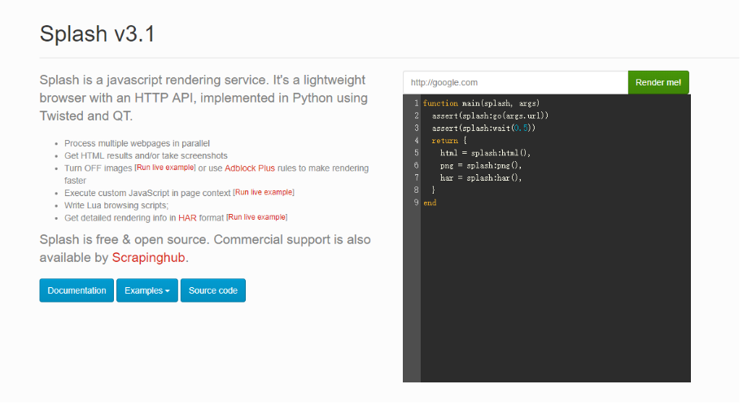

# 爬虫学习使用指南--动态信息的加载

> Auth: 王海飞
>
> Data：2019-07-27
>
> Email：779598160@qq.com
>
> github：https://github.com/coco369/knowledge 

### 前言

​		根据权威机构发布的全球互联网可访问性审计报告，全球约有四分之三的网站其内容或部分内容是通过JavaScript动态生成的，这就意味着在浏览器窗口中“查看网页源代码”时无法在HTML代码中找到这些内容，也就是说我们之前用的抓取数据的方式无法正常运转了。解决这样的问题基本上有三种方案，分别为:

1. 分析动态网站所加载的ajax请求
2. 使用自动化测试工具selenium
3. 使用动态渲染js的splash，Splash是JS渲染引擎，它是使用Webkit开发的轻量级无界面浏览器，提供基于HTML接口的JS渲染服务。其使用Twisted和QT。Twisted（QT）用来让服务具有异步处理能力，以发挥webkit的并发能力。

#### 1. splash介绍

​		目前互联网行业中许多的网页通过javascript模式进行交互，简单的爬取网页模式无法胜任javascript页面的生成和ajax网页的爬取，同时通过分析连接请求的方式来落实局部连接数据请求，相对比较复杂，尤其是对带有特定时间戳算法的页面，分析难度较大，效率不高。而通过调用浏览器模拟页面动作模式，需要使用浏览器，无法实现异步和大规模爬取需求。鉴于上述理由Splash也就有了用武之地。一个页面渲染服务器，返回渲染后的页面，便于爬取，便于规模应用。

#### 2. splash安装

​		通过创建splash的docker容器来创建splash服务。如下在windows中安装docker，并创建容器。或者在CentOS中安装docker容器。CentOS、Windows中安装docker，请移步[地址](../../docker/docker概念与安装.md)。

##### 下拉Splash镜像

```
docker pull scrapinghub/splash
```
##### 创建容器

```
#启动splash服务，并通过http，https，telnet提供服务
#通常一般使用http模式 ，可以只启动一个8050就好 
#Splash 将运行在 0.0.0.0 at ports 8050 (http), 8051 (https) and 5023 (telnet).
docker run -p 5023:5023 -p 8050:8050 -p 8051:8051 scrapinghub/splash
```

##### 启动docker容器后，在浏览器中直接访问本地地址:8050，即可看到如下图所示界面：



#### 3. splash的使用

解析动态信息加载网站，以下访问豆瓣电影为例:
```
import requests


def main():
    splash_url = 'http://149.129.98.163:8050/render.html'
    url = 'https://movie.douban.com/explore#!type=movie&tag=%E7%83%AD%E9%97%A8&sort=recommend&page_limit=20&page_start=0'

    args = {
        'url': url,  # 爬取的地址
        'timeout': 10,  # 超时时间
        'images': 0  # 是否加载图片
    }
    response = requests.get(splash_url, params=args)
    print(response.text)


if __name__ == '__main__':
    main()
```

执行以上的程序，可从控制台的输出打印中发现，response.text中会加载出需要js渲染后的数据。

<b>传参说明</b>：

​		url： 爬取的地址

​		timeout：超时时间

​		roxy：代理

​		wait：等待渲染时间

​		images: 是否下载，默认1（下载）

​		js_source: 渲染页面前执行的js代码

​		