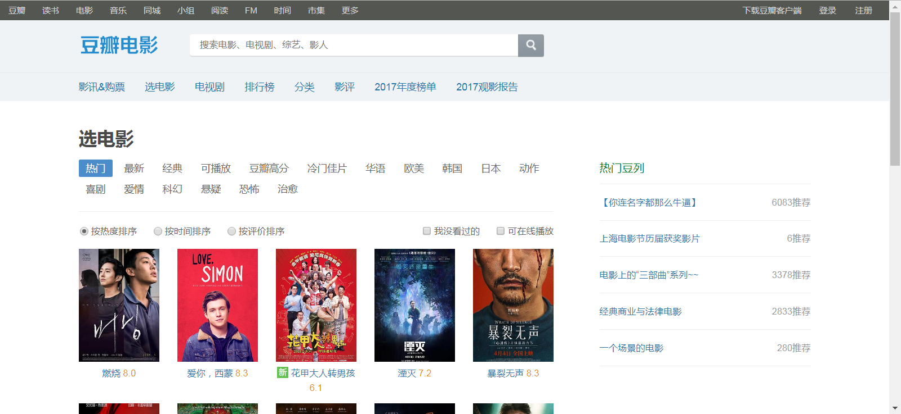
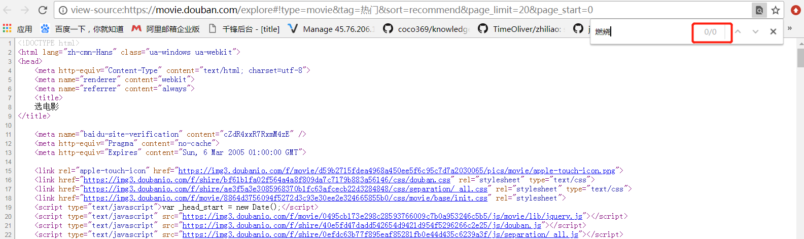
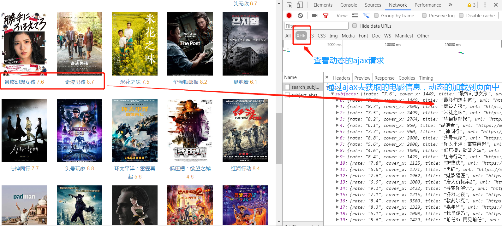

# 爬虫学习使用指南--动态分析

>Auth: 王海飞
>
>Data：2018-06-20
>
>Email：779598160@qq.com
>
>github：https://github.com/coco369/knowledge 


### 前言

​		根据权威机构发布的全球互联网可访问性审计报告，全球约有四分之三的网站其内容或部分内容是通过JavaScript动态生成的，这就意味着在浏览器窗口中“查看网页源代码”时无法在HTML代码中找到这些内容，也就是说我们之前用的抓取数据的方式无法正常运转了。解决这样的问题基本上有三种方案，如下介绍其中的两种解决方案：

>一是JavaScript逆向工程；

>另一种是渲染JavaScript获得渲染后的内容。
>


### 1. JavaScript逆向工程

我们以[豆瓣电影](https://movie.douban.com/explore#!type=movie&tag=%E7%83%AD%E9%97%A8&sort=recommend&page_limit=20&page_start=0)为例，说明什么是JavaScript逆向工程。其实所谓的JavaScript逆向工程就是找到通过Ajax请求动态获取数据的接口。



但是当我们在浏览器中通过右键菜单“显示网页源代码”的时候，居然惊奇的发现页面的HTML代码中连一个电影的名称都搜索不到。



那网页中的数据到底是怎么加载出来的呢，其实网页中的数据就是一个动态加载出来的。可以在浏览器的“开发人员工具”的“网络”中可以找到获取这些图片数据的网络API接口，如下图所示。



那么结论就很简单了，只要我们找到了这些网络API接口，那么就能通过这些接口获取到数据，当然实际开发的时候可能还要对这些接口的参数以及接口返回的数据进行分析，了解每个参数的意义以及返回的JSON数据的格式，这样才能在我们的爬虫中使用这些数据。


### 2. selenium自动框架

使用自动化测试工具Selenium，它提供了浏览器自动化的API接口，这样就可以通过操控浏览器来获取动态内容。首先可以使用pip来安装Selenium。

#### 2.1 安装

	pip install selenium

#### 2.2 使用

我们通过Selenium实现对Chrome浏览器的操控，如果要操控其他的浏览器，可以创对应的浏览器对象，例如Chrome、Firefox、Edge等，还有手机端的浏览器Android、BlackBerry等，另外无界面浏览器PhantomJS也同样支持。

	from selenium import webdriver
	
	browser = webdriver.Firefox()
	browser = webdriver.Ie()
	browser = webdriver.Opera()
	browser = webdriver.Chrome()
	browser = webdriver.PhantomJS()

这样我们就完成了一个浏览器对象的初始化，接下来我们要做的就是调用browser对象，让其执行各个动作，就可以模拟浏览器操作了。

案例中我们使用Chrome浏览器，在模拟Chrome浏览器的时候，如果报如下的错误的话，说明你没有Chrome的驱动。接下来就是添加Chrome的驱动到我们的环境变频path中，或者在程序中指定Chrome驱动的位置

	selenium.common.exceptions.WebDriverException: Message: 'chromedriver' executable needs to be in PATH. Please see https://sites.google.com/a/chromium.org/chromedriver/home

驱动已经下载好了，保存地址在(spider/chromedriver_win32/)中

#### 2.3 访问url

可以用get()方法来请求一个网页，参数传入链接URL即可


#### 2.4 获取元素

在浏览器中的操作，都可以通过selenium来完成，比如填充表单，模拟点击等等。那我们在进行这些操作的时候，首先需要知道我们要填充表单的位置在哪儿，模拟点击的按钮在哪儿。那怎么去获取这些信息呢。selenium中获取元素的方法有很多。

##### 获取单个元素

大概解释一下如下用法:

>find\_element\_by\_name()是根据Name值获取

>ind\_element\_by\_id()是根据ID获取

>find\_element\_by\_xpath()是根据Xpath提取

>find\_element\_by\_css\_selector('#xxx')是根据id=xxx来获取

>find_element()方法，它需要传入两个参数，一个是查找的方式By，另一个就是值，实际上它就是find_element_by_id()这种方法的通用函数版本。

注意：
	from selenium.webdriver.common.by import By 

	find_element_by_id(id)
	就等价于find_element(By.ID, id)
	
	find_element_by_css_selector('#xxx')
	等价于find_elements(By.CSS_SELECTOR, '.service-bd li')


##### 获取多个元素

>find_elements_by_css_selector('#xxx li')是根据id=xxx来获取下面的所有li的结果


#### 2.5 查找淘宝导航条的所有条目

案例代码：

	from selenium import webdriver
	
	chromedriver = 'C:\Program Files (x86)\Google\Chrome\Application\chromedriver'
	browser = webdriver.Chrome(chromedriver)
	browser.get('https://www.taobao.com')
	lis = browser.find_elements_by_css_selector('.service-bd li a')
	for li in lis:
	    # 获取文本信息
	    print(li.text)
	    # 获取属性
	    print(li.get_attribute('href'))
	browser.close()

#### 2.6 延时等待

在Selenium中，get()方法会在网页框架加载结束之后就结束执行，此时如果获取page_source可能并不是浏览器完全加载完成的页面，如果某些页面有额外的Ajax请求，我们在网页源代码中也不一定能成功获取到。所以这里我们需要延时等待一定时间确保元素已经加载出来。在这里等待的方式有两种，一种隐式等待，一种显式等待。

##### 隐式等待(当查找元素或元素并没有立即出现的时候，隐式等待将等待一段时间再查找 DOM，默认的时间是0)

以访问知乎发现页面为案例：

	from selenium import webdriver
	
	chromedriver = 'C:\Program Files (x86)\Google\Chrome\Application\chromedriver'
	browser = webdriver.Chrome(chromedriver)
	
	# 用implicitly_wait()方法实现了隐式等待。
	browser.implicitly_wait(10)
	
	browser.get('https://www.zhihu.com/explore')
	input = browser.find_element_by_class_name('zu-top-add-question')
	print(input)

##### 显式等待(表明某个条件成立才执行获取元素的操作、也可以等待的时候指定一个最大的时间)

以 淘宝首页为案例:

```
from selenium import webdriver

browser = webdriver.Chrome()
browser.get('https://www.taobao.com/')
wait = WebDriverWait(browser, 10)
input = wait.until(EC.presence_of_element_located((By.ID, 'q')))
button = wait.until(EC.element_to_be_clickable((By.CSS_SELECTOR, '.btn-search')))
print(input, button)
```

- title_is 标题是某内容
- title_contains 标题包含某内容
- presence_of_element_located 元素加载出，传入定位元组，如(By.ID, 'p')
- visibility_of_element_located 元素可见，传入定位元组
- visibility_of 可见，传入元素对象
- presence_of_all_elements_located 所有元素加载出
- text_to_be_present_in_element 某个元素文本包含某文字
- text_to_be_present_in_element_value 某个元素值包含某文字
- frame_to_be_available_and_switch_to_it frame加载并切换
- invisibility_of_element_located 元素不可见
- element_to_be_clickable 元素可点击
- staleness_of 判断一个元素是否仍在DOM，可判断页面是否已经刷新
- element_to_be_selected 元素可选择，传元素对象
- element_located_to_be_selected 元素可选择，传入定位元组
- element_selection_state_to_be 传入元素对象以及状态，相等返回True，否则返回False
- element_located_selection_state_to_be 传入定位元组以及状态，相等返回True，否则返回False
- alert_is_present 是否出现Alert

#### 2.7 前进后退

使用back()方法可以后退，forward()方法可以前进

	browser.back()
	time.sleep(1)
	browser.forward()

#### 2.8 Cookies操作

	from selenium import webdriver
	
	chromedriver = 'C:\Program Files (x86)\Google\Chrome\Application\chromedriver'
	browser = webdriver.Chrome(chromedriver)
	browser.get('https://www.zhihu.com/explore')
	
	# 获取所有cookies信息
	print(browser.get_cookies())
	
	# 添加一个Cookie信息
	browser.add_cookie({'name': '王大帅', 'value': '16'})
	print(browser.get_cookies())
	# 删除所有的Cookies
	browser.delete_all_cookies()
	print(browser.get_cookies())
	browser.close()

#### 2.9 切换窗口

以淘宝为例：

打开浏览器在主页中点击女装案例，再切换回主页再点击男装按钮，然后主页进行back()和froward()操作，最后退出整个浏览器quit()

	import time
	
	from selenium import webdriver
	
	chromedriver = 'C:\Program Files (x86)\Google\Chrome\Application\chromedriver'
	browser = webdriver.Chrome(chromedriver)
	
	# 隐式延迟
	browser.implicitly_wait(20)
	
	browser.get('https://www.taobao.com')
	
	# 获取主窗口
	taobao_handler = browser.current_window_handle
	
	# 点击导航栏女装按钮
	browser.find_element_by_xpath('/html/body/div[4]/div[1]/div[1]/div[1]/div/ul/li[1]/a[1]').click()
	
	time.sleep(3)
	
	# 获取当前窗口
	text_browser_handler_nv = browser.current_window_handle
	
	# 切换窗口继续点击男装案例
	browser.switch_to_window(taobao_handler)
	
	# # 点击导航栏男装按钮
	browser.find_element_by_xpath('/html/body/div[4]/div[1]/div[1]/div[1]/div/ul/li[1]/a[2]').click()
	
	time.sleep(3)
	
	# 后退
	browser.back()
	
	time.sleep(3)
	# 前进
	browser.forward()
	
	# 关闭浏览器
	browser.quit()


获取一共启动了多少窗口：

	browser.window_handles


#### 2.3 案例

还是爬取豆瓣电影上的电影资源，获取电影图片以及电影的名称。我们使用Selenium来获取到页面上的动态内容，再提取电影图片和名称。

案例代码：

	from bs4 import BeautifulSoup
	from selenium import webdriver


​	
​	def main():
​	    chromedriver = 'C:\Program Files (x86)\Google\Chrome\Application\chromedriver'
​	    driver = webdriver.Chrome(chromedriver)
​	    driver.get('https://movie.douban.com/explore#!type=movie&tag=%E7%83%AD%E9%97%A8&sort=recommend&page_limit=20&page_start=0')
​	    soup = BeautifulSoup(driver.page_source, 'lxml')
​	    for img_tag in soup.body.select('img[src]'):
​	        print(img_tag.attrs.get('src'))
​	        print(img_tag.attrs.get('alt'))


​	
​	if __name__ == '__main__':
​	    main()

运行结果：

	https://img1.doubanio.com/view/photo/s_ratio_poster/public/p2520095279.jpg
	燃烧
	https://img1.doubanio.com/view/photo/s_ratio_poster/public/p2523592367.jpg
	爱你，西蒙
	https://img3.doubanio.com/view/photo/s_ratio_poster/public/p2509748066.jpg
	花甲大人转男孩
	https://img3.doubanio.com/f/movie/caa8f80abecee1fc6f9d31924cef8dd9a24c7227/pics/movie/ic_new.png
	None
	https://img1.doubanio.com/view/photo/s_ratio_poster/public/p2516914607.jpg
	湮灭
	https://img3.doubanio.com/view/photo/s_ratio_poster/public/p2517333671.jpg
	暴裂无声
	https://img3.doubanio.com/view/photo/s_ratio_poster/public/p2518852413.jpg
	寂静之地
	https://img3.doubanio.com/view/photo/s_ratio_poster/public/p2518132366.jpg
	血观音
	https://img3.doubanio.com/view/photo/s_ratio_poster/public/p2507572275.jpg
	无问西东
	https://img1.doubanio.com/view/photo/s_ratio_poster/public/p2510081688.jpg
	三块广告牌
	https://img1.doubanio.com/view/photo/s_ratio_poster/public/p2512717509.jpg
	古墓丽影：源起之战
	https://img3.doubanio.com/view/photo/s_ratio_poster/public/p2520543845.jpg
	幕后玩家
	https://img3.doubanio.com/view/photo/s_ratio_poster/public/p2505928032.jpg
	大佛普拉斯
	https://img3.doubanio.com/view/photo/s_ratio_poster/public/p2511250973.jpg
	信笺故事
	https://img1.doubanio.com/view/photo/s_ratio_poster/public/p2514384737.jpg
	现在去见你
	https://img3.doubanio.com/view/photo/s_ratio_poster/public/p2505925363.jpg
	伯德小姐
	https://img1.doubanio.com/view/photo/s_ratio_poster/public/p2515650989.jpg
	水形物语
	https://img3.doubanio.com/view/photo/s_ratio_poster/public/p2510057340.jpg
	忌日快乐
	https://img1.doubanio.com/view/photo/s_ratio_poster/public/p2518648419.jpg
	负重前行
	https://img3.doubanio.com/view/photo/s_ratio_poster/public/p2504277551.jpg
	至暗时刻
	https://img3.doubanio.com/view/photo/s_ratio_poster/public/p2522275201.jpg
	陈翔六点半之铁头无敌
	https://img3.doubanio.com/f/movie/caa8f80abecee1fc6f9d31924cef8dd9a24c7227/pics/movie/ic_new.png
	None
	
	Process finished with exit code 0