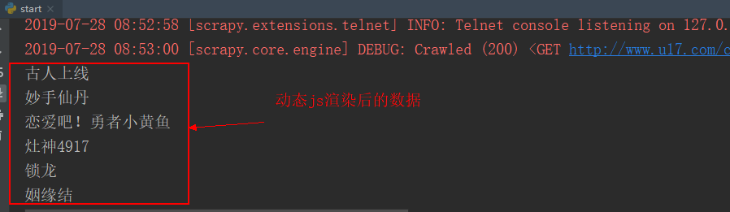

# 爬虫学习使用指南--scrapy-splash动态加载

> Auth: 王海飞
>
> Data：2019-07-28
>
> Email：779598160@qq.com
>
> github：https://github.com/coco369/knowledge 

### 前言: 

​		之前的实战中已实现使用Selenium抓取京东商品的过程，这是一种抓取JavaScript动态渲染页面的方式。除了Selenium，Splash也可以实现同样的功能。本节实战将使用Scrapy+Splash的方式来爬取有妖气漫画中动态加载出来的漫画信息。

​		本实战例子需要使用的技术有：scrapy、splash、scrapy-splash

有妖气漫画网站地址: http://www.u17.com/comic_list/th99_gr99_ca99_ss0_ob0_ac2_as0_wm0_co99_ct99_p1.html?order=1

截图如下:


### 1. 准备

​	安装scrapy、安装Scrapy-Splash库、安装确保docker容器中Splash已经能正常运行。安装命令如下：
```
pip install scrapy

pip install scapy-splash
```
### 2. 实战代码

爬取有妖气漫画实现思路步骤如下：

1）创建scrapy项目
```
scrapy startproject u17splash
```
2）修改配置settings.py
```
# 配置splash服务地址
SPLASH_URL = 'http://149.129.98.163:8050'

# 去重过滤器
DUPEFILTER_CLASS = 'scrapy_splash.SplashAwareDupeFilter'

# 使用Splash的Http缓存
HTTPCACHE_STORAGE = 'scrapy_splash.SplashAwareFSCacheStorage'

# 配置下载中间件
DOWNLOADER_MIDDLEWARES = {
    'scrapy_splash.SplashCookiesMiddleware': 723,
    'scrapy_splash.SplashMiddleware': 725,
    'scrapy.downloadermiddlewares.httpcompression.HttpCompressionMiddleware': 810,
}

# 配置spider中间件
SPIDER_MIDDLEWARES = {
	'scrapy_splash.SplashDeduplicateArgsMiddleware': 100,
}
```

3）定义爬虫spiders文件（u17.py）

```
from scrapy import Spider, Selector
from scrapy_splash import SplashRequest

class U17Spider(Spider):
    name = 'u17'
    start_url = 'http://www.u17.com/comic_list/th99_gr99_ca99_ss0_ob0_ac2_as0_wm0_co99_ct99_p1.html?order=1'


    def start_requests(self):
        yield SplashRequest(url=self.start_url, callback=self.parse, args={'timeout': 10})


    def parse(self, response):
        sel = Selector(response)
        comic_li = sel.xpath('//*[@id="all_comic_list"]/li')
        for comic in comic_li:
            name = comic.xpath('./div/a/text()').extract_first()
            print(name)
```

4. 输出结果

   

   