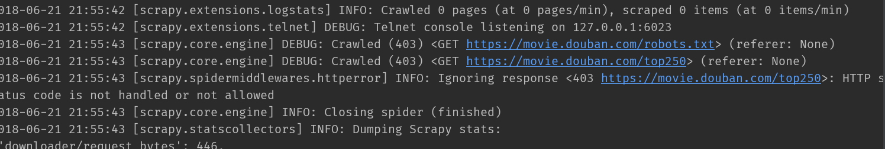
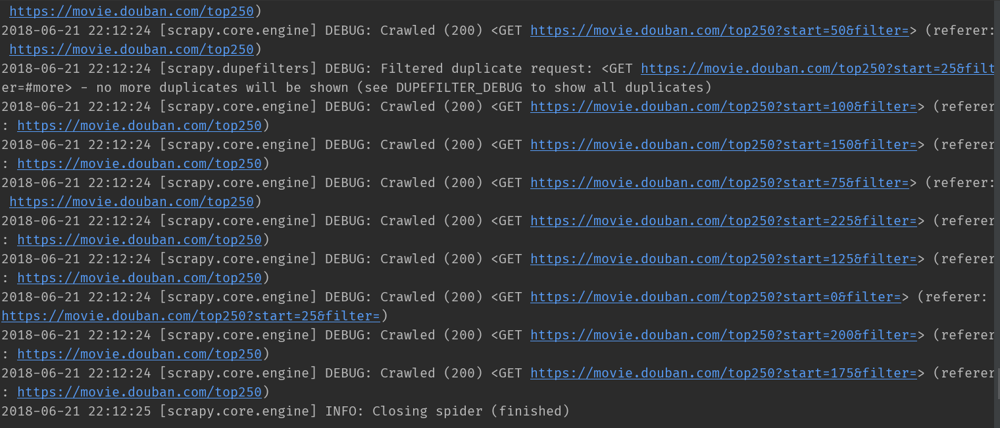
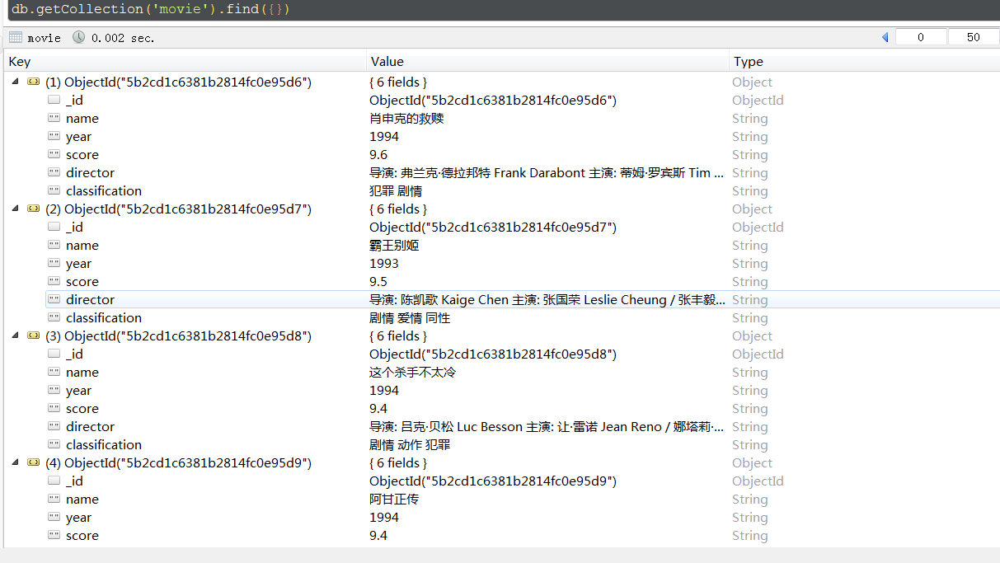

# 爬虫学习使用指南--scrapy框架

>Auth: 王海飞
>
>Data：2018-06-21
>
>Email：779598160@qq.com
>
>github：https://github.com/coco369/knowledge 

### 爬取豆瓣电影前250的电影资源，地址(https://movie.douban.com/top250)

按照scrapy的处理流程可以整理如下操作：

#### 1. <b>items.py</b>:设置数据存储模板，用于结构化数据

在items.py文件中定义字段，这些字段用来保存数据，方便后续的操作。

	import scrapy

	class DoubanItem(scrapy.Item):
	
	    name = scrapy.Field()  # 电影名称
	    year = scrapy.Field()  # 电影出片年份
	    score = scrapy.Field()  # 评分
	    director = scrapy.Field()  # 导演
	    classification = scrapy.Field()  # 电影分类

#### 2. <b>spiders</b>:爬虫目录，如：创建文件，编写爬虫规则。

a) 添加爬取规则属性rules，这个属性是一个列表，它可以包含多个Rule,每个Rule描述了那些链接需要抓取，那些不需要。这些rule可以有callback，也可以没有。

b) 爬虫的通常需要在一个网页里面爬去其他的链接，然后一层一层往下爬，scrapy提供了LinkExtractor类用于对网页链接的提取

LinkExtractor常用的参数有：

	allow：提取满足正则表达式的链接
	deny：排除正则表达式匹配的链接（优先级高于allow）
	allow_domains：允许的域名（可以是str或list）deny_domains：排除的域名（可以是str或list）
	restrict_xpaths：提取满足XPath选择条件的链接（可以是str或list）
	restrict_css：提取满足css选择条件的链接（可以是str或list）
	tags：提取指定标签下的链接，默认从a和area中提取（可以是str或list）
	attrs：提取满足拥有属性的链接，默认为href（类型为list）
	unique：链接是否去重（类型为boolean）
	process_value：值处理函数（优先级大于allow）

案例代码如下：

	from scrapy.selector import Selector
	from scrapy.linkextractors import LinkExtractor
	from scrapy.spiders import CrawlSpider, Rule
	
	from dbspider.items import DoubanItem
	
	class MovieSpider(CrawlSpider):
	    name = 'douban'
		# 不在此允许范围内的域名就会被过滤
	    allowed_domains = ['movie.douban.com']
	
	    start_urls = ['https://movie.douban.com/top250']
	    rules = (
	        Rule(LinkExtractor(allow=(r'https://movie.douban.com/top250.*')), callback='parse_item'),
	    )
	
	    def parse_item(self, response):
	        sel = Selector(response)
	        item = DoubanItem()
	        # 获取页面中电影名
	        item['name'] = sel.xpath('//*[@id="content"]/div/div[1]/ol/li/div/div[2]/div[1]/a/span[1]/text()').extract()
	        # 获取页面中电影的评分
	        item['score'] = sel.xpath('//*[@id="content"]/div/div/ol/li/div/div[2]/div[2]/div/span[2]/text()').extract()
	        # 获取页面中电影的年份
	        item['year']=sel.xpath('//*[@id="content"]/div/div[1]/ol/li/div/div[2]/div[2]/p[1]/text()[2]').re(r'\d+')
	        # 获取电影年份，分类等信息
	        director =sel.xpath('//*[@id="content"]/div/div[1]/ol/li/div/div[2]/div[2]/p[1]/text()[2]').extract()
	        # 去除获取的电影年份，分类中的空格，以及特殊符号
	        director = [i.strip().replace('\xa0', '') for i in director]
	        # 获取电影的导演和主演的信息
	        item['director'] = sel.xpath('//*[@id="content"]/div/div[1]/ol/li/div/div[2]/div[2]/p[1]/text()[1]').extract()
	        # 获取电影分类的信息，切割字符串获取指定的电影分类信息
	        item['classification'] = [i.split('/')[2] for i in director]
	        return item

完成前面两步骤的时候，我们就可以来运行我们的项目了。运行命令 scrapy crawl douban。其中我们可以在控制台看到爬取到的数据，如果想将这些数据保存到文件中，可以通过-o参数来指定文件名，Scrapy支持我们将爬取到的数据导出成JSON、CSV、XML、pickle、marshal等格式。

注意: 将数据保存为result.json格式数据时，需要指定编码。因此在settings.py文件中定义FEED_EXPORT_ENCODING='utf-8'

	scrapy crawl douban -o result.json

运行结果，可能出乎我们的意料，我们发现了在请求电影https://movie.douban.com/top250地址的时候，报了一个403的错误。众所周知，403明显是权限禁止访问了。这个时候就需要去设置我们之前设置过的USER_AGENT的参数了

在settings.py中添加如下的USER_AGENT信息：

	USER_AGENT = 'Mozilla/5.0 (Windows NT 6.1; WOW64) AppleWebKit/537.36 (KHTML, like Gecko) Chrome/55.0.2883.87 Safari/537.36'

再次：我们再去运行scrapy crawl douban的命令，即可正常获取信息

从返回的结果中可以看出，我们定义了匹配的rule规则后，电影top250的分页地址信息，也都全部加载出来了，并且GET请求也成功的获取到了对应url的信息。在接下来，我们做数据持久化的时候，相当方便了。

#### 3. <b>pipelines</b>:数据处理行为，如：一般结构化的数据持久化

	import pymongo
	
	from scrapy.conf import settings
	from scrapy import log
	
	class DoubanPipeline(object):
	
	    def __init__(self):
	        connection = pymongo.MongoClient(settings['MONGODB_SERVER'], settings['MONGODB_PORT'])
	        db = connection[settings['MONGODB_DB']]
	        self.collection = db[settings['MONGODB_COLLECTION']]
	
	    def process_item(self, item, spider):
	
	        for i in range(len(item['name'])):
	            new_moive=[{
	                "name":item['name'][i],
	                "year":item['year'][i],
	                "score":item['score'][i],
	                "director":item['director'][i],
	                "classification":item['classification'][i],
	            }]
	            self.collection.insert(new_moive)
	            log.msg("Item wrote to MongoDB database %s/%s" % (settings['MONGODB_DB'],
	                                                              settings['MONGODB_COLLECTION']),
	                    level=log.DEBUG, spider=spider)
	        return item

在做持久化的时候，选择使用mongodb作为数据存储的文档型数据库，关于mongodb的安装配置以及简单的使用，都在之前讲到过，如果有疑问可以点击[《mongodb配置》](../sql/mongodb.md)和[《mongodb语法》](../sql/mongodb语法.md)进行查看

#### 4. <b>settings.py</b>:配置文件，如：递归的层数、并发数，延迟下载等

在settings.py文件中设置mongodb的访问地址，user_agent参数，延迟下载参数等等

	# -*- coding: utf-8 -*-
	
	# Scrapy settings for dbspider project
	#
	# For simplicity, this file contains only settings considered important or
	# commonly used. You can find more settings consulting the documentation:
	#
	#     https://doc.scrapy.org/en/latest/topics/settings.html
	#     https://doc.scrapy.org/en/latest/topics/downloader-middleware.html
	#     https://doc.scrapy.org/en/latest/topics/spider-middleware.html
	
	BOT_NAME = 'dbspider'
	
	SPIDER_MODULES = ['dbspider.spiders']
	NEWSPIDER_MODULE = 'dbspider.spiders'
	
	# Crawl responsibly by identifying yourself (and your website) on the user-agent
	#USER_AGENT = 'dbspider (+http://www.yourdomain.com)'
	USER_AGENT = 'Mozilla/5.0 (Windows NT 6.1; WOW64) AppleWebKit/537.36 (KHTML, like Gecko) Chrome/55.0.2883.87 Safari/537.36'
	
	# Obey robots.txt rules
	# ROBOTSTXT_OBEY = True
	
	# Configure maximum concurrent requests performed by Scrapy (default: 16)
	#CONCURRENT_REQUESTS = 32
	
	# Configure a delay for requests for the same website (default: 0)
	# See https://doc.scrapy.org/en/latest/topics/settings.html#download-delay
	# See also autothrottle settings and docs
	
	# The download delay setting will honor only one of:
	#CONCURRENT_REQUESTS_PER_DOMAIN = 16
	#CONCURRENT_REQUESTS_PER_IP = 16
	
	# Disable cookies (enabled by default)
	COOKIES_ENABLED = False
	
	MONGODB_SERVER = '127.0.0.1'
	MONGODB_PORT = 27017
	MONGODB_DB = 'douban'
	MONGODB_COLLECTION = 'movie'
	# Disable Telnet Console (enabled by default)
	#TELNETCONSOLE_ENABLED = False
	
	# Override the default request headers:
	#DEFAULT_REQUEST_HEADERS = {
	#   'Accept': 'text/html,application/xhtml+xml,application/xml;q=0.9,*/*;q=0.8',
	#   'Accept-Language': 'en',
	#}
	
	# Enable or disable spider middlewares
	# See https://doc.scrapy.org/en/latest/topics/spider-middleware.html
	#SPIDER_MIDDLEWARES = {
	#    'dbspider.middlewares.DbspiderSpiderMiddleware': 543,
	#}
	
	# Enable or disable downloader middlewares
	# See https://doc.scrapy.org/en/latest/topics/downloader-middleware.html
	#DOWNLOADER_MIDDLEWARES = {
	#    'dbspider.middlewares.DbspiderDownloaderMiddleware': 543,
	#}
	
	# Enable or disable extensions
	# See https://doc.scrapy.org/en/latest/topics/extensions.html
	#EXTENSIONS = {
	#    'scrapy.extensions.telnet.TelnetConsole': None,
	#}
	
	# Configure item pipelines
	# See https://doc.scrapy.org/en/latest/topics/item-pipeline.html
	
	ITEM_PIPELINES = {
	   'dbspider.pipelines.DoubanPipeline': 300,
	}
	
	LOG_LEVEL = 'DEBUG'
	
	# Enable and configure the AutoThrottle extension (disabled by default)
	# See https://doc.scrapy.org/en/latest/topics/autothrottle.html
	#AUTOTHROTTLE_ENABLED = True
	# The initial download delay
	#AUTOTHROTTLE_START_DELAY = 5
	# The maximum download delay to be set in case of high latencies
	#AUTOTHROTTLE_MAX_DELAY = 60
	# The average number of requests Scrapy should be sending in parallel to
	# each remote server
	#AUTOTHROTTLE_TARGET_CONCURRENCY = 1.0
	# Enable showing throttling stats for every response received:
	#AUTOTHROTTLE_DEBUG = False
	
	# Enable and configure HTTP caching (disabled by default)
	# See https://doc.scrapy.org/en/latest/topics/downloader-middleware.html#httpcache-middleware-settings
	#HTTPCACHE_ENABLED = True
	#HTTPCACHE_EXPIRATION_SECS = 0
	#HTTPCACHE_DIR = 'httpcache'
	#HTTPCACHE_IGNORE_HTTP_CODES = []
	#HTTPCACHE_STORAGE = 'scrapy.extensions.httpcache.FilesystemCacheStorage'

#### 运行效果，mongodb中的存储结果展示

