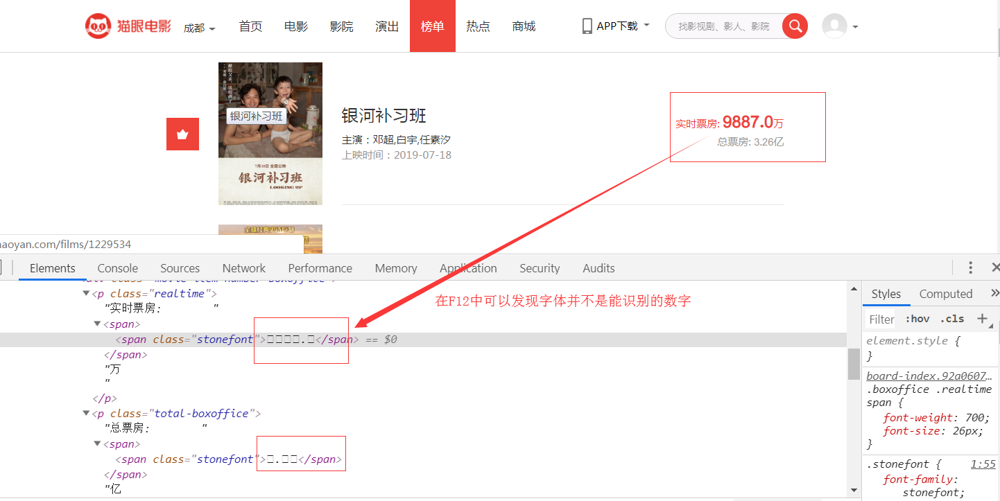
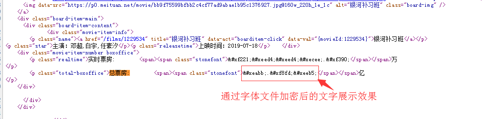
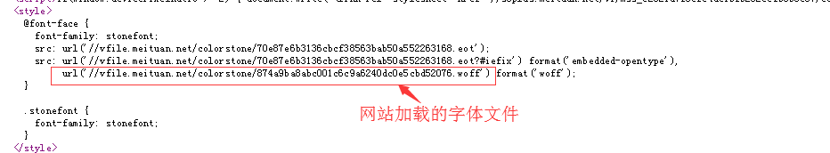
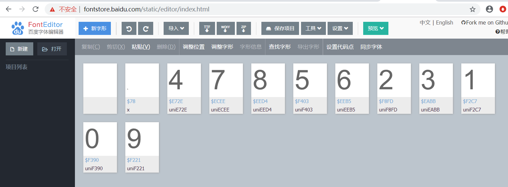
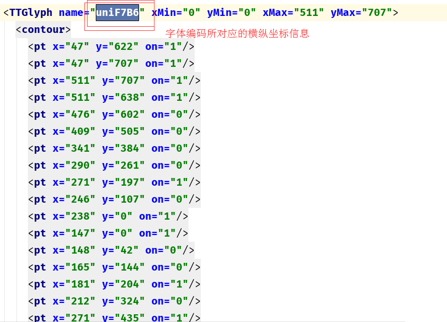

# 爬虫学习使用指南--字体加密破解

> Auth: 王海飞
>
> Data：2019-07-20
>
> Email：779598160@qq.com
>
> github：https://github.com/coco369/knowledge 

### 前言 -- 字体加密

​	字体反爬也就是自定义字体反爬，通过调用自定义的字体文件来渲染网页中的文字，而网页中的文字不再是文字，而是相应的字体编码，通过复制或者简单的采集是无法采集到编码后的文字内容的。 因此本案例将实现字体加密破解。目前许多网站都有字体加密策略，如58同城、猫眼电影等网站。

### 1. 字体文件

#### 1.1 猫眼网站分析

本实战以猫眼电影的票房为例。在猫眼的榜单中可以看到电影的实时票房。



通过查看网站的源码，可以发现票房的数字，并不是9887.0，而是如下图所示内容:




分析:  CSS 中有一个 @font-face，它允许网页开发者为其网页指定在线字体。原本是用来消除对用户电脑字体的依赖，现在有了新作用——反爬。

汉字光常用字就有好几千，如果全部放到自定义的字体中，那么字体文件就会变得很大，必然影响网页的加载速度，因此一般网站会选取关键内容加以保护，如上图所示，网站将实时票房的关键信息进行编码，导致爬虫在获取网站源码的时候，并不能直接提取出关键的票房等信息。

#### 1.2 字体文件分析

分析源码，从源码中找到@font-face属性，如下图所示:



将上图中以.woff结尾的地址输入到浏览器中，即可将该文件下载下下来。下载文件后，再使用百度字体编辑器FontEditor打开刚下载的字体文件(百度字体编辑器地址为: <http://fontstore.baidu.com/static/editor/index.html> )，如下图所示:



分析:  网页源码中显示的 &#xf403; 跟这里打开的字体文件显示的是不是有点像？事实上确实如此，去掉开头的 &#x 和结尾的 ; 后，剩余的4个16进制显示的数字加上 uni 就是字体文件中的编码。所以 &#xf403 对应的就是数字“5”。 

### 2. 代码实现 

#### 2.1 字体文件处理 

处理字体文件，我们需要用到 FontTools 库，安装如下:

```
pip install fonttools
```
然后，先将字体文件转换为 xml 文件，代码如下: 

```
from fontTools.ttLib import TTFont

# 打开和当前py文件同级的base2.woff 
font=TTFont('base2.woff')
# 将font字体文件保存为font2.xml格式文件
font.saveXML('font2.xml')
```

#### 2.2 xml文件解析 

​	打开xml文件，可以发现如下图所示内容，其中name参数显示的为0-9数字的编码，而id 仅仅是编号而已，千万别当成是对应的真实值。实际上，整个字体文件中，没有任何地方是说明 编码uniE8F6 对应的真实值是啥的。 


如uniF7B6这个编码对应的数字为多少呢？该xml文件中并没有给出具体的值，只是给出了在页面加载时，其横纵坐标的像素值。如下图所示uniF7B6的坐标值:




#### 2.3 代码实现 

实现思路: 

​	我们先随便下载一个字体文件，命名为 base.woff，然后利用 fontstore 网站查看编码和实际值的对应关系，手工做成字典并保存下来。爬虫爬取的时候，下载字体文件，根据网页源码中的编码，在字体文件中找到“字形”，再循环跟 base.woff 文件中的“字形”做比较，“字形”一样那就说明是同一个字了。在 base.woff 中找到“字形”后，获取“字形”的编码，而之前我们已经手工做好了编码跟值的映射表，由此就可以得到我们实际想要的值了。

​	这里的前提是每个字体文件中所定义的“字形”都是一样的（猫眼目前是这样的，以后也许还会更改策略），如果更复杂一点，每个字体中的“字形”都加一点点的随机形变，那这个方法就没有用了。

```
import re
import ssl
import urllib
from urllib.request import urlretrieve, urlopen
from fontTools.ttLib import TTFont

context = ssl._create_unverified_context()


def process_font(url):
    # loc.woff是事先下载好的字体文件
    # 可以通过font1.saveXML()来了解文件的结构, font1就像一个的字典, XML文件里的tag可以对font1用字典的方法获取
    font1 = TTFont('./fonts/base.woff')
    # 使用百度的FontEditor手动确认本地字体文件name和数字之间的对应关系, 保存到字典中
    loc_dict = {'uniE8B2': '5', 'uniF818': '3', 'uniECCC': '8', 'uniE622': '1', 'uniEC92': '2', 'uniF31A': '4',
                'uniE86D': '9', 'uniE33C': '6', 'uniE1FA': '7', 'uniE13E': '0'}
    # 获取字符的name列表, 打印出来后发现第一个和最后一个name所对应的不是数字, 所以切片
    uni_list1 = font1.getGlyphNames()[1: -1]

    # 网页源码
    rsp = urlopen(url,context=context).read().decode()
    # 获取动态的字体文件并下载
    font_url = 'http://' + re.findall(r'url\(\'//(.*?\.woff)', rsp)[0]
    # web字体文件落地名
    filename = font_url.split('/')[-1]
    # 下载web字体文件
    filenames=f'./fonts/{filename}'
    urlretrieve(font_url,filenames)

    # 打开web字体文件
    font2 = TTFont(filenames)
    # 获取字符的name列表
    uni_list2 = font2.getGlyphNames()[1: -1]

    # web字体文件中name和num映射
    new_map = {}

    for uni2 in uni_list2:
        # 获取name 'uni2' 在font2中对应的对象
        obj2 = font2['glyf'][uni2]
        for uni1 in uni_list1:
            # 获取name 'uni1' 在font1中对应的对象
            obj1 = font1['glyf'][uni1]
            # 如果两个对象相等, 说明对应的数字一样
            if obj1 == obj2:
                # 将name键num值对加入new_map
                new_map[uni2] = loc_dict[uni1]

    # 将数字替换至源码
    for i in uni_list2:
        pattern = '&#x' + i[3:].lower() + ';'
        rsp = re.sub(pattern, new_map[i], rsp)

    # 返回处理处理后的源码
    return rsp


def parse_html(html):
    #  解析源码，获取岗位信息等
    # re.S多行匹配
    font_flie=re.compile('vfile\.meituan\.net\/colorstone\/(\w+\.woff)',re.S)
    result1=font_flie.findall(html)
    patterns=re.compile('<i class="board-index board-index-.*?">(.*?)</i>.*?'
                        '.*?'
                        '      .*?'
                        '<p class="name"><a href=.*?title=.*?'
                        'data-act="boarditem-click" data-val="{movieId:.*?>(.*?)</a></p>(.*?)'
                        '<p class="releasetime">上映时间：(.*?)</p>    </div>.*?'
                        '<p class="realtime">实时票房:        <span><span class="stonefont">(.*?)'
                        '</span></span>(.*?)</p>'
                        '.*?<p class="total-boxoffice">总票房.*?', re.S)
    result=patterns.findall(html)
    return result


def get_html(url):
    proxies = {
        'http': 'http://112.35.56.134:80'
    }
    headers={
        'User-Agent':'Mozilla/5.0 (Windows NT 6.1; WOW64) AppleWebKit/535.1 (KHTML, like Gecko) Chrome/14.0.835.163 Safari/535.1'
    }
    request=urllib.request.Request(url,headers=headers)
    response=urllib.request.urlopen(request,context=context)

    return response.read().decode('utf-8')

def main():

    url = 'https://maoyan.com/board/1'
    res = process_font(url)
    # 获取地址对应的源码
    result = parse_html(res)
    lists = []
    for i in result:
        list1 = {}
        i = list(i)
        list1['rank'] = i[0]
        list1['images_url'] = i[1][1:-2]
        list1['name'] = i[2].strip()
        list1['acts'] = i[3].strip()[16:-4]
        list1['time'] = i[4].strip()
        list1['total'] = i[-2] + i[-1].strip()
        lists.append(list1)
    print(lists)

if __name__ == '__main__':
    # 猫眼国内实时票房top10
    main()
```


