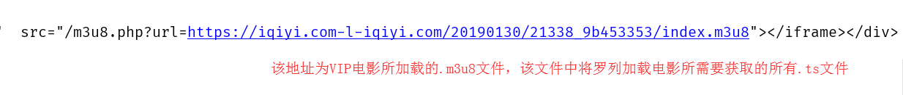
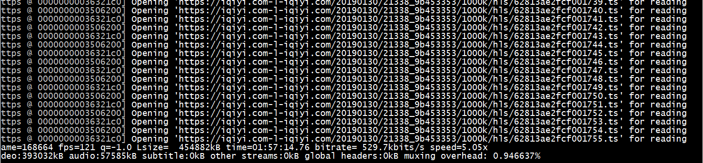

# 爬虫学习使用指南--电影爬取

> Auth: 王海飞
>
> Data：2019-07-20
>
> Email：779598160@qq.com
>
> github：https://github.com/coco369/knowledge 

### 前言 -- 爬取VIP视频

​	如今的各种视频网站都有非常多不错的电影，但是也有很多需要开通VIP才能观看的电影。如爱奇艺的VIP电影只能看前6分钟，还有乐视视频，芒果视频，土豆视频，腾讯视频，优酷视频，搜狐视频，pptv视频等。本文档主要讲解如何突破各视频网站对于非VIP用户的电影下载限制。

### 1. 视频流/音频流

流媒体：从远程服务器传输过来的文件流

伪流媒体：边下边存，会保存起来

实时流媒体：边下边播，不会保存

### 2. 解析视频方法1

​	用户可百度搜索[全民vip视频在线解析](http://www.qmaile.com/ )，该网站可以解析爱奇艺、腾讯、搜狐等网站的VIP电影，而且可以免费观看。唯一的缺点就是不能下载解析后的VIP视频。如下步骤讲解如何使用'全民解析'进行观看VIP视频。

步骤1: 打开爱奇艺，搜索VIP的电影，并复制电影的URL地址。如下图所示:


步骤2: 将电影的URL地址，复制到全民VIP视频网站中。如下图所示:


步骤3: 愉快的观看VIP电影。

### 3. 解析视频方法2

​	视频文件主要以.m3u8和.ts结尾，因此为了拿到各大网站的电影，需要通过分析其加载的.ts文件，并将ts文件保存下来即可。如下展示爱奇艺VIP电影在播放时加载的ts文件。


注意: 在XHR中可以发现视频在播放的同时，将一直请求ajax，ajax的请求为.ts结尾的地址。通过在浏览器中直接访问.ts结尾的请求，将会保存其相应的内容，该保存的内容可通过播放视频软件进行播放，其内容为电影的某几秒钟片段信息。因此保存整个电影，即保存该电影的所有.ts结尾的文件，最后将所有文件进行合并为一个电影即可。

通过如上分析可知：想要获取电影，即获取.ts文件。如下就讲解如何ts文件，并执行下载。实现步骤如下:

步骤1： 通过访问http://jx.618g.com/?url=电影地址，可解析电影，并进行观看。也可通过requests库获取该地址所加载.m3u8文件。如使用requests.get请求地址，地址为: <http://jx.618g.com/?url=https://www.iqiyi.com/v_19rs1vn7nk.html> 

```
import requests

url = 'http://jx.618g.com/?url=https://www.iqiyi.com/v_19rs1vn7nk.html'
response = requests.get(url1)
print(response.text)
```

步骤2: 分析requests请求返回的结果，找到源码中请求的.m3u8文件地址。



​	在浏览器中直接访问图片中的蓝色地址，即可直接下载该.m3u8文件。通过打开该下载好的文件，可以发现该文件中定义了如下图所示的内容。其中.ts结尾的文件即为电影某个片段的信息。
```
#EXTM3U
#EXT-X-VERSION:3
#EXT-X-TARGETDURATION:14
#EXT-X-MEDIA-SEQUENCE:0
#EXTINF:9.049,
/20190318/pQywGHE5/800kb/hls/y484X4793000.ts
#EXTINF:10.425,
/20190318/pQywGHE5/800kb/hls/y484X4793001.ts
#EXTINF:2.21,
/20190318/pQywGHE5/800kb/hls/y484X4793002.ts
#EXTINF:5.796,
/20190318/pQywGHE5/800kb/hls/y484X4793003.ts
#EXTINF:2.002,
/20190318/pQywGHE5/800kb/hls/y484X4793004.ts
```

步骤3:  使用ffmpeg进行电影的下载。

​	FFmpeg是一套可以用来记录、转换数字音频、视频，并能将其转化为流的开源计算机程序。它提供了录制、转换以及流化音视频的完整解决方案。它包含了非常先进的音频/视频编解码库libavcodec。

​	如下命令就是将.m3u8文件中记录的所有.ts文件进行下载，最终生成一个可播放的'电影.mp4'文件。

```
ffmbeg -i https://iqiyi.com-l-iqiyi.com/20190130/21338_9b453353/index.m3u8 -vcodec copy -acodec copy 电影.mp4
```

执行命令结束后，可看到如下图所示截图:

