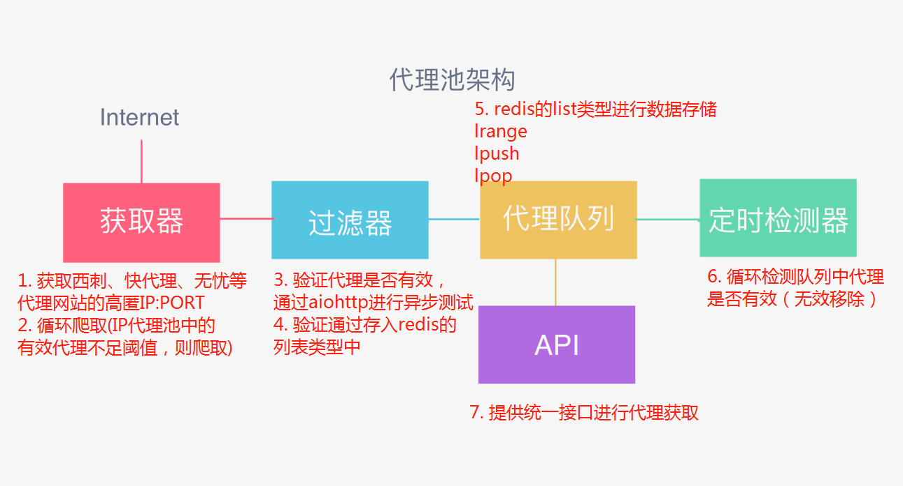

# 爬虫学习使用指南—ip代理池

> Auth: 王海飞
>
> Data：2019-09-24
>
> Email：779598160@qq.com
>
> github：https://github.com/coco369/knowledge 

### 前言 -- ip代理池

​	很多网站会设置访问限制🚫，也就是说，如果一个IP频繁访问该网站，那么网站就会认为，这是一个爬虫程序，而不是用户行为。为了避免远程服务器封锁IP，或者想加快爬取速度，一个可行的方法就是使用代理IP，我们需要做的就是创建一个自己的代理IP池。

​	**思路**：通过免费IP代理网站爬取IP，构建一个容量为100的代理IP池。从代理IP池中随机选取IP，在使用IP之前，检查IP是否可用。如果可用，使用该IP访问目标页面，如果不可用，舍弃该IP。当代理IP池中IP的数量小于20的时候，更新整个代理IP池，即重新从免费IP代理网站爬取IP，构建一个新的容量为100的代理IP池。

### 代理池实现思路图解

ip代理池的组成部分：获取器、过滤器、代理队列、定时检查器、API

