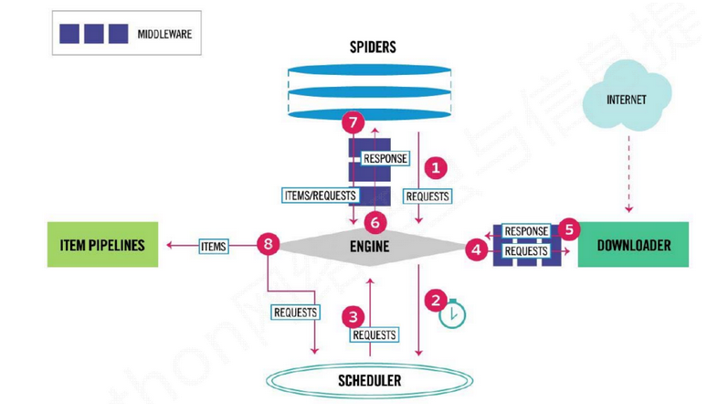
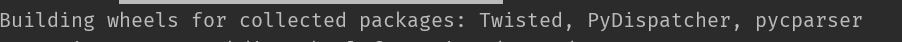
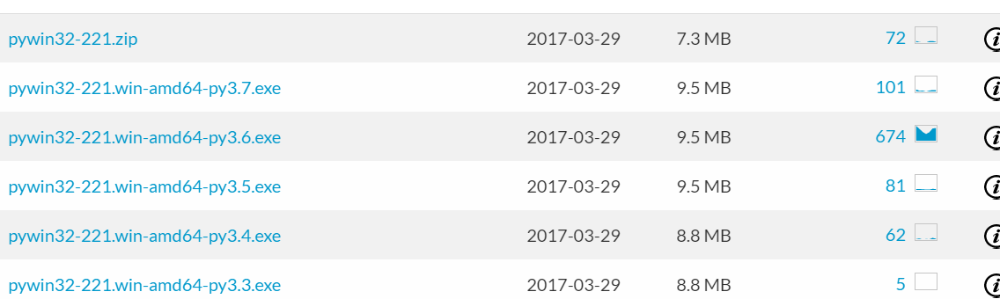
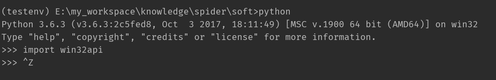
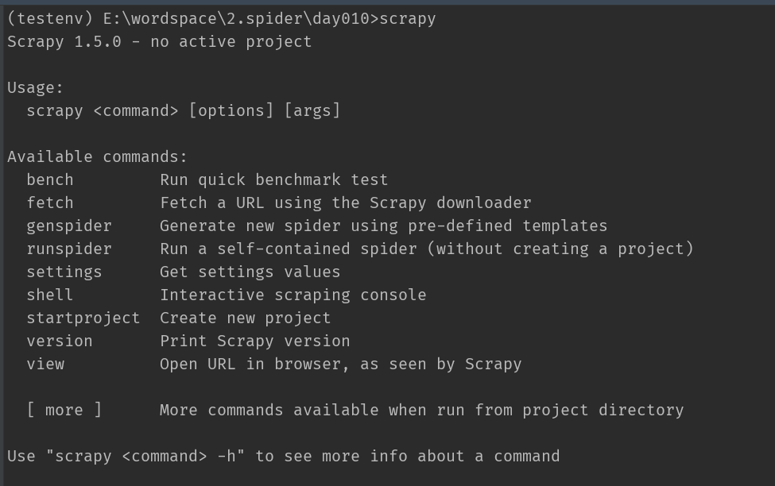
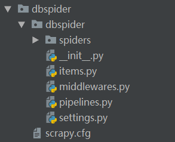
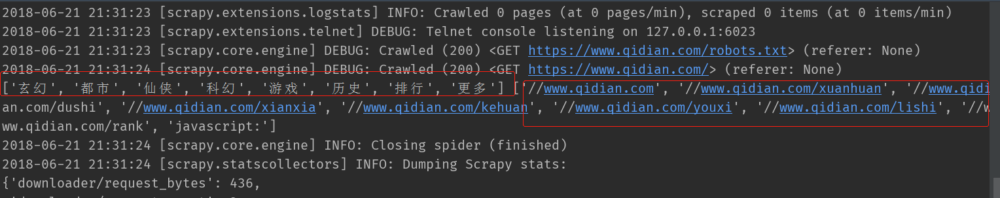

# 爬虫学习使用指南--scrapy框架

>Auth: 王海飞
>
>Data：2018-06-21
>
>Email：779598160@qq.com
>
>github：https://github.com/coco369/knowledge 


### 前言

Scrapy是一个为了爬取网站数据，提取结构性数据而编写的应用框架。 可以应用在包括数据挖掘，信息处理或存储历史数据等一系列的程序中。

其最初是为了 页面抓取 (更确切来说, 网络抓取 )所设计的， 也可以应用在获取API所返回的数据或者通用的网络爬虫。

Scrapy 使用了 Twisted异步网络库来处理网络通讯。整体架构大致如下:


流程图1：


流程图2：


[中文官网](https://scrapy-chs.readthedocs.io/zh_CN/0.24/index.html)


### 初窥Scrapy

### 1. 安装

	pip install Scrapy

安装过程中会安装如下一些包，在之前的安装过程中，偶尔会出现Twisted失败的话，需要自己手动去安装。



在此也先安装另外一个必备的包pywin32，如果不安装该包的话，在运行爬虫的时候可能会提示<b>"ModuleNotFoundError: No module named 'win32api'"</b>，因为Python没有自带访问windows系统API的库的，需要下载第三方库。库的名称叫pywin32。可以去网站上下载，[下载地址](https://sourceforge.net/projects/pywin32/files/pywin32/Build%20221/)



按照自己电脑上的python版本，进行下载安装。安装的时候，先进入虚拟环境中，然后执行pip install pywin32-221.win-amd64-py3.6.whl 命令即可将包安装在我们当前的虚拟环境中了。如果已安装好pywin32，则进入python解释器中导入win32api，如果导入成功则表示安装pywin32成功。否则安装失败。




### 2. Scrapy组件

#### 1. 引擎(Scrapy)

用来处理整个系统的数据流处理, 触发事务(框架核心)

#### 2. 调度器(Scheduler)

用来接受引擎发过来的请求, 压入队列中, 并在引擎再次请求的时候返回. 可以想像成一个URL（抓取网页的网址或者说是链接）的优先队列, <br>由它来决定下一个要抓取的网址是什么, 同时去除重复的网址

#### 3. 下载器(Downloader)

用于下载网页内容, 并将网页内容返回给蜘蛛(Scrapy下载器是建立在twisted这个高效的异步模型上的)

#### 4. 爬虫(Spiders)

爬虫是主要干活的, 用于从特定的网页中提取自己需要的信息, 即所谓的实体(Item)。用户也可以从中提取出链接,让Scrapy继续抓取下一个页面

#### 5. 项目管道(Pipeline)

负责处理爬虫从网页中抽取的实体，主要的功能是持久化实体、验证实体的有效性、清除不需要的信息。当页面被爬虫解析后，<br>将被发送到项目管道，并经过几个特定的次序处理数据。

#### 6. 下载器中间件(Downloader Middlewares)

位于Scrapy引擎和下载器之间的框架，主要是处理Scrapy引擎与下载器之间的请求及响应。

#### 7. 爬虫中间件(Spider Middlewares)

介于Scrapy引擎和爬虫之间的框架，主要工作是处理蜘蛛的响应输入和请求输出。

#### 8. 调度中间件(Scheduler Middewares)

介于Scrapy引擎和调度之间的中间件，从Scrapy引擎发送到调度的请求和响应。

### 3. 处理流程

Scrapy的整个数据处理流程由Scrapy引擎进行控制，通常的运转流程包括以下的步骤：

1. 引擎询问蜘蛛需要处理哪个网站，并让蜘蛛将第一个需要处理的URL交给它。
	
2. 引擎让调度器将需要处理的URL放在队列中。
	
3. 引擎从调度那获取接下来进行爬取的页面。
	
4. 调度将下一个爬取的URL返回给引擎，引擎将它通过下载中间件发送到下载器。
	
5. 当网页被下载器下载完成以后，响应内容通过下载中间件被发送到引擎；如果下载失败了，引擎会通知调度器记录这个URL，待会再重新下载。
	
6. 引擎收到下载器的响应并将它通过蜘蛛中间件发送到蜘蛛进行处理。
	
7. 蜘蛛处理响应并返回爬取到的数据条目，此外还要将需要跟进的新的URL发送给引擎。
	
8. 引擎将抓取到的数据条目送入条目管道，把新的URL发送给调度器放入队列中。
	

上述操作中的2-8步会一直重复直到调度器中没有需要请求的URL，爬虫停止工作。


### 4. Scrapy项目

在创建项目开始，我们先确认一下之前安装的scrapy能否正常运行，如下情况即安装成功：



从图中可以看出scrapy下有非常多的参数，如shell、startproject等参数。如下讲解shell参数和startproject参数


#### 4.1 进入交互式终端<shell参数>

​        Scrapy shell**也称"Scrapy终端"，是**一个交互终端**，使**我们可以**在未启动spider爬虫的情况下**尝试及调试代码。

​        更为方便的是，可以直接在终端中测试XPath或CSS表达式**，**而不用import导入相应模块**。通过查看其运行的结果，**方便了我们分析目标网页**，并从中**测试我们的表达式是否提取到了数据。

操作步骤如下：

1. 进入虚拟环境（激活爬虫虚拟环境）
2. 执行交互式命令：scrapy shell 目标网站。scrapy将在交互式终端中爬取目标网站的内容。
3. 查看响应状态response，并通过响应response.xpath()语法来获取页面的内容。
4. 退出交互式终端，exist()命令。


#### 4.2 创建scrapy项目<startprojec参数>

	scrapy startproject dbspider

创建成功以后，在我们的文件夹中会发现一个dbspider的目录，这个项目文件就是我们的爬虫项目了。可以先看看它的构成，接下来详细讲解一下每一个文件代表的意思。



#### 4.2 文件解释

文件说明：

<b>scrapy.cfg</b>:项目的配置信息，主要为Scrapy命令行工具提供一个基础的配置信息。（真正爬虫相关的配置信息在settings.py文件中）

<b>items.py</b>:设置数据存储模板，用于结构化数据，如：Django的Model

<b>pipelines</b>:数据处理行为，如：一般结构化的数据持久化

<b>settings.py</b>:配置文件，如：递归的层数、并发数，延迟下载等

<b>spiders</b>:爬虫目录，如：创建文件，编写爬虫规则。

在spiders文件中创建爬虫的时候，一般以爬取的网站的域名为爬虫的名称

### 5. 编写爬虫

爬虫文件的创建可以<b>用户自己在spiders文件夹下创建</b>也可以通过如下<b>命令创建爬虫</b>，命令所示：

```
scrapy genspider 爬虫名 爬取网站地址
```

爬取起点中文网的网页源码,爬取小说分类名称以及url。

案例代码：


	import scrapy
	from scrapy.selector import Selector
	
	class QiDianSpider(scrapy.spiders.Spider):
	    name = "qidian"
	    start_urls = [
	        "https://www.qidian.com/",
	    ]
	
	    def parse(self, response):
	        # 爬取时请求的url
	        current_url = response.url
	
	        # 返回的html
	        body = response.body
	
	        # 返回的html unicode编码
	        unicode_body = response.body_as_unicode()
	        res = Selector(response)
	
	        # 获取小说的分类信息
	        xiaoshuo_type = res.xpath('//*[@id="pin-nav"]/div/div[1]/ul/li/a/text()').extract()
	
	        xiaoshuo_href = res.xpath('//*[@id="pin-nav"]/div/div[1]/ul/li/a/@href').extract()
	
	        print(xiaoshuo_type, xiaoshuo_href)


#### 5.1 运行命令：

	scrapy crawl qidian

启动命令中 'qidian'参数为我们定义爬虫中的name属性的值

执行流程：

>name: spider对应不同的name

>start_urls:是spider抓取网页的起始点，可以包括多个url。

>parse()：spider抓到一个网页以后默认调用的callback，避免使用这个名字来定义自己的方法。当spider拿到url的内容以后，会调用parse方法，并且传递一个response参数给它，response包含了抓到的网页的内容，在parse方法里，你可以从抓到的网页里面解析数据。

运行结果：




​	