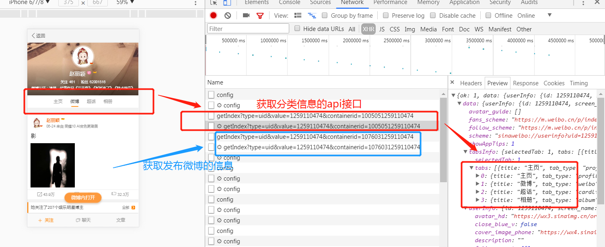
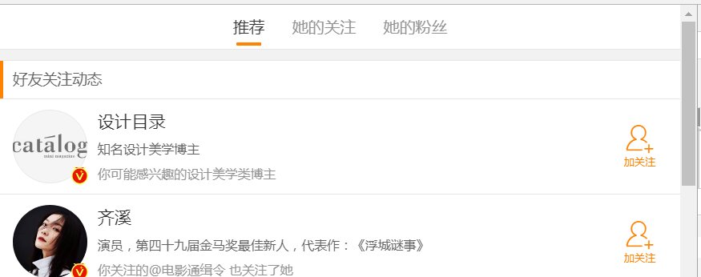
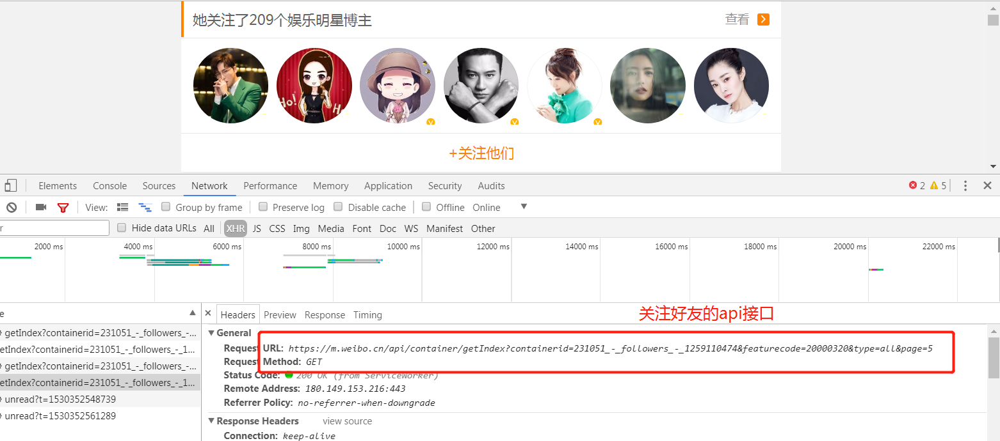
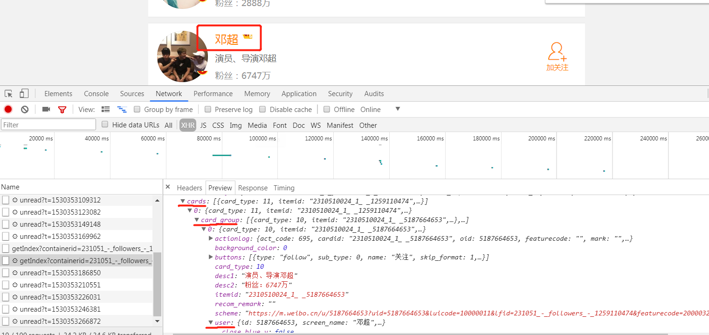

# 爬虫学习使用指南--scrapy框架

>Auth: 王海飞
>
>Data：2018-06-21
>
>Email：779598160@qq.com
>
>github：https://github.com/coco369/knowledge 

### 爬取微博用户信息

#### 1. 分析获取微博用户信息和发布微博信息的接口

通过分析获取到api接口：

https://m.weibo.cn/api/container/getIndex?type=uid&value={uid}&containerid=107603{uid}

#### 2. 获取用户的基本信息

获取用户信息的api接口：

https://m.weibo.cn/api/container/getIndex?uid={uid}&type=uid&value={uid}&containerid=100505{uid}

下面是返回的数据，从userInfo中即可获取到用户基础的数据

	{
		"ok": 1,
		"data": {
			"userInfo": {
				"id": 1259110474,
				"screen_name": "赵丽颖",
				"profile_image_url": "https:\/\/tvax3.sinaimg.cn\/crop.0.0.512.512.180\/4b0c804aly8foci4eilfvj20e80e8gly.jpg",
				"profile_url": "https:\/\/m.weibo.cn\/u\/1259110474?uid=1259110474&luicode=10000011&lfid=1005051259110474",
				"statuses_count": 1325,
				"verified": true,
				"verified_type": 0,
				"verified_type_ext": 1,
				"verified_reason": "演员，代表作品《花千骨》《杉杉来了》《陆贞传奇》",
				"close_blue_v": false,
				"description": "",
				"gender": "f",
				"mbtype": 12,
				"urank": 45,
				"mbrank": 7,
				"follow_me": false,
				"following": false,
				"followers_count": 62008634,
				"follow_count": 461,
				"cover_image_phone": "https:\/\/wx4.sinaimg.cn\/crop.0.0.640.640.640\/4b0c804aly1fdwoyoobn7j20e60e83z9.jpg",
				"avatar_hd": "https:\/\/wx3.sinaimg.cn\/orj480\/4b0c804aly8foci4eilfvj20e80e8gly.jpg",
				"like": false,
				"like_me": false,
				"toolbar_menus": [{
					"type": "profile_follow",
					"name": "关注",
					"pic": "",
					"params": {
						"uid": 1259110474
					}
				}, {
					"type": "link",
					"name": "聊天",
					"pic": "http:\/\/h5.sinaimg.cn\/upload\/2015\/06\/12\/2\/toolbar_icon_discuss_default.png",
					"params": {
						"scheme": "sinaweibo:\/\/messagelist?uid=1259110474&nick=赵丽颖"
					},
					"scheme": "https:\/\/passport.weibo.cn\/signin\/welcome?entry=mweibo&r=https://m.weibo.cn/u/1259110474?uid=1259110474&luicode=10000011&lfid=100103type%3D1%26q%3D%E8%B5%B5%E4%B8%BD%E9%A2%96"
				}, {
					"type": "link",
					"name": "文章",
					"pic": "",
					"params": {
						"scheme": "sinaweibo:\/\/cardlist?containerid=2303190002_445_1259110474_WEIBO_ARTICLE_LIST_DETAIL&count=20"
					},
					"scheme": "https:\/\/m.weibo.cn\/p\/index?containerid=2303190002_445_1259110474_WEIBO_ARTICLE_LIST_DETAIL&count=20&luicode=10000011&lfid=1005051259110474"
				}]
			},
			"avatar_guide": [],
			"fans_scheme": "https:\/\/m.weibo.cn\/p\/index?containerid=231051_-_fans_intimacy_-_1259110474&luicode=10000011&lfid=1005051259110474",
			"follow_scheme": "https:\/\/m.weibo.cn\/p\/index?containerid=231051_-_followersrecomm_-_1259110474&luicode=10000011&lfid=1005051259110474",
			"tabsInfo": {
				"selectedTab": 1,
				"tabs": [{
					"title": "主页",
					"tab_type": "profile",
					"containerid": "2302831259110474"
				}, {
					"title": "微博",
					"tab_type": "weibo",
					"containerid": "1076031259110474",
					"apipath": "\/profile\/statuses",
					"url": "\/index\/my"
				}, {
					"title": "超话",
					"tab_type": "cardlist",
					"containerid": "2314751259110474"
				}, {
					"title": "相册",
					"tab_type": "album",
					"containerid": "1078031259110474",
					"filter_group_info": {
						"title": "全部照片(0)",
						"icon": "http:\/\/u1.sinaimg.cn\/upload\/2014\/06\/10\/userinfo_icon_album.png",
						"icon_name": "专辑",
						"icon_scheme": ""
					}
				}]
			},
			"showAppTips": 1,
			"scheme": "sinaweibo:\/\/userinfo?uid=1259110474&luicode=10000011&lfid=100103type=1&q=赵丽颖&from=1110006030"
		}
	}

#### 3. 获取微博用户的关注和粉丝列表信息

##### 查看微博主页，点击查看微博关注的用户信息，找到对应的api接口:

##### 找到粉丝和关注的div按钮:

##### 查看获取微博关注的用户的信息的api接口:

##### 分析关注的用户的信息:

#### 4. 案例--开始愉快的爬取想要的某个人的全部资料吧

