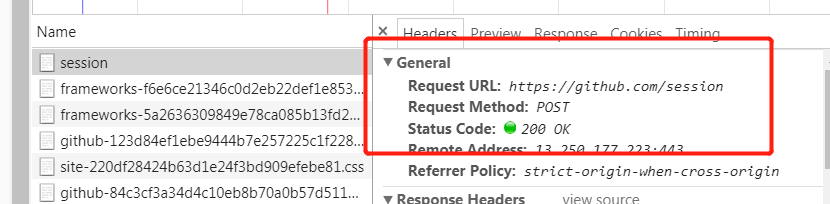
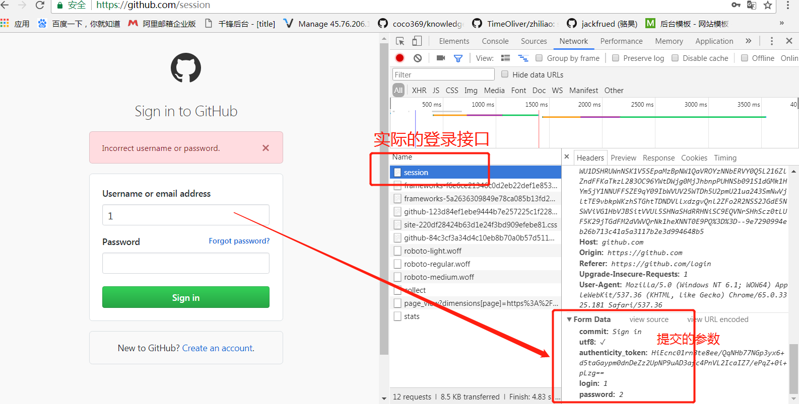
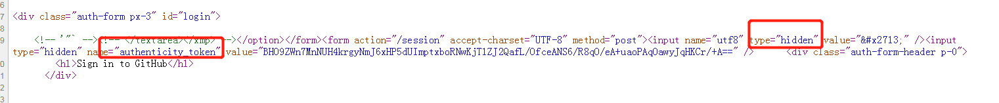

# 爬虫学习使用指南

>Auth: 王海飞
>
>Data：2018-06-20
>
>Email：779598160@qq.com
>
>github：https://github.com/coco369/knowledge 


### 1. github登陆页面分析

当浏览器作为客户端与远端服务器连接时，远端服务器会根据需要，产生一个 SessionID，并附在 Cookie 中发给浏览器。接下来的时间里，只要 Cookie 不过期，浏览器与远端服务器的连接，都会使用这个 SessionID；而浏览器会自动与服务器协作，维护相应的 Cookie。

在 requests 中，也是这样。我们可以创建一个 requests.Session，尔后在该 Session 中与远端服务器通信，其中产生的 Cookie，requests 会自动为我们维护好。

#### 1.1 分析登录接口

我们想要模拟登陆GitHub网站，首先打开GitHub 登录页面是 https://github.com/login，开启开发者模式调试功能，在登录页面中填入 Username 和 Password 之后，可以看到实际提交表单的地址是https://github.com/session



通过开发者工具调试可以看出，登录的时候调用的是一个https://github.com/session的url，并且是一个post请求。在后面我们模拟登陆，就可以模拟一个post请求，并传递参数到这个地址即可。



在以上分析中，可以知道在模拟登陆的时候，需要传递那些参数。其中commit 和 utf8 两项是定值；login 和 password 分别是用户名和密码，这很好理解。唯独authenticity_token 是一长串无规律的字符。该字段类似于django中的csrf。那么怎么去获取该字段呢，在查看源码的时候其实就可以看到了,该字段是一个隐藏hidden的input标签，其中value的值就是我们需要的信息，该值可以通过正则匹配获取到。



以上分析就可以自己来实现一个模拟登陆github的功能了，来我们自己动手试试~

### 2. 模拟登陆

案例代码：
```	
	import requests
	import re

	def get_authenticity_token(login_url):
	    user_headers = {
	        'User-Agent': 'Mozilla/5.0 (Macintosh; Intel Mac OS X 10_9_5) AppleWebKit/537.36 (KHTML, like Gecko) Chrome/48.0.2564.116 Safari/537.36',
	    }
	
	    session = requests.Session()
	    response = session.get(login_url, headers=user_headers)
	    pattern = re.compile(r'<input type="hidden" name="authenticity_token" value="(.*)" />')
	
	    authenticity_token = pattern.findall(response.content.decode('utf-8'))[1]
	
	    return authenticity_token, session, user_headers


	def login_github(login_url, session_url, user, password):
	
	    authenticity_token, session, user_headers = get_authenticity_token(login_url)
	    print(authenticity_token)
	    login_data = {
	        'commit': 'Sign in',
	        'utf8': '%E2%9C%93',
	        'authenticity_token': authenticity_token,
	        'login': user,
	        'password': password
	    }
	
	    response = session.post(session_url, headers=user_headers, data=login_data)
	    print(response)

	
	if __name__ == '__main__':
	    session_url = 'https://github.com/session'
	    login_url = 'https://github.com/login'
	    user = 'yyy'
	    password = 'xxxx'
	    login_github(login_url, session_url, user, password)
```
