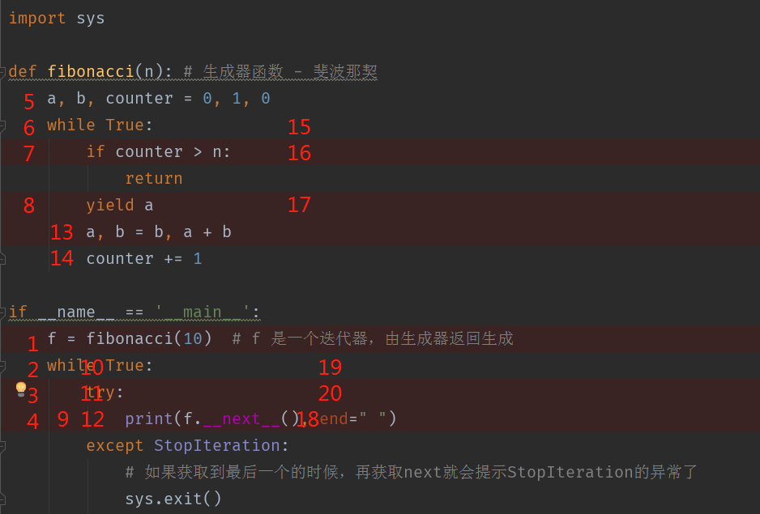

# 爬虫学习使用指南--协程

>Auth: 王海飞
>
>Data：2018-06-15
>
>Email：779598160@qq.com
>
>github：https://github.com/coco369/knowledge 

### 前言

什么是协程(Coroutine),引入协程的时候，我们先来回顾一下多线程的概念。当有一个进程，其中有A线程和B线程，都用于打印全局自增的变量的时候，由于多线程A和B都会相互竞争资源，所有才有了线程锁的引入，也就有了线程相互切换的开销问题。所以在多线程中，当你的线程越多，你的资源开销越大。

协程在此基础上就有很大的优势了，具体体现在协程其实就是一个线程，在执行过程中，在程序内部可中断，然后转而执行别的程序，在适当的时候再返回来接着执行

总结一下：

最大的优势就是协程极高的执行效率。因为子程序切换不是线程切换，而是由程序自身控制，因此，没有线程切换的开销，和多线程比，线程数量越多，协程的性能优势就越明显。

第二大优势就是不需要多线程的锁机制，因为只有一个线程，也不存在同时写变量冲突，在协程中控制共享资源不加锁，只需要判断状态就好了，所以执行效率比多线程高很多。

因为协程是一个线程执行，那怎么利用多核CPU呢？最简单的方法是多进程+协程，既充分利用多核，又充分发挥协程的高效率，可获得极高的性能。

##### 历史回顾:

Python 2.2：第一次提出了生成器（最初称之为迭代器）的概念（PEP 255）。

Python 2.5：引入了将对象发送回暂停了的生成器这一特性即生成器的send()方法（PEP 342）。

Python 3.3：添加了yield from特性，允许从迭代器中返回任何值（注意生成器本身也是迭代器），这样我们就可以串联生成器并且重构出更好的生成器。

Python 3.4：引入asyncio.coroutine装饰器用来标记作为协程的函数，协程函数和asyncio及其事件循环一起使用，来实现异步I/O操作。

Python 3.5：引入了async和await，可以使用async def来定义一个协程函数，这个函数中不能包含任何形式的yield语句，但是可以使用return或await从协程中返回值。

<b>在将协程的时候，需要分别引入迭代器和生成器的含义以及案例</b>

#### 1. 迭代器

迭代器和生成器都是python中最重要的知识点。迭代器可以遍历整个对象，在你需要取值的时候，调用next就可以依次获取迭代器中的下一个值，在迭代中中只能往下取值，不能再往上取值的

案例代码：

声明一个列表[1，2，3，4]，然后使用iter()去创建一个迭代器，然后依次调用\_\_next\_\_()就可以获取到迭代器中的下一个值了

    s = iter([1, 2, 3, 4])
    print(type([1, 2, 3, 4]))
    
    print(type(s))
    print(s.__next__())
    print(s.__next__())
    print(s.__next__())

运行结果：

	<class 'list'>
	<class 'list_iterator'>
	1
	2
	3
	
	Process finished with exit code 0

### 2. 生成器

什么是生成器：使用了 yield 的函数被称为生成器（generator）。生成器函数返回的结果就是一个迭代器，只能用于迭代操作。既然是迭代器了，就有\_\_next\_\_()的属性了。

那生成器是怎么工作的呢：在调用生成器运行的过程中，当在第一次运行的时候，在遇到yield时函数会暂停并保持当前所有的运行信息，返回一个yield的值，当再次\_\_next\_\_()的时候，才会在当前代码位置进行运行。

案例代码： 实现斐波那契算法 0 1 1 2 3 5 8 13 21 34 55 

	import sys

​	
	def fibonacci(n):
	    # 生成器函数 - 斐波那契
	    a, b, counter = 0, 1, 0
	    while True:
	        if counter > n:
	            return
	        yield a
	        a, b = b, a + b
	        counter += 1

​	
	if __name__ == '__main__':
	
	    f = fibonacci(10)  # f 是一个迭代器，由生成器返回生成
	
	    while True:
	        try:
	            # print(next(f), end=" ")
	            print(f.__next__(), end=" ")
	        except StopIteration:
	            # 如果获取到最后一个的时候，再获取next就会提示StopIteration的异常了
	            sys.exit()

运行结果为：

	0 1 1 2 3 5 8 13 21 34 55 
	
	Process finished with exit code 0

执行线路图：

查看执行的流程可以使用debug模式去运行，通过断点调试可以很清晰的了解到整个代码的运行流程。

### 3. 协程

案例代码： 消费者和生产者模式

	import time

​	
	def consumer():
	    r = '1xx'
	    while True:
	        n = yield r
	        if not n:
	            return
	        print('[CONSUMER] 吃鸡翅 %s...' % n)
	        time.sleep(1)
	        r = '吃完啦，饱饱的了'

​	
	def produce(customer):
	    # 启动迭代器
	    customer.__next__()
	    # 设置变量参数为0
	    n = 0
	    while n < 3:
	        n = n + 1
	        print('[PRODUCER] 做鸡翅 %s...' % n)
	        # 想customer中传递变量n，直接跳到consumer中执行
	        r = customer.send(n)
	        print('[PRODUCER] 吃鸡翅状态 return: %s' % r)
	    # 关闭消费者
	    customer.close()

​	
	if __name__ == '__main__':
	    print('开始协程')
	    customer = consumer()
	    produce(customer)
	    print('结束协程')

运行结果：

	开始协程
	[PRODUCER] 做鸡翅 1...
	[CONSUMER] 吃鸡翅 1...
	[PRODUCER] 吃鸡翅状态 return: 吃完啦，饱饱的了
	[PRODUCER] 做鸡翅 2...
	[CONSUMER] 吃鸡翅 2...
	[PRODUCER] 吃鸡翅状态 return: 吃完啦，饱饱的了
	[PRODUCER] 做鸡翅 3...
	[CONSUMER] 吃鸡翅 3...
	[PRODUCER] 吃鸡翅状态 return: 吃完啦，饱饱的了
	结束协程
	
	Process finished with exit code 0

代码分析：

1. 在获取迭代器的时候，有三种获取方式
	
	next(customer)
  
	customer.send(None)

	customer.\_\_next\_\_()

	
注意:
	
	customer函数是一个generator（生成器），把一个customer传入produce后：
	
	首先调用next()启动生成器；
	
	然后，一旦生产了东西，通过customer.send(n)切换到consumer执行；
	
	customer通过yield拿到消息，处理，又通过yield把结果传回；
	
	produce拿到customer处理的结果，继续生产下一条消息；
	
	produce决定不生产了，通过c.close()关闭consumer，整个过程结束。
	
	整个流程无锁，由一个线程执行，produce和consumer协作完成任务，所以称为“协程”，而非线程的抢占式多任务。

重点：区分next()和send()的区别

其实next()和send()在一定意义上作用是相似的，区别是send()可以传递yield表达式的值进去，而next()不能传递特定的值，只能传递None进去。因此，我们可以看做next() 和 send(None) 作用是一样的。需要提醒的是，第一次调用时，请使用next()语句或是send(None)，不能使用send发送一个非None的值，否则会直接报错

