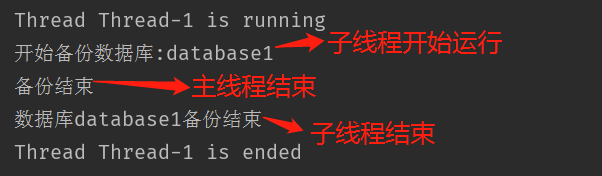
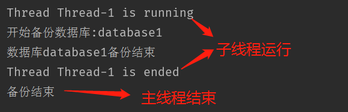
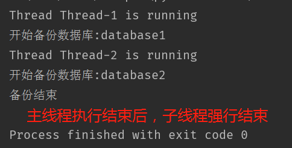
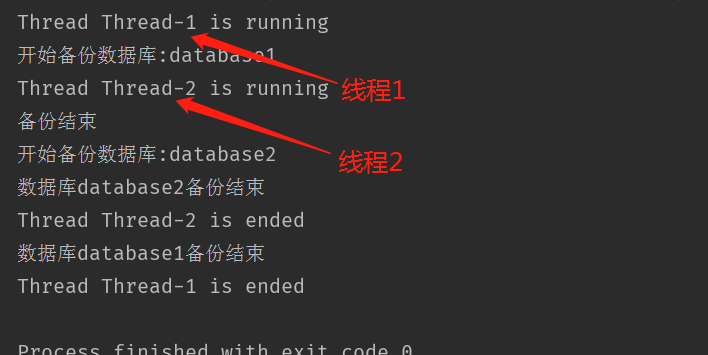
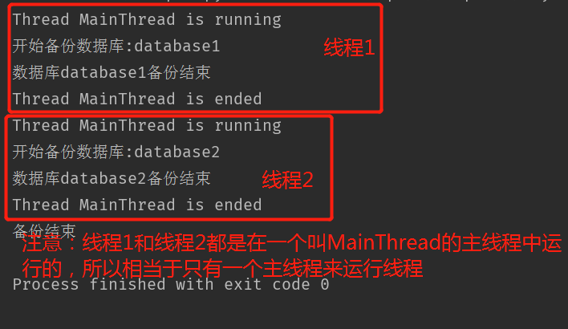

# 爬虫学习使用指南

>Auth: 王海飞
>
>Data：2018-06-04
>
>Email：779598160@qq.com
>
>github：https://github.com/coco369/knowledge 

### 前言

在使用爬虫之前，我们需要了解到很多的概念知识，包括<font style="color:red">同步、异步概念， 阻塞、非阻塞概念，并发、并行概念，多线程、多进程概念，线程锁概念，协程概念</font>等等

### 1. 同步和异步、阻塞和非阻塞

案例：

故事：老王煮稀饭。

人物：老王，锅两个（普通锅，简称普锅；会响的高压锅，简称响锅）。

老王想了想，有好几种等待方式

1.老王用普锅煮稀饭，并且站在那里，不管稀饭开没开，每隔一定时间看看稀饭开了没。<b>－同步阻塞</b>

老王想了想，这种方法不够聪明。

2.老王还是用普锅煮稀饭，不再傻傻的站在那里看稀饭水开，跑去寝室上网，但是还是会每隔一段时间过来看看稀饭水开了没有，水没有开就走人。<b>－同步非阻塞</b>

老王想了想，现在的方法聪明了些，但是还是不够好。

3.老王这次使用高大上的响锅来煮稀饭，站在那里，但是不会再每隔一段时间去看水开，而是等水开了，水壶会自动的通知他。<b>－异步阻塞</b>

老王想了想，不会呀，既然响锅可以通知我，那我为什么还要傻傻的站在那里等呢，嗯，得换个方法。

4.老王还是使用响锅煮稀饭，跑到客厅上网去，等着响锅自己把水煮熟了以后通知他。<b>－异步非阻塞</b>

老王豁然，这下感觉轻松了很多。

#### 1.1 同步和异步

同步和异步是相对于操作结果来说，会不会等待结果

#### 1.2 阻塞和非阻塞

阻塞是在煮稀饭的过程中，你不能去干其他的事情。非阻塞是在煮稀饭的过程中，你还可以去做其他的事情。阻塞和非阻塞是相对于线程是否被阻塞


#### 1.3 同步和阻塞的区别

同步是一个过程，阻塞是线程的一个状态。

当多个线程操作同一公共变量的时候可能会出现竞争的情况，这时候需要使用同步来防止多个线程同时占用资源的情况，让一个线程在运行状态中，另外的线程处于就绪状态，当前一个线程处于暂停状态的时候，后面的处于就绪状态的线程，获取到资源以后，获取到时间片以后就会处于运行状态了。所以阻塞是线程的一个状态而已

#### 1.4 并发和并行

并发：从点餐系统看，该肯德基店只有一个负责点餐的收银员，而又2台收银点餐设备，服务员同时操作2个收银点餐终端，这叫并发操作收银点餐终端。

并行：肯德基为了拓展业务，提高同时服务的能力，在全世界开设分店，这叫并行。

如何实现并发呢：需要引入多进程，多线程，协程


### 2. 进程

<b>概念</b>：

进程即正在执行的一个过程。进程是对正在运行程序的一个抽象。操作系统以进程为单位分配存储空间，每个进程都有自己的地址空间、数据栈以及其他用于跟踪进程执行的辅助数据，操作系统管理所有进程的执行，为它们合理的分配资源。进程可以通过fork或spawn的方式来创建新的进程来执行其他的任务，不过新的进程也有自己独立的内存空间，因此必须通过进程间通信机制（IPC，Inter-Process Communication）来实现数据共享，具体的方式包括管道、信号、套接字、共享内存区等。

<b>python实现进程</b>：

multiprocessing模块就是跨平台版本的多进程模块。

multiprocessing模块提供了一个Process类来代表一个进程对象，

代码：
```
	import os
	import time
	from random import randint
	from multiprocessing import Process

	def coding():
	    while True:
	        print('开始撸代码，PID是%s' % os.getpid())
	        time.sleep(randint(1, 3))
	        print('写累了，不撸了，PID是%s' % os.getpid())

	def play_weixin():
	    while True:
	        print('玩一会微信，PID是%s' % os.getpid())
	        time.sleep(randint(1,2))
	        print('不玩微信了，开始撸代码，PID是%s' % os.getpid())
	
	if __name__ == '__main__':
	
	    # 创建进程
	    p1 = Process(target=coding)
	    p2 = Process(target=coding)
	    p3 = Process(target=play_weixin)
	
	    # 启动进程
	    p1.start()
	    # 阻塞进程p1
	    p1.join()
		
		# 启动进程
	    p2.start()
	    p3.start()
		
		# 主进程
	    while True:
	        time.sleep(3)
	        print('我是主进程，PID是%s' % os.getpid())
```
#### 2.1 杀掉进程

按照上面案例代码运行的话，p1进程会一直阻塞，后面的p2和p3并不会执行。如果在windows中运行的代码，则直接运行‘启动任务管理器’去杀掉进程，这时候p2和p3的进程就会执行了，说明进程之间是相互没有关联的，互不影响的。如果在linux系统中，直接kill -9 PID，就可以杀掉进程了

### 3. 线程

一个进程中的多个线程可以共享一个资源内存空间

Python的标准库提供了两个模块：thread和threading，thread是低级模块，threading是高级模块，对thread进行了封装。绝大多数情况下，我们只需要使用threading这个高级模块。

启动一个线程,创建threading的实例，然后直接start()就可以启动我们定义的线程了。

#### 3.1 多线程

定义一个线程类，继承自threading.Thread

其中打印一下当前线程的名称，使用threading.current_thread().name来获取当前线程的名称。默认的Python就自动给线程命名为Thread-1，Thread-2……。当然我们也可以自定义线程的名称
	
	import threading
	
	class DataCopy(threading.Thread):
	
	    def __init__(self, dbname):
	        super(DataCopy, self).__init__()
	        self.dbName = dbname
	
	    def run(self):
	
			print('Thread %s is running' % threading.current_thread().name)
	        print('开始备份数据库:%s' % self.dbName)
	
	        time.sleep(5)
	
	        print('数据库%s备份结束' % self.dbName)
			print('Thread %s is ended' % threading.current_thread().name)

启动一个线程：

	thread1 = DataCopy('database1')
	
	thread1.start()
	
	# 线程执行结束的输出提示
	print('备份结束')

运行结果：



从结果中可以看出，主线程不管你的子线程结没结束，主线程在打印输出以后就直接结束了。这样是不对的。所以我们需要修改代码，引入<b>线程阻塞的概念</b>
	

#### 3.2 线程阻塞

什么是线程阻塞: join([time]): 等待至线程中止。这阻塞调用线程直至线程的join() 方法被调用中止-正常退出或者抛出未处理的异常-或者是可选的超时发生。

通俗理解：在你的子线程没有中止或者运行完之前，你的主线程都不会结束


重新启动一个线程：

	thread1 = DataCopy('database1')
	
	thread1.start()
	
	# 线程阻塞
	thread1.join()
	
	# 线程执行结束的输出提示
	print('备份结束')

运行结果：



#### 3.3 守护线程

当定义子线程为守护线程的话，当主线程结束了，不管子线程是否执行完，都会被直接给暂停掉。默认daemon为False


代码：

	thread1 = DataCopy('database1')
	thread2 = DataCopy('database2')
	
	# 设置守护线程
	thread1.daemon = True
	thread2.daemon = True
	
	# 运行线程
	thread1.start()
	thread2.start()
	
	# 线程执行结束的输出提示
	print('备份结束')



#### 3.4 线程启动

解释: start和run的区别

start() 方法是启动一个子线程，线程名就是我们定义的name，或者默认的线程名Thread-1， Thread-2......

run() 方法并不启动一个新线程，就是在主线程中调用了一个普通函数而已。


代码1，先使用start()启动线程，并且打印当前线程的名称：
	
​	
	thread1 = DataCopy('database1')
	thread2 = DataCopy('database2')
	
	# 使用start启动，两个线程同时执行
	thread1.start()
	thread2.start()
	
	# 线程执行结束的输出提示
	print('备份结束')

运行结果：




代码2，使用run()启动线程，并且打印当前线程的名称：

	thread1 = DataCopy('database1')
	thread2 = DataCopy('database2')
		
	thread1.run()
	thread2.run()
	
	# 线程执行结束的输出提示
	print('备份结束')

运行结果：


