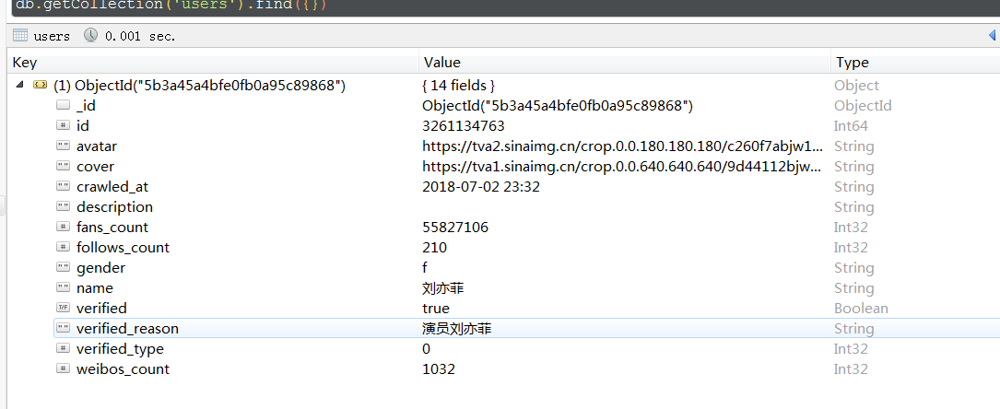

# 爬虫学习使用指南--scrapy框架--微博用户信息

>Auth: 王海飞
>
>Data：2018-07-03
>
>Email：779598160@qq.com
>
>github：https://github.com/coco369/knowledge 

### 1. 爬取微博用户信息

#### 1.1 写spiders文件处理我们解析的接口信息

定义我们需要爬取的启始地址,需要爬取那些微博用户的id信息，以及爬取到微博用户的信息的实体化

	import json
	
	from scrapy.spiders import Spider
	from scrapy import Request
	
	from dbspider.items import UserItem
	
	
	class WeiboSpider(Spider):
	    name = 'weibocn'
	
	    allowed_domains = ['m.weibo.cn']
	    # 获取微博用户的基本信息
	    user_url = 'https://m.weibo.cn/api/container/getIndex?uid={uid}&type=uid&value={uid}&containerid=100505{uid}'
	   
	    # 用户的id
	    # start_users = ['3217179555', '1742566624', '2282991915', '1288739185', '3952070245', '5878659096']
	    start_users = ['3261134763']
	
	    # 该方法必须返回一个可迭代对象(iterable)。该对象包含了spider用于爬取的Request。
	    # 当spider启动爬取并且未指定start_urls时，该方法被调用。
	    def start_requests(self):
	        for uid in self.start_users:
	            yield Request(self.user_url.format(uid=uid), callback=self.parse_user)
	
	    # 当请求url返回网页没有指定回调函数时，默认的Request对象回调函数
	    def parse_user(self, response):
	        """
	        解析用户信息
	        :param response: Response对象
	        """
	        result = json.loads(response.text)
	        if result.get('data').get('userInfo'):
	            user_info = result.get('data').get('userInfo')
	            user_item = UserItem()
	            field_map = {
	                'id': 'id', 'name': 'screen_name', 'avatar': 'profile_image_url', 'cover': 'cover_image_phone',
	                'gender': 'gender', 'description': 'description', 'fans_count': 'followers_count',
	                'follows_count': 'follow_count', 'weibos_count': 'statuses_count', 'verified': 'verified',
	                'verified_reason': 'verified_reason', 'verified_type': 'verified_type'
	            }
	            for field, attr in field_map.items():
	                user_item[field] = user_info.get(attr)
	            yield user_item

#### 1.2 定义实体items

	class UserItem(scrapy.Item):
		
		# mongodb中文档的名称
	    collection = 'users'
	
	    id = scrapy.Field()
	    name = scrapy.Field()
	    avatar = scrapy.Field()
	    cover = scrapy.Field()
	    gender = scrapy.Field()
	    description = scrapy.Field()
	    fans_count = scrapy.Field()
	    follows_count = scrapy.Field()
	    weibos_count = scrapy.Field()
	    verified = scrapy.Field()
	    verified_reason = scrapy.Field()
	    verified_type = scrapy.Field()
	    follows = scrapy.Field()
	    fans = scrapy.Field()
	    crawled_at = scrapy.Field()

#### 1.3 settings.py配置文件中定义items的加载顺序，以及mongodb的设置

其中数字300，301，302是访问item的权限，先访问300，依次类推

	ITEM_PIPELINES = {
	   'dbspider.pipelines.TimePipeline': 300,
	   'dbspider.pipelines.WeiboPipeline': 301,
	   'dbspider.pipelines.MongoPipeline': 302,
	}
	
	# 以下是mongodb的配置信息
	MONGODB_SERVER = '127.0.0.1'
	MONGODB_PORT = 27017
	MONGODB_DB = 'weibo'

#### 1.4 项目管道pipelines

	# 权限定义为300，首先访问该通道的函数，函数中初始化一个爬取时crawled_at的时间参数
	class TimePipeline(object):
	
	    def process_item(self, item, spider):
	
	        now = time.strftime('%Y-%m-%d %H:%M', time.localtime())
	        item['crawled_at'] = now
	        return item
	
	# 目前先不做任何的处理，直接返回item
	class WeiboPipeline(object):
	
	    def process_item(self, item, spider):
	
	        return item
	
	# 用户处理数据，并进行持久化到mongodb中的操作
	class MongoPipeline(object):
	    def __init__(self):
	        self.mongo_uri = settings['MONGODB_SERVER']
	        self.mongo_db = settings['MONGODB_DB']
	
	    # 当蜘蛛打开时调用此方法
	    def open_spider(self, spider):
	        self.client = pymongo.MongoClient(self.mongo_uri)
	        self.db = self.client[self.mongo_db]
	        self.db[UserItem.collection].create_index([('id', pymongo.ASCENDING)])
	
	    # 当蜘蛛关闭时调用此方法。
	    def close_spider(self, spider):
	        self.client.close()
		
		# 使用mongodb的update方法，当数据不存在的时候进行保存，当数据存在的时候，进行更新操作
	    def process_item(self, item, spider):
	        self.db[item.collection].update({'id': item.get('id')}, {'$set': item}, True)
	        return item
	
处理结果：

