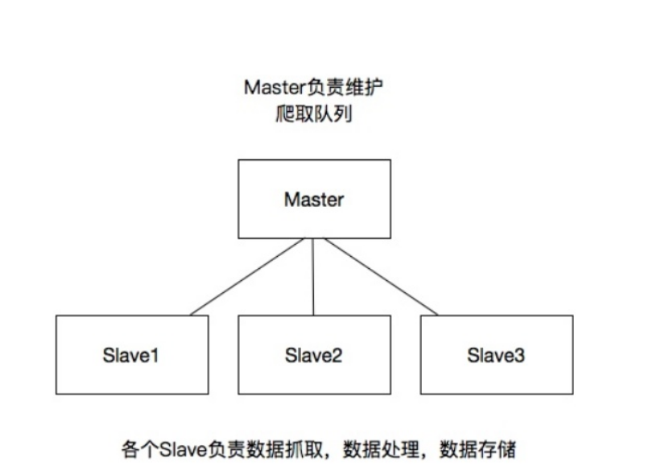

# 爬虫学习使用指南

>Auth: 王海飞
>
>Data：2018-07-05
>
>Email：779598160@qq.com
>
>github：https://github.com/coco369/knowledge

### 前言

说到分布式系统的时候，要和集中式系统进行对比的学习，下面就先介绍下集中式系统，对比它们的优缺点进行学习。

#### 集中式系统

集中式系统：

集中式系统中整个项目就是一个独立的应用，整个应用也就是整个项目，所有的业务逻辑功能都在一个应用里面。如果遇到并发的瓶颈的时候，就多增加几台服务器来部署项目，以此来解决并发分问题。在nginx中进行负载均衡即可。

缺点： 

> a) 不易于扩展 

> b) 如果发现你的项目代码中有bug的话，那么你的所有的服务器中的项目代码都是有问题的，这时候要更新这个bug的时候，就需要同时更新所有的服务器了。

优点：

> 维护方便

#### 分布式系统

分布式系统:

分布式系统中，我们的整个项目可以拆分成很多业务块，每一个业务块单独进行集群的部署。这样就将整个项目分开了，在进行拓展的时候，系统是很容易横向拓展的。在并发的时候，也很好的将用户的并发量提上去。

缺点：

> a) 项目拆分的过于复杂，给运维带来了很高的维护成本

> b) 数据的一致性，分布式事务，分布式锁等问题不能得到很好的解决 
	
优点：

> a) 一个业务模块崩了，并不影响其他的业务

> b) 利于扩展

> c) 在上线某个新功能的时候，只需要新增对应的分布式的节点即可，测试也只需要测试该业务功能即可。很好的避免了测试在上线之前需要将整个系统进行全方面的测试

### 1. scrapy的分布式原理

我们还是先回顾下scrapy的运行原理的构造图:

该图很好的阐释了在不是scrapy的服务器中的运行结构图，在维护爬取的url队列的时候，使用scheduler进行调度的。那么如果要修改为分布式的scrapy爬虫的话，其实就是将爬取的队列进行共享，多台部署了scrapy爬虫的服务器共享该爬取队列。

### 2. 分布式架构：

### 3. 搭建分布式爬虫

我们使用scrapy_redis进行分布式爬虫的搭建

#### 3.1 安装
	
	pip install scrapy_redis

