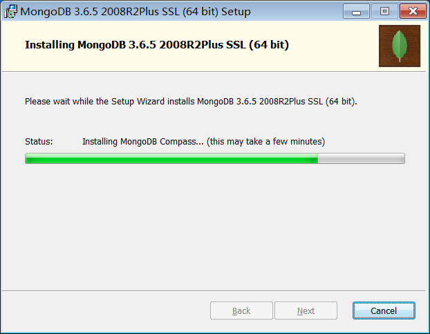
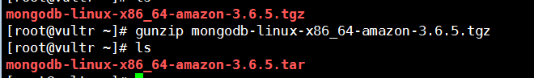
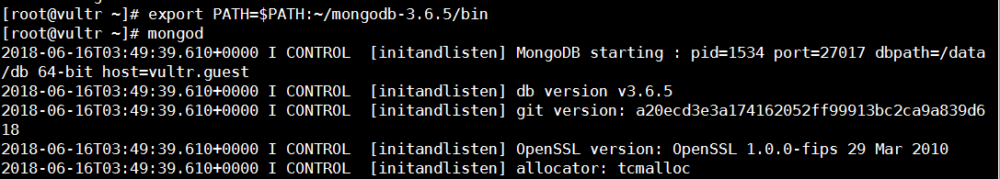
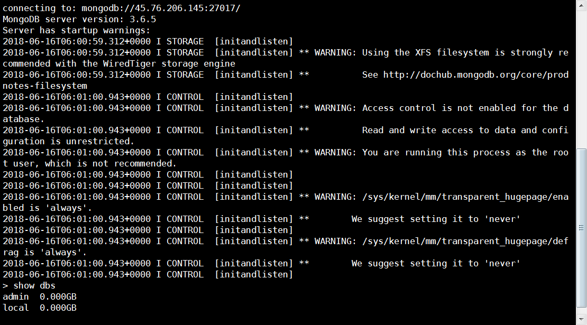
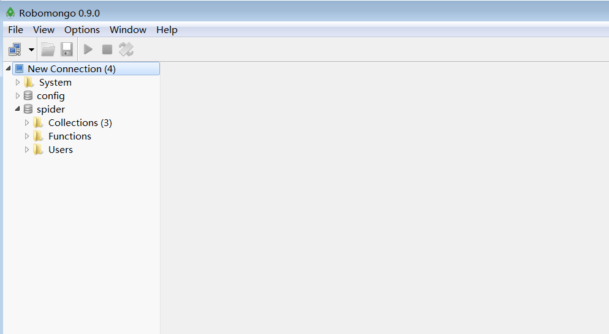

# mongodb使用指南

>Auth: 王海飞
>
>Data：2018-06-16
>
>Email：779598160@qq.com
>
>github：https://github.com/coco369/knowledge 

### 前言

MongoDB是2009年问世的一个面向文档的数据库管理系统，由C++语言编写，旨在为Web应用提供可扩展的高性能数据存储解决方案。虽然在划分类别的时候后，MongoDB被认为是NoSQL的产品，但是它更像一个介于关系数据库和非关系数据库之间的产品，在非关系数据库中它功能最丰富，最像关系数据库。

MongoDB将数据存储为一个文档，一个文档由一系列的“键值对”组成，其文档类似于JSON对象，但是MongoDB对JSON进行了二进制处理（能够更快的定位key和value），因此其文档的存储格式称为BSON。关于JSON和BSON的差别大家可以看看MongoDB官方网站的文章[《JSON and BSON》](https://www.mongodb.com/json-and-bson)。

目前，MongoDB已经提供了对Windows、MacOS、Linux、Solaris等多个平台的支持，而且也提供了多种开发语言的驱动程序，Python当然是其中之一。

### 2 windows下安装

我可以从MongoDB的[官方下载](https://www.mongodb.com/download-center#community)链接下载MongoDB，官网上提供了windows的安装msi文件，也提供了linux和mac的安装包的，可以直接下载安装

windows的下载msi文件比较大有183M，下载需耐心等待了。

#### 2.10 windows下安装配置

自定义了安装目录以后，直接下一步下一步就可以完成本地的mongo安装了

### 3 linux下安装

#### 3.1 wget获取mongodo

wget地址:

	wget https://fastdl.mongodb.org/linux/mongodb-linux-x86_64-amazon-3.6.5.tgz

#### 3.2 gunzip解压缩

gunzip是个使用广泛的解压缩程序,它用于解开被gzip压缩过的文件

#### 3.3 安装

解压，并指定安装到刚创建的mongodb-3.6.5中，并去除掉第一级的目录结构(--strip-components number参数)

	mkdir mongodb-3.6.5
	
	tar -xvf mongodb-linux-x86_64-amazon-3.6.5.tar --strip-components 1 -C mongodb-3.6.5/

#### 3.4 设置环境变量，启动mongod

启动mongod：

	export PATH=$PATH:~/mongodb-3.6.5/bin
	mkdir -p /data/db
	mongod --bind_ip 45.76.206.145

启动mongo，然后就可以愉快的使用mongodb进行玩耍啦：

 	mongo --port 45.76.206.145

设置配置文件mongodb.conf

	vi mongodb.conf
	
	dbpath = /home/mongodb/data/db #数据文件存放目录
	
	logpath = /home/mongodb/logs/mongodb.log #日志文件存放目录
	port = 27017  #端口
	fork = true  #以守护程序的方式启用，即在后台运行
	nohttpinterface = true
	auth=true
	bind_ip=0.0.0.0

启动mongo命令: mongod -f mongodb.conf

#### 3.5 查看进程

centos下安装 yum install net-tools 就可以使用netstat -lntp 去查看进程端口等信息了

#### 3.6 sql和mongodb进行对比

我们通过与关系型数据库进行对照的方式来说明MongoDB中的一些概念。

| SQL         | MongoDB     | 解释（SQL/MongoDB）    |
| ----------- | ----------- | ---------------------- |
| database    | database    | 数据库/数据库          |
| table       | collection  | 二维表/集合            |
| row         | document    | 记录（行）/文档        |
| column      | field       | 字段（列）/域          |
| index       | index       | 索引/索引              |
| table joins | ---         | 表连接/嵌套文档        |
| primary key | primary key | 主键/主键（`_id`字段） |

### 4. robomongo可视化工具

在windows开发环境中，需要可视化mongodb数据库，通常都会使用robomongo这个可视化工具。请自行去官网下载

简单的配置一下即可访问centos7 上的mongodb数据库了。

<b>坑：</b>

如果在配置robomongo的过程中，遇到无法访问，出现'connect: network is unreachable'的提示的话，表示mongo的远程没有开启，或者防火墙的问题。首先需要检查mongodb.conf文件中的bind_ip是否是0.0.0.0。其次在查看防火墙是否开启，可直接关闭防火墙，在进行robomongo链接尝试。

	systemctl stop firewalld.service #停止firewall 
	
	systemctl disable firewalld.service #禁止firewall开机启动 