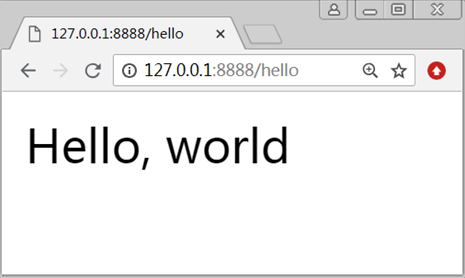

# tornado使用操作指南--入门

>Auth: 王海飞
>
>Data：2019-02-17
>
>Email：779598160@qq.com
>
>github：https://github.com/coco369/knowledge 

### 1. tornado介绍


&nbsp;&nbsp;&nbsp;&nbsp;&nbsp;在Python的众多优秀的Web框架中，Tornado框架主要用于处理日趋严峻的高并发问题，其在创建、扩展以及部署中都有非常优秀的体现。正是因为Tornado框架在设计之初就考虑到性能问题，旨在解决C1OK问题，这才将Tornado设计成为一个拥有非常高性能的框架。

&nbsp;&nbsp;&nbsp;&nbsp;&nbsp;Tornado是基于Bret Taylor和其他人员为FriendFeed所开发的网络服务框架，得利于其非阻塞的方式和对epoll的运用，Tornado可以处理数以千计的连接，是理想的实时通信Web框架。因此如果需要编写一个可扩展性的应用、RESTful API或异步，那么Tornado框架是首选的选择。


[官方文档地址](http://www.tornadoweb.org/en/stable/)

[资料文档地址](http://shouce.jb51.net/tornado/ch1.html#ch1-1-1)

### 2. 安装tornado

#### 2.1虚拟环境搭建

	创建tornadoenv虚拟环境:
	virtualenv --no-site-packages -p D:\python3\python.exe tornadoenv
	
	激活windows下虚拟环境:
	cd Scripts
	activate

#### 2.2 安装

	在激活的虚拟环境tornadoenv中安装:
	pip install tornado


### 3. 基于tornado的最简单应用（单进程）

创建FirstTornado.py文件

```
import tornado.ioloop
	import tornado.web

	
	class MainHandler(tornado.web.RequestHandler):
	    def get(self):
	        self.write("Hello, world")

	
	def make_app():
	    return tornado.web.Application(handlers=[
	        (r"/hello", MainHandler),
	    ])

	
	if __name__ == "__main__":
	    app = make_app()
	    app.listen(8888)
	    tornado.ioloop.IOLoop.current().start()
```


运行：python FirstTornado.py

如下进行详细讲解每一行代码的含义，如下:

<b>&nbsp;&nbsp;&nbsp;&nbsp;&nbsp;&nbsp;&nbsp;&nbsp;编写一个Tornado应用中最多的工作是定义类继承Tornado的RequestHandler类。在这个例子中，我们创建了一个简单的应用，在给定的端口监听请求，并在路由（"/hello"）响应请求。</b>

你可以在命令行里尝试运行这个程序以测试输出：

	python hello.py

现在你可以在浏览器中打开http://localhost:8888/hello，



#### 3.1 代码分析

示例中编写的Tornado应用没有使用任何Tornado的异步功能，只是定义了一个MainHandler类，并继承了Tornado的RequestHandler类。

示例代码分析如下:

<b> 1) MainHandler类:</b>

&nbsp;&nbsp;&nbsp;&nbsp;&nbsp;&nbsp;&nbsp;&nbsp;MainHandler类是Tornado的请求处理函数类，当处理一个请求时，Tornado会实例化这个类，并调用与HTTP请求方法所对应的方法。在示例中的MainHandler类中定义了get方法，也就是说当HTTP请求方式为GET时，MainHandler中的get方法将会被调用并作出响应。

<b> 2）self.write()方法</b>

&nbsp;&nbsp;&nbsp;&nbsp;&nbsp;&nbsp;&nbsp;&nbsp;以一个字符串作为函数的参数，将字符串写入到HTTP响应中。

<b> 3）make_app()方法</b>

&nbsp;&nbsp;&nbsp;&nbsp;&nbsp;&nbsp;&nbsp;&nbsp;返回一个Tornado的Application类的实例，传递给Application类的__init__方法中的最重要的参数就是handlers，该参数表示告知Tornado应用应该调用那个类来处理响应。比如本例子中想调用MainHandler中的get方法，则应该访问http://127.0.0.1:8888/hello地址。

<b> 4) app.listen(8888)</b>

&nbsp;&nbsp;&nbsp;&nbsp;&nbsp;&nbsp;&nbsp;&nbsp;Application对象被创建后，可以调用listen()方法来监听端口和IP地址。如本例子中监听的端口为8888，由于IP地址没有定义，因此可直接访问127.0.0.1或者公网IP地址。

​	如果app.listen(port=8888，address=‘localhost’)则表示只能通过本地127.0.0.1:8888访问。

​	如果app.listen(port=8888, address='0.0.0.0')则表示可以通过127.0.0.1:8888或公网IP地址:8888访问。其效果和app.listen(8888)是一样的，address参数默认可不写。

重点: app.listen()调用的代码如下:

```
from tornado.httpserver import HTTPServer
server = HTTPServer(self, **kwargs)
server.listen(port, address)
return server
```

<b> 5）tornado.ioloop.IOLoop.current().start()</b>

&nbsp;&nbsp;&nbsp;&nbsp;&nbsp;&nbsp;&nbsp;&nbsp;用于创建一个Tornado的IOLoop的实例，并一直运行Tornado项目，用于接收处理客户端的访问请求。

在虚拟环境tornadoenv中运行FirstTornado.py文件，然后在浏览器中访问http://127.0.0.1:8888/hello地址或者http://公网ip地址:8888/hello地址

### 4. 修改启动方式，使用命令行参数启动服务

修改最简单的tornado程序,命名为helloTornado2.py。 如下:
```
import tornado.ioloop
import tornado.web
from tornado.options import define, options, parse_command_line
	
# 定义默认的端口
define('port', default=8000, type=int)

	
class MainHandler(tornado.web.RequestHandler):
    def get(self):
        self.write("Hello, world")


def make_app():
    return tornado.web.Application(handlers=[
        (r"/hello", MainHandler),
    ])

	
if __name__ == "__main__":
    # 解析命令行
    parse_command_line()
    # 获取Application对象
    app = make_app()
    # 监听端口
    app.listen(options.port)
    # 启动IOLoop实例
    tornado.ioloop.IOLoop.current().start()
```

<b>&nbsp;&nbsp;&nbsp;&nbsp;&nbsp;&nbsp;&nbsp;&nbsp;Tornado中包含了一个有用的读取命令行的模块（tornado.options），可以使用tornado.options模块来指定应用监听HTTP请求的端口。</b>

	# 读取命令行中的配置
	from tornado.options import define, options, parse_command_line
	
	# 定义默认的端口
	define('port', default=8000, type=int)


导入tornado.options的define函数，define函数中接收了<b>三个参数</b>，分析如下:

<b> 1）第一个参数‘port’ </b>

&nbsp;&nbsp;&nbsp;&nbsp;&nbsp;&nbsp;&nbsp;&nbsp;表示定义的port参数将成为全局options的一个属性。

<b> 2）第二个参数default </b>

&nbsp;&nbsp;&nbsp;&nbsp;&nbsp;&nbsp;&nbsp;&nbsp;表示port属性的默认值，默认值为8000。如果在启动命令行中没有指定port参数，则项目启动的端口默认为8000。如果在启动命令行中指定了port参数，则使用命令行中的参数作为项目启动的端口。

<b> 3）第三个参数type </b>

&nbsp;&nbsp;&nbsp;&nbsp;&nbsp;&nbsp;&nbsp;&nbsp;用于做参数类型的校验，当不适合的参数类型被给予时会抛出异常。示例中指定type为int类型，则表示命令行中的指定的port参数必须为整型。

<b style="color:red;"> 启动并运行helloTornado2.py </b>

	python helloTornado2.py --port=8888


### 5. 基于tornado的最简单应用（多进程）

```
import tornado.ioloop
import tornado.web
import tornado.httpserver
from tornado.options import define, options, parse_command_line

define('port', default=8000, type=int)

class MainHandler(tornado.web.RequestHandler):
	def get(self):
		self.write("Hello, world")

if __name__ == "__main__":

	# 解析命令行
	parse_command_line()
	# 获取Application对象
	app = make_app()
	# 获取httpserver对象
	server = tornado.httpserver.HTTPServer(app)
	# 监听端口
	server.bind(options.port)
	server.start(0)
	# 启动IOLoop实例
	tornado.ioloop.IOLoop.current().start()
```

注意: 指定多进程的方式只能在linux下才可行，在windows下会报错。实例中代码server.start(num_processes)方法用于指定开启几个进程。

- 如果num_processes默认为1，表示开启一个进程。
- 如果num_processes参数为None或者<=0,则表示自动根据机器硬件的cpu核数创建同等数目的子进程。
- 如果num_processes参数>0，则创建num_processes个子进程。

因此在windows中num_processes一般不写或者写1。ss

### 6. 取消日志打印

```
from tornado.options import options，parse_command_line

# 取消日志打印
options.logging=None
# 解析命令行
parse_command_line()
```

